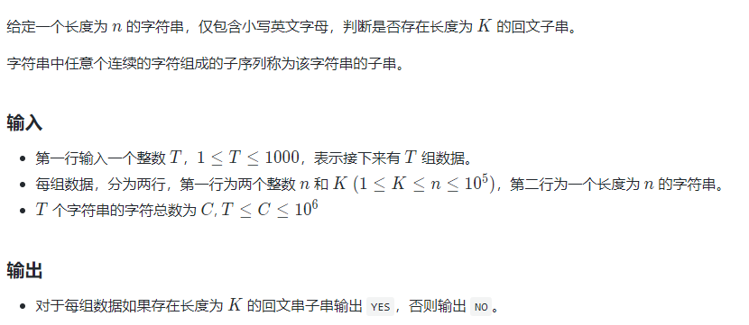

整理分类做过的 `leetcode`，好记性不如烂笔头啊~

[TOC]

# HW

## [字符串分隔](https://www.nowcoder.com/practice/d9162298cb5a437aad722fccccaae8a7?tpId=37&tqId=21227&rp=1&ru=/exam/oj/ta&qru=/exam/oj/ta&sourceUrl=%2Fexam%2Foj%2Fta%3FtpId%3D37&difficulty=undefined&judgeStatus=undefined&tags=&title=)

•输入一个字符串，请按长度为8拆分每个输入字符串并进行输出；

•长度不是8整数倍的字符串请在后面补数字0，空字符串不处理。

**示例1**

```
输入：
abc
输出：
abc00000
```

**提示**

* 每个字符串长度小于等于100

```c++
#include <bits/stdc++.h>
using namespace std;

int main() {
    string s;
    while (cin >> s) { // 注意 while 处理多个 case
        while (s.size() % 8) {
            s += '0';
        }
        for (int i=0; i<s.size()/8; ++i) {
            cout << s.substr(i*8, 8) << endl;
        }
    }
    return 0;
}

```

## 最长字串

* 给你一个字符串 s，字符串s首尾相连成一个环形 ，请你在环中找出 'o' 字符出现了偶数次最长子字符串的长度。

  输入描述：

  输入是一串小写字母组成的字符串

  输出描述：

  输出是一个整数

```
示例1
输入：
alolobo
输出：
6
说明：
最长子字符串之一是 "alolob"，它包含'o' 2个。

示例2
输入：
looxdolx
输出：
7
说明：
最长子字符串是 "oxdolxl"，由于是首尾连接在一起的，所以最后一个 'x' 和开头的 'l'是连接在一起的，此字符串包含 2 个'o' 。

示例3
输入：
bcbcbc
输出：
6
说明：
这个示例中，字符串 "bcbcbc" 本身就是最长的，因为  'o' 都出现了 0 次。
```

**提示：**

1 <= s.length <= 5 x 10^5

s 只包含小写英文字母。

```cpp
#include <bits/stdc++.h>
using namespace std;

int main () {
    string s;
    cin >> s;
    int count = 0, n = s.length();
    for (auto c:s) {
        if (c == 'o') {
            count++;
        }
    }
    if (n % 2 == 0) {
        cout << n << endl;
    }
    else {
        cout << n - 1 << endl;
    }
    return 0;
}
```


# 滑动窗口/双指针

**最短或最长的子串  最多可变k次**

## [LC-3. 无重复字符的最长子串](https://leetcode-cn.com/problems/longest-substring-without-repeating-characters/)

给定一个字符串 `s` ，请你找出其中不含有重复字符的 **最长子串** 的长度。

**示例 1:**

```
输入: s = "abcabcbb"
输出: 3 
解释: 因为无重复字符的最长子串是 "abc"，所以其长度为 3。
```

**示例 2:**

```
输入: s = "bbbbb"
输出: 1
解释: 因为无重复字符的最长子串是 "b"，所以其长度为 1。
```

**示例 3:**

```
输入: s = "pwwkew"
输出: 3
解释: 因为无重复字符的最长子串是 "wke"，所以其长度为 3。
     请注意，你的答案必须是 子串 的长度，"pwke" 是一个子序列，不是子串。
```

**示例 4:**

```
输入: s = ""
输出: 0
```

**提示：**

- `0 <= s.length <= 5 * 104`
- `s` 由英文字母、数字、符号和空格组成

```c++
/** （一）
 * 这里可以建立一个 HashMap，建立每个字符和其最后出现位置之间的映射
 * 然后定义两个变量 res 和 left，其中 res 用来记录最长无重复子串的长度
 * left 指向该无重复子串左边的起始位置的前一个，所以初始化就是 -1
 * 然后遍历整个字符串，对于每一个遍历到的字符，如果该字符已经在 HashMap 中存在了，
 * 并且如果其映射值大于 left 的话，那么更新 left 为当前映射值。然后映射值更新为当前坐标i，
 * 这样保证了 left 始终为当前边界的前一个位置，然后计算窗口长度的时候，直接用 i-left 即可，
 * 用来更新结果 res。
 */

class Solution {
public:
    int lengthOfLongestSubstring(string s) {
        int res = 0, left = -1, n = s.size();
        unordered_map<int, int> m;
        for (int i = 0; i < n; ++i) {
            if (m.count(s[i]) && m[s[i]] > left) {
                left = m[s[i]];  
            }
            m[s[i]] = i;
            res = max(res, i - left);            
        }
        return res;
    }
};
```

这种解法使用了 `HashSet`，核心算法和上面的很类似，把出现过的字符都放入` HashSet `中，遇到 `HashSet `中没有的字符就加入` HashSet` 中并更新结果 `res`，如果遇到重复的，则从左边开始删字符，直到删到重复的字符停止。

```c++
/** （二）
 * 下面这种解法使用了 HashSet，核心算法和上面的很类似，
 * 把出现过的字符都放入 HashSet 中，遇到 HashSet 中没有的字符就加入 HashSet
 * 并更新结果 res，如果遇到重复的，则从左边开始删字符，直到删到重复的字符停止。
 */

class Solution {
public:
    int lengthOfLongestSubstring(string s) {

        int n=s.size();
        if(n==0) return 0;

        int left=0, res=0;
        unordered_set<char> st;
        for(int i=0;i<n;++i){
            while(st.find(s[i])!=st.end()){
                st.erase(s[left]);
                left++;
            }
            st.insert(s[i]);
            res=max(res,i-left+1);
            
        }
        return res;
    }
};
```

## [LC-76. 最小覆盖子串](https://leetcode-cn.com/problems/minimum-window-substring/)

给你一个字符串 `s` 、一个字符串 `t` 。返回 `s` 中涵盖 `t` 所有字符的最小子串。如果 `s` 中不存在涵盖 `t` 所有字符的子串，则返回空字符串 `""` 。

**注意：**

- 对于 `t` 中重复字符，我们寻找的子字符串中该字符数量必须不少于 `t` 中该字符数量。
- 如果 `s` 中存在这样的子串，我们保证它是唯一的答案。

 **进阶：**你能设计一个在 `o(n)` 时间内解决此问题的算法吗？

**示例 1：**

```
输入：s = "ADOBECODEBANC", t = "ABC"
输出："BANC"
```

**示例 2：**

```
输入：s = "a", t = "a"
输出："a"
```

**示例 3:**

```
输入: s = "a", t = "aa"
输出: ""
解释: t 中两个字符 'a' 均应包含在 s 的子串中，
因此没有符合条件的子字符串，返回空字符串。
```

**提示：**

- `1 <= s.length, t.length <= 105`
- `s` 和 `t` 由英文字母组成

这道题给了我们一个原字符串`s`，还有一个目标字符串`t`，让在`s`中找到一个最短的子串，使得其包含了`t`中的所有的字母，并且限制了时间复杂度为` O(n)`。这道题的要求是要在`O(n) `的时间度里实现找到这个最小窗口字串，暴力搜索 `Brute Force `肯定是不能用的，因为遍历所有的子串的时间复杂度是平方级的。那么来想一下，时间复杂度卡的这么严，说明必须在一次遍历中完成任务，当然遍历若干次也是` O(n)`，但不一定有这个必要，尝试就一次遍历拿下！那么再来想，既然要包含T中所有的字母，那么对于T中的每个字母，肯定要快速查找是否在子串中，既然总时间都卡在了` O(n)`，肯定不想在这里还浪费时间，就用空间换时间（也就算法题中可以这么干了，七老八十的富翁就算用大别野也换不来时间啊。依依东望，望的就是时间呐），使用` HashMap`，建立T中每个字母与其出现次数之间的映射。

```c++
/**
 * step1: 确定右边界
 * 先用 HashMap 统计好 t 串中字母的，再遍历 s 串，对于 s 中的每个字母
 * 都将 HashMap 中的映射值减1，如果减1后的映射值仍大于等于0，说明当前遍历到的字母是 t 串中的字母
 * 使用 cnt++ 记录。当cnt 和 t 串字母个数相等时，说明此时的窗口已经包含了 t 串中的所有字母
 * step2: 收缩左边界
 * 由于遍历的时候，映射值减了1，所以此时去除字母的时候，就要把减去的1加回来，
 * 此时如果加1后的值大于0了，说明当前遍历到的字母是 t 串中的字母，
 * 那么 cnt 值就要减1了，然后移动左边界left
 */

class Solution {
public:
    string minWindow(string s, string t) {
        string res = "";
        unordered_map<char, int> letterCnt;
        int left = 0, cnt = 0, minLen = INT_MAX;
        for (char c : t) ++letterCnt[c];         //遍历t
        for (int i = 0; i < s.size(); ++i) {
            if (--letterCnt[s[i]] >= 0) ++cnt;   //--letterCnt[s[i]] >= 0，s[i]在t中
            while (cnt == t.size()) {
                if (minLen > i - left + 1) {
                    minLen = i - left + 1;
                    res = s.substr(left, minLen); //从left开始，长度为minLen的字符串
                }
                //收缩左边界 ++letterCnt[s[left]] > 0， 0->1 该元素在t中，
                if (++letterCnt[s[left]] > 0) --cnt;   
                //因为不在t中的本来为0，先减去，现在再增加，最终还是0.
                ++left;
            }
        }
        return res;

    }
};
```

## [pa-3.寻找最靠左的匹配子串](https://www.papamelon.com/problem/3)

给定一个字符串 A 长度为 N，1 <= N <= 2*10^5，下标从 0 开始标号，仅包含 0 到 9 这十种字符。

再给定另一个字符串 B，长度为 M，1 <= M <= 2*10^5，下标从 0 开始标号，也是仅包含 0 到 9 这十种字符。

例如以下字符串就是一个合法的 A或 B

```
066465353473034515
```

现在我们要在 A寻找一个连续的子串 s，使得 s包含 B中出现的所有字符，且要保证 s的**长度尽可能短**。如果存在多个符合上述条件的 s，**返回最靠左**的那个。

例如:

- B串：

```
3314
```

- A串：

```
563145633
```

子串 A[2:7]为 `314563`，包含了 B串中出现的 `3`, `3`, `1`, `4`。

子串 A[3:8]为 `145633`，也包含了 B串中出现的 `3`, `3`, `1`, `4`。

两个子串长度一样，而前者更靠左，因此前者就是我们要找的答案。

**输入**

- 每组测试数据的第一行是整数 T，$1 \leq T \leq 1000$，表示接下来有 T对 A, B串
- 接下来有 $2*T$行，每两行分别表示一对 A串和 B串
- A*A* 串长度为 N，1 <= N <= 2*10^5
- B*B* 串长度为 M，1 <= M <= 2*10^5
- 一组测试数据中字符总数为 C，  2 * T  <= C <= 2*10^6

**输出**

- 输出 T行，每行两个整数，用空格分割，表示 A的子串下标
- 如果不存在这样的合法子串，输出 `-1 -1`

样例 1

输入

```
1
563145633
3314
```

输出

```
2 7

```

样例 2

输入

```
2
678
123
12345
1233
```

输出

```
-1 -1
-1 -1
```


```c++
/** （一）
 * 核心算法继承LC-76，先确定右边界再收缩左边界
 * 需要注意输入输出的练习
 * if else规范书写，一个小bug调式了好久
 */
#include<bits/stdc++.h>
using namespace std;

class Solution {
public:
    string s, t;
    vector<vector<int>> res;
    void minWindow() {
        cin >> s >> t;
        unordered_map<char, int> mp;
        int left = 0, cnt = 0, minLen = INT_MAX;
        for (char c : t) ++mp[c];        
        for (int i = 0; i < s.size(); ++i) {
            if (--mp[s[i]] >= 0) ++cnt;   
            while (cnt == t.size()) {
                if (minLen > i - left + 1) {
                    minLen = i - left + 1;
                    res.clear();
                    res.push_back({left,left+minLen-1});
                }
                if (++mp[s[left]] > 0) --cnt;   
                ++left;
            }
        }
        // return res;
        if(res.size()==0)
            cout<< -1 << " " << -1 <<endl;
        else
            cout << res[0][0] << " "  << res[0][1] <<endl;
    }
};
int main(){
    int T;
    cin >> T;
    while(T--) Solution().minWindow();
    return 0;
}

```


```c++
/** （二）
 * 核心算法继承LC-76，
 * 代码稍微简洁，逻辑不变
 */
#include<bits/stdc++.h>
using namespace std;

string s, t;
unordered_map<char, int> mp;

void solve(){
    cin >> s >> t;
    vector<vector<int>> res;
    int left = 0, cnt = 0, minLen = INT_MAX;
    mp.clear();
    for (char c : t) ++mp[c];         
    for (int i = 0; i < s.size(); ++i) {
        if (--mp[s[i]] >= 0) ++cnt;   
        while (cnt == t.size()) {
            if (minLen > i - left + 1) {
                minLen = i - left + 1;
                res.clear();
                res.push_back({left,left+minLen-1});
            }
            if (++mp[s[left]] > 0) --cnt;   
            ++left;
        }
    }
    // return res;
    if(res.size()==0)
        cout<< -1 << " " << -1 <<endl;
    else
        cout << res[0][0] << " "  << res[0][1] <<endl;
}

int main(){
    int T;
    cin >> T;
    while(T--) solve();
    return 0;
}

```

## [pa-191.优雅地分割字符串](https://www.papamelon.com/problem/191)

给定一个只包含小写字母的字符串，长度不超过 100000

将字符串分割成左右两半，要求左右两半的字符种类完全相等（个数可以不同）。

有多少种不同的分割方式？

**输入**

- 多组测试数据，以 `EOF` 结束
- 每组测试数据一行字符串，仅包含小写字母，长度不超过 100000
- 多组测试数据的字符串长度总和不超过 100000

**输出**

- 每组测试数据输出一行，一行一个整数，表示有多少种切割方式

**样例 **


```
输入
abcabc
aaaa
acbbbca
输出
1
3
2
```


```c++
/*
 * @Author: Henry
 * @Date: 2021-11-11 20:31:38
 * @LastEditTime: 2021-11-11 22:14:00
 * @Description: 
 */

#include <bits/stdc++.h>
using namespace std;
const int INF = INT_MAX;

void solve(string s){

    vector<int> l(26, INF), r(26, -1), cnt(26, 0);
    // l[i] 第 i 个字符首次出现在 s 中的位置
    // r[i] 第 i 个字符最后出现在 s 中的位置
    // cnt[i] 第 i 个字符出现了多少次

    for (int i = 0; i < s.length(); i++) {
        int k = s[i] - 'a';  // 在字母表中位置
        l[k] = min(l[k], i);
        r[k] = max(r[k], i);
        cnt[k]++;
    }

    int flag = 1, maxl = -1, minr = INF;
    for (int i = 0; i < 26; i++) if (cnt[i]) {
        if (cnt[i] == 1) { //只出现一次的字符 不满足
            flag = 0;
            break;
        }
        maxl = max(maxl, l[i]);
        minr = min(minr, r[i]);
    }

    // 切割位置一定在 [maxl, minr)
    // max{la, lb, lc ... lz}  min{ra, rb, rc ... rz}
    if (!flag || minr < maxl) cout << 0 << endl;
    else cout << minr - maxl << endl;

}

int main(){

    string s;
    while(cin >> s) solve(s);

    return 0;
}
```

## [LC-1. 两数之和](https://leetcode-cn.com/problems/two-sum/)

给定一个整数数组 `nums` 和一个整数目标值 `target`，请你在该数组中找出 **和为目标值** *target*  的那 **两个** 整数，并返回它们的数组下标。

你可以假设每种输入只会对应一个答案。但是，数组中同一个元素在答案里不能重复出现。

你可以按任意顺序返回答案。

 

**示例 1：**

```
输入：nums = [2,7,11,15], target = 9
输出：[0,1]
解释：因为 nums[0] + nums[1] == 9 ，返回 [0, 1] 。
```

**示例 2：**

```
输入：nums = [3,2,4], target = 6
输出：[1,2]
```

**示例 3：**

```
输入：nums = [3,3], target = 6
输出：[0,1]
```

 

**提示：**

- `2 <= nums.length <= 104`
- `-109 <= nums[i] <= 109`
- `-109 <= target <= 109`
- **只会存在一个有效答案**

**进阶：** 你可以想出一个时间复杂度小于 `O(n2)` 的算法吗？

```c++
/** （一）
 * 笨方法
 * 最容易想到的方法是枚举数组中的每一个数 x，寻找数组中是否存在 target - x。
 * 当我们使用遍历整个数组的方式寻找 target - x 时，需要注意到每一个位于 x 之前的元素都已经和 x 匹配过，
 * 因此不需要再进行匹配。而每一个元素不能被使用两次，所以我们只需要在 x 后面的元素中寻找 target - x
 */

class Solution {
public:
    vector<int> twoSum(vector<int>& nums, int target) {
        vector<int> res;
        int n=nums.size();
        for(int i=0;i<n-1;++i){
            for(int j=i+1;j<n;++j){
                if(target== nums[i]+nums[j]){
                    res.push_back(i);
                    res.push_back(j);
                }
            }
        }
        return res;

    }
};
```


```c++
/** （二）
 * 注意到方法一的时间复杂度较高的原因是寻找 target - x 的时间复杂度过高。因此，我们需要一种更优秀的方法，
 * 能够快速寻找数组中是否存在目标元素。如果存在，我们需要找出它的索引。
 * 使用哈希表，可以将寻找 target - x 的时间复杂度降低到从 O(N)O(N) 降低到 O(1)。
 * 这样我们创建一个哈希表，对于每一个 x，我们首先查询哈希表中是否存在 target - x，然后将 x 插入到哈希表中，
 * 即可保证不会让 x 和自己匹配。
 */

class Solution {
public:
    vector<int> twoSum(vector<int>& nums, int target) {
        vector<int> res;
        unordered_map<int, int> mp;
        for(int i=0;i<nums.size();++i){
            if(mp.find(target-nums[i])!=mp.end()){
                res.push_back(i);
                res.push_back(mp.find(target-nums[i])->second);
            }
            // mp.insert(pair<int, int>(nums[i], i));
            mp[nums[i]]=i;
        }
        return res;
    }
};
```


```c++
// （三）再精简一下
class Solution {
public:
    vector<int> twoSum(vector<int>& nums, int target) {
        unordered_map<int, int> m;
        for (int i = 0; i < nums.size(); ++i) {
            if (m.count(target - nums[i])) {
                return {i, m[target - nums[i]]};
            }
            m[nums[i]] = i;
        }
        return {};
    }
};
```


## [LC-15. 三数之和](https://leetcode-cn.com/problems/3sum/)

难度中等3545收藏分享切换为英文接收动态反馈

给你一个包含 `n` 个整数的数组 `nums`，判断 `nums` 中是否存在三个元素 *a，b，c ，*使得 *a + b + c =* 0 ？请你找出所有和为 `0` 且不重复的三元组。

**注意：**答案中不可以包含重复的三元组。

 

**示例 1：**

```
输入：nums = [-1,0,1,2,-1,-4]
输出：[[-1,-1,2],[-1,0,1]]
```

**示例 2：**

```
输入：nums = []
输出：[]
```

**示例 3：**

```
输入：nums = [0]
输出：[]
```

 

**提示：**

- `0 <= nums.length <= 3000`
- `-105 <= nums[i] <= 105`


```c++
/**
 * 排序+双指针
 * 固定第一个数，转化为求两数之和
 * 特别注意相邻元素去重
 */

class Solution {
public:
    vector<vector<int>> threeSum(vector<int>& nums) 
    {
        int size = nums.size();
        if (size < 3)   return {};          // 特判
        vector<vector<int> >res;            // 保存结果（所有不重复的三元组）
        std::sort(nums.begin(), nums.end());// 排序（默认递增）
        for (int i = 0; i < size; i++)      // 固定第一个数，转化为求两数之和
        {
            if (nums[i] > 0)  return res; // 第一个数大于 0，后面都是递增正数，不可能相加为零
            // 去重：如果此数已经选取过，跳过
            if (i > 0 && nums[i] == nums[i-1])  continue;
            // 双指针在nums[i]后面的区间中寻找和为0-nums[i]的另外两个数
            int left = i + 1;
            int right = size - 1;
            while (left < right)
            {
                if (nums[left] + nums[right] > -nums[i])
                    right--;    // 两数之和太大，右指针左移
                else if (nums[left] + nums[right] < -nums[i])
                    left++;     // 两数之和太小，左指针右移
                else
                {
                    // 找到一个和为零的三元组，添加到结果中，左右指针内缩，继续寻找
                    res.push_back(vector<int>{nums[i], nums[left], nums[right]});
                    left++;
                    right--;
                    // 去重：第二个数和第三个数也不重复选取
                    // 例如：[-4,1,1,1,2,3,3,3], i=0, left=1, right=5
                    while (left < right && nums[left] == nums[left-1])  left++;
                    while (left < right && nums[right] == nums[right+1])    right--;
                }
            }
        }
        return res;
    }
};
```

## [LC-40. 组合总和 II](https://leetcode-cn.com/problems/combination-sum-ii/)

给定一个数组 `candidates` 和一个目标数 `target` ，找出 `candidates` 中所有可以使数字和为 `target` 的组合。

`candidates` 中的每个数字在每个组合中只能使用一次。

**注意：**解集不能包含重复的组合。 

 

**示例 1:**

```
输入: candidates = [10,1,2,7,6,1,5], target = 8,
输出:
[
[1,1,6],
[1,2,5],
[1,7],
[2,6]
]
```

**示例 2:**

```
输入: candidates = [2,5,2,1,2], target = 5,
输出:
[
[1,2,2],
[5]
]
```

**提示:**

- `1 <= candidates.length <= 100`
- `1 <= candidates[i] <= 50`
- `1 <= target <= 30`

```c++
/**
 * 回溯+剪枝
 * 特别注意相邻元素去重
 */

class Solution {
    vector<vector<int>> res;
    vector<int> temp;
public:
    void backtrack(vector<int>& candidates, int target, int index){
        if(target == 0){
            res.push_back(temp);
            return;
        }
        for(int i = index; i < candidates.size() && target-candidates[i] >= 0; i++)
        {
            //去重
            if(i > index && candidates[i] == candidates[i-1])
                continue;
            //处理节点
            temp.push_back(candidates[i]);
            //递归
            backtrack(candidates, target-candidates[i], i+1);
            //回溯，撤销处理结果
            temp.pop_back();
        }

    }

    vector<vector<int>> combinationSum2(vector<int>& candidates, int target) {
        //对candidates先排序
        sort(candidates.begin(), candidates.end());
        backtrack(candidates, target, 0);
        return res;
    }
};
```

## [LC-451.根据字符出现频率排序](https://leetcode-cn.com/problems/sort-characters-by-frequency/)

给定一个字符串，请将字符串里的字符按照出现的频率降序排列。

示例 :

```
输入:
"tree"
输出:
"eert"
解释:
'e'出现两次，'r'和't'都只出现一次。
因此'e'必须出现在'r'和't'之前。此外，"eetr"也是一个有效的答案。

输入:
"cccaaa"
输出:
"cccaaa"
解释:
'c'和'a'都出现三次。此外，"aaaccc"也是有效的答案。
注意"cacaca"是不正确的，因为相同的字母必须放在一起。

输入:
"Aabb"
输出:
"bbAa"
解释:
此外，"bbaA"也是一个有效的答案，但"Aabb"是不正确的。
注意'A'和'a'被认为是两种不同的字符。。
```


```c++
/**
 * 哈希表记录每个字符出现的频率，将字符去重后存入列表
 * 再将列表中的字符按照频率降序排序
 * 生成排序后的字符串时，遍历列表中的每个字符
 */
class Solution {
public:
    string frequencySort(string s) {
        string res;
        unordered_map<char, int> mp;
        for(auto it:s) mp[it]++;

        vector<pair<char, int>> vec; 
        for (auto it : mp) vec.push_back(it);

        sort(vec.begin(), vec.end(), [](const pair<char, int> &a, const pair<char, int> &b){return a.second > b.second;});
        
        for (auto [ch, num] : vec) {
            for (int i = 0; i < num; i++) {
                res.push_back(ch);
            }
        }
        return res;
    }
};
/**
 * vector<pair<int,int> >vec
 * vec.push_back(make_pair<int,int>(10,50));
 * vec.push_back(make_pair(20,30));
 * vector<pair<int,int>> ::iterator iter;
 * for(iter=vec.begin();iter!=vec.end();iter++);
 * 第一个数据:(*iter).first
 * 第二个数据:(*iter).second
 */
```

## [LC-165.比较版本号](https://leetcode-cn.com/problems/compare-version-numbers/)

给你两个版本号 version1 和 version2 ，请你比较它们。

版本号由一个或多个修订号组成，各修订号由一个 '.' 连接。每个修订号由 多位数字 组成，可能包含 前导零 。每个版本号至少包含一个字符。修订号从左到右编号，下标从 0 开始，最左边的修订号下标为 0 ，下一个修订号下标为 1 ，以此类推。例如，2.5.33 和 0.1 都是有效的版本号。

比较版本号时，请按从左到右的顺序依次比较它们的修订号。比较修订号时，只需比较 忽略任何前导零后的整数值 。也就是说，修订号 1 和修订号 001 相等 。如果版本号没有指定某个下标处的修订号，则该修订号视为 0 。例如，版本 1.0 小于版本 1.1 ，因为它们下标为 0 的修订号相同，而下标为 1 的修订号分别为 0 和 1 ，0 < 1 。

返回规则如下：

>- 如果 version1 > version2 返回 1，
>- 如果 version1 < version2 返回 -1，
>- 除此之外返回 0。

**示例**

```
输入：version1 = "1.01", version2 = "1.001"
输出：0
解释：忽略前导零，"01" 和 "001" 都表示相同的整数 "1"

输入：version1 = "1.0", version2 = "1.0.0"
输出：0
解释：version1 没有指定下标为 2 的修订号，即视为 "0"

输入：version1 = "0.1", version2 = "1.1"
输出：-1
解释：version1 中下标为 0 的修订号是 "0"，version2 中下标为 0 的修订号是 "1" 。0 < 1，所以 version1 < version2

输入：version1 = "1.0.1", version2 = "1"
输出：1

输入：version1 = "7.5.2.4", version2 = "7.5.3"
输出：-1
```


```c++
// 双指针
class Solution {
public:
    int compareVersion(string version1, string version2) {
        int n = version1.length(), m = version2.length();
        int i = 0, j = 0;
        while (i < n || j < m) {
            int x = 0;
            for (; i < n && version1[i] != '.'; ++i) {
                x = x * 10 + version1[i] - '0';
            }
            ++i; // 跳过点号
            int y = 0;
            for (; j < m && version2[j] != '.'; ++j) {
                y = y * 10 + version2[j] - '0';
            }
            ++j; // 跳过点号
            if (x != y) {
                return x > y ? 1 : -1;
            }
        }
        return 0;
    }
};
```

```c++
//  stringstream + getline 分割
class Solution {
public:
    vector<int> strtoint(string s){
        vector<int> data;
        stringstream ss(s);
        string tmp;
        while(getline(ss, tmp, '.')){
            data.push_back(stoi(tmp));
        }
        return data;
    }

    int compareVersion(string version1, string version2) {
        vector<int> res1 = strtoint(version1);
        vector<int> res2 = strtoint(version2);
        while(res1.size()<res2.size())  res1.push_back(0);
        while(res1.size()>res2.size())  res2.push_back(0);
        for(int i=0; i<res1.size(); ++i){
            if(res1[i]>res2[i]) return 1;
            else if(res1[i]<res2[i]) return -1;
        }
        return 0;
    }
};
```


## [LC-136.只出现一次的数字](https://leetcode-cn.com/problems/single-number/)

给定一个非空整数数组，除了某个元素只出现一次以外，其余每个元素均出现两次。找出那个只出现了一次的元素。

**说明**

你的算法应该具有线性时间复杂度。 你可以不使用额外空间来实现吗？

**示例 **

```
输入: [2,2,1]
输出: 1

输入: [4,1,2,1,2]
输出: 4
```


```c++
/*
 * @Description: 位运算
 * 任何数和 0 做异或运算，结果仍然是原来的数，即 a⊕0=a
 * 任何数和其自身做异或运算，结果是 0，即 a⊕a=0
 * 异或运算满足交换律和结合律，即 a⊕b⊕a=b⊕a⊕a=b⊕(a⊕a)=b⊕0=b
 */
class Solution {
public:
    int singleNumber(vector<int>& nums) {
        int ret = 0;
        for (auto e: nums) ret ^= e;
        return ret;
    }
};
```


给定一个数组，从数组中查找左右对称相加的和等于k的最长子数组

示例

arr = [2,4,4,5,10,5,6,9,8]   k=10

res = [4,5,10,5,6]


arr = [2,6,7,10,2,5,6,9]   k=12

res = [6,7,10,2,5,6]


# 排序

## [时间复杂度](https://blog.csdn.net/yushiyi6453/article/details/76407640)


## 快速排序

**快速排序稳定性**
快速排序是不稳定的算法，它不满足稳定算法的定义。

> 算法稳定性 -- 假设在数列中存在a[i]=a[j]，若在排序之前，a[i]在a[j]前面；并且排序之后，a[i]仍然在a[j]前面。则这个排序算法是稳定的

**快速排序时间复杂度**
快速排序的时间复杂度在最坏情况下是O(N2)，平均的时间复杂度是O(N*lgN)。
这句话很好理解：假设被排序的数列中有N个数。遍历一次的时间复杂度是O(N)，需要遍历多少次呢？至少lg(N+1)次，最多N次。

>- 为什么最少是lg(N+1)次？快速排序是采用的分治法进行遍历的，我们将它看作一棵二叉树，它需要遍历的次数就是二叉树的深度，而根据完全二叉树的定义，它的深度至少是lg(N+1)。因此，快速排序的遍历次数最少是lg(N+1)次。
>-  为什么最多是N次？这个应该非常简单，还是将快速排序看作一棵二叉树，它的深度最大是N。因此，快读排序的遍历次数最多是N次。
>- 在最坏的情况下，待排序的序列为正序或者逆序，每次划分只得到一个比上一次划分少一个记录的子序列，注意另一个为空。如果递归树画出来，它就是一棵斜树。此时需要执行n‐1次递归调用，且第i次划分需要经过n‐i次关键字的比较才能找到第i个记录，也就是枢轴的位置，因此比较次数为 n(n-1)/2,最终其时间复杂度为O(n2)

```c++
class Quicksort{
public:
    int partition(vector<int> &arr, int left, int right){
        int i=left, j=right;
        int rd = rand()%(right-left+1)+left;
        swap(arr[rd], arr[right]);
        // 先以最右侧元素为基准
        while (i < j) {
            // 先从左往右遍历
            while (i < j && arr[i] <= arr[right]) i++;
            // 再从右往左遍历
            while (i < j && arr[j] >= arr[right]) j--;
            // i所指元素小于基准，j所指元素大于基准
            // 交换i和j的元素
            swap(arr[i], arr[j]);
            // 循环进行，直到i和j指向同一个位置
        }
        //不稳定性发生在中枢元素与a[i]交换的时刻
        swap(arr[i], arr[right]); // 将基准元素换到循环停止的位置
        // 此时基准左边全小于它的数，右边全是大于它的数
        return i;
    }

    void quick_sort(vector<int> &arr, int left, int right){
        if(left<right){
            int t = partition(arr,left,right);
            quick_sort(arr,left,t-1);
            quick_sort(arr,t+1,right);
        }
    }
};
```


## 冒泡排序

**原理**

>冒泡排序从小到大排序：一开始交换的区间为0~N-1，将第1个数和第2个数进行比较，前面大于后面，交换两个数，否则不交换。再比较第2个数和第三个数，前面大于后面，交换两个数否则不交换。依次进行，最大的数会放在数组最后的位置。

```c++
/*
 * 一维数组作为参数
 * int sum_arr (int att[] , int size)
 * int sum_arr (int *att , int size)
 * array[]为待排序数组，n为数组长度
 */
void BubbleSort(int array[], int n){
    int i, j;
    for(i=0; i<n-1; i++){
        for(j=0; j<n-1-i; j++){
            if(array[j]>array[j+1]){
                int tmp=array[j];
                array[j]=array[j+1];
                array[j+1]=tmp;
            }
        }
    }
}
```

## 选择排序

**原理**

>选择排序从小到大排序：一开始从0~ n-1区间上选择一个最小值，将其放在位置0上，然后在1~n-1范围上选取最小值放在位置1上。重复过程直到剩下最后一个元素，数组即为有序。

```c++
//array[]为待排序数组，n为数组长度
void selectSort(int array[], int n)
{
    int i, j ,min ,k;
    for( i=0; i<n-1; i++)
    {
        min=i; //每趟排序最小值先等于第一个数，遍历剩下的数
        for( j=i+1; j<n; j++) //从i下一个数开始检查
        {
            if(array[min]>array[j])
            {
                min=j;
            }
        }
        if(min!=i)
        {
            k=array[min];
            array[min]=array[i];
            array[i]=k;
        }
    }
}
```

## 插入排序

**原理**

>每一轮都会从输入地数据里移除一个元素，并将其正确地插入已经排好顺序地那个范围之内。至于移除是哪一个元素，则可以随机选取，直至将所有地元素都处理完为止。

```c++
void insersort(int a[], int n){
    int i, j, v;
    for(i=1; i<=n; ++i){
        v = a[i];
        j = i;
        while(a[j-1]>v&&j>=1 ){
            a[j] = a[j-1];
            j--;
        }
        a[j] = v;
    }

}
```
## 希尔排序

**原理**

>希尔排序也叫递减增量排序，是对插入排序的推广。对于本身已经基本上拍好顺序的数组来说，插入排序的处理效率比较高，而希尔排序可以视为跨度为n的插入排序。

```c++
void shellsort(int array[], int n)  //希尔排序函数
{
	int i, j, step;
	for (step = n / 2; step > 0; step = step / 2){ //这里的step步长是根据元素情况定义的
		for (i = 0; i < step; i++){  //i是子数组的编号
			for (j = i + step; j < n; j = j + step){  //数组下标j，数组步长下标j+step
				if (array[j] < array[j - step]){
					int temp = array[j];  //把数组下标j的值放到temp中
					int k = j - step;
					while (k >= 0 && temp < array[k]){
						array[k + step] = array[k];  //把大的值往后插入
						k = k - step;
					}
					array[k + step] = temp;  //把小的值往前插入
				}
			}
		}
	}
}
```


## 归并排序

**原理**

>归并排序是建立在归并操作上的一种有效的排序算法。该算法是采用分治法（Divide and Conquer）的一个非常典型的应用。将已有序的子序列合并，得到完全有序的序列；即先使每个子序列有序，再使子序列段间有序。若将两个有序表合并成一个有序表，称为2-路归并。

**算法描述**

- 把长度为n的输入序列分成两个长度为n/2的子序列；
- 对这两个子序列分别采用归并排序；
- 将两个排序好的子序列合并成一个最终的排序序列

```c++
#实现归并，并把数据都放在list1里面 
void merging(int *list1, int list1_size, int *list2,  int list2_size){
    int i=0, j=0, k=0, m=0;
    int temp[MAXSIZE];

    while(i < list1_size && j < list2_size){
        if(list1[i]<list2[j]){
            temp[k++] = list1[i++];
        }
        else{
            temp[k++] = list2[j++];
        }
    }
    while(i<list1_size){
        temp[k++] = list1[i++];
    }
    while(j<list2_size){
        temp[k++] = list2[j++];
    }

    for(m=0; m < (list1_size+list2_size); m++){
        list1[m]=temp[m];
    }
}
//如果有剩下的，那么说明就是它是比前面的数组都大的，直接加入就可以了 
void mergeSort(int array[], int n){
    if(n>1){
        int *list1 = array;
        int list1_size = n/2;
        int *list2 = array + n/2;
        int list2_size = n-list1_size;

        mergeSort(list1, list1_size);
        mergeSort(list2, list2_size);

        merging(list1, list1_size, list2, list2_size);
    }
}
//归并排序复杂度分析：一趟归并需要将待排序列中的所有记录  
//扫描一遍，因此耗费时间为O(n),而由完全二叉树的深度可知，  
//整个归并排序需要进行[log2n],因此，总的时间复杂度为  
//O(nlogn),而且这是归并排序算法中平均的时间性能  
//空间复杂度：由于归并过程中需要与原始记录序列同样数量级的  
//存储空间去存放归并结果及递归深度为log2N的栈空间，因此空间  
//复杂度为O(n+logN)  
//也就是说，归并排序是一种比较占内存，但却效率高且稳定的算法 
```


# 贪心

## [LC-122. 买卖股票的最佳时机 II](https://leetcode-cn.com/problems/best-time-to-buy-and-sell-stock-ii/)

难度简单1290收藏分享切换为英文接收动态反馈

给定一个数组 `prices` ，其中 `prices[i]` 是一支给定股票第 `i` 天的价格。

设计一个算法来计算你所能获取的最大利润。你可以尽可能地完成更多的交易（多次买卖一支股票）。

**注意：**你不能同时参与多笔交易（你必须在再次购买前出售掉之前的股票）。

 

**示例 1:**

```
输入: prices = [7,1,5,3,6,4]
输出: 7
解释: 在第 2 天（股票价格 = 1）的时候买入，在第 3 天（股票价格 = 5）的时候卖出, 这笔交易所能获得利润 = 5-1 = 4 。
     随后，在第 4 天（股票价格 = 3）的时候买入，在第 5 天（股票价格 = 6）的时候卖出, 这笔交易所能获得利润 = 6-3 = 3 。
```

**示例 2:**

```
输入: prices = [1,2,3,4,5]
输出: 4
解释: 在第 1 天（股票价格 = 1）的时候买入，在第 5 天 （股票价格 = 5）的时候卖出, 这笔交易所能获得利润 = 5-1 = 4 。
     注意你不能在第 1 天和第 2 天接连购买股票，之后再将它们卖出。因为这样属于同时参与了多笔交易，你必须在再次购买前出售掉之前的股票。
```

**示例 3:**

```
输入: prices = [7,6,4,3,1]
输出: 0
解释: 在这种情况下, 没有交易完成, 所以最大利润为 0。
```

 

**提示：**

- `1 <= prices.length <= 3 * 10^4`
- `0 <= prices[i] <= 10^4`

```c++


```


## [pa-9.套娃](https://www.papamelon.com/problem/9)

小棒瓜瓜有 n个套娃，设第 i个套娃的体积为v_i，大套娃可以套住小套娃，同时要满足以下条件：

- 一个大套娃想要套住另一个小套娃，体积至少是其 3 倍；例如大套娃体积为 10，小套娃体积为 3，前者是后者的 3.333… 倍，可以套住
- 一个大套娃只能套住一个小套娃，一旦套住后，小套娃不能再套其他更小的套娃，也就是说不能继续嵌套下去
- 当大套娃套住小套娃后，小套娃不再可见

现在我们要帮小棒瓜瓜选择一种最优的套娃方案，使得最终可见的套娃数量最少。

**输入**

- 第一行输入整数 T,  1 <= T <=1000，表示接下来有 T组数据
- 接下来有 T行，每行表示一组套娃的信息
- 对于每组套娃，第一个整数是 n，表示套娃数量，1 <= n <= 600；后面跟着 n个正整数，用空格分隔，表示每个套娃的体积，第 i个整数为 v_i, 1 <= v_i <= 10000​

**输出**

- 输出 T行，每行一个整数，表示 T组套娃经过操作，可见套娃的最小数量

样例 1

**输入**

```
2
3 1 3 7
3 1 2 3
```

**输出**

```
2
2
```


```c++
/*
 *  |-----------------|------------------|
 * a[0]              a[n/2]             a[n-1]
 * 根据条件2，一个大娃只能套一个小娃，所以最终可见套娃数量最少为 n/2
 * 所以小娃在前半部分，大娃在后半部分
 */

#include <bits/stdc++.h>
using namespace std;
int T, n;
vector<int> a;

void solve(){
    cin >> n ;
    a.clear();
    for(int i=0;i<n;++i){
        int tmp;
        cin>>tmp;
        a.push_back(tmp);
    }
    sort(a.begin(),a.end());

    int i=0, j=n/2;
    int res = n;

    while(i<n/2 && j<n){
        if(a[j]/a[i] >=3){
            res--;
            i++;
            j++;
        }else j++;
    }
    cout << res << endl;
}

int main(){
    cin >> T ;
    while(T--) solve();
    return 0;
}
```


## [pa-18.套娃II](https://www.papamelon.com/problem/18)

小棒瓜瓜在第一次得到 [套娃](https://www.papamelon.com/problem/9) 玩具后，喜欢上了这种玩具，这次他准备用行李箱上带着套娃去旅游。

现在有 n个套娃，设第 i 个套娃的体积为 v_i，大套娃可以套住小套娃，同时要满足以下条件：

- 一个大套娃想要套住另一个小套娃，体积至少是其 33 倍；例如大套娃体积为 10，小套娃体积为 3，前者是后者的 3.333… 倍，可以套住
- 一个大套娃只能套住一个小套娃，一旦套住后，小套娃不能再套其他更小的套娃，也就是说不能继续嵌套下去
- 当大套娃套住小套娃后，两者的体积就是大套娃的体积

小棒瓜瓜有一个行李箱，它的容积是 C，希望能用行李箱装下 **最多数量** 的套娃，在能装下最多套娃的情况下，选择 **占用空间最小** 的方案。

来看一下实际的例子：

有 66 个套娃，它们的体积分别为[1,3,4,3,12,10]，行李箱的容积为 16

 **第一种方案**

- 第三个套娃能套住第一个套娃，套住后两者体积为 4
- 第五个套娃能套住第二个套娃，套住后两者体积为 12
- 最终选择 4 个套娃，总体积为 16

 **第二种方案**

- 第二个套娃能套住第一个套娃，套住后两者体积为 3
- 第六个套娃能套住第四个套娃，套住后两者体积为 10
- 最终选择 4 个套娃，总体积为 13

**第三种方案**

- 第二个套娃能套住第一个套娃，套住后两者体积为 3
- 再选择第三，四个套娃，它们两个不套住其他的任何套娃，也不被别人套住，共占用体积 7
- 最终选择 4 个套娃，总体积为 10

上述方案能带走的套娃数量是最多的，而第三种方案占用空间更小，选择第三种方案。

 **输入**

- 第一行输入整数 T, ,1≤ T ≤100，表示接下来有 T 组数据

- 接下来有 T 行，每行表示套娃和行李箱的信息

  - 第一个整数是 n, 1≤ n ≤12，表示套娃数量
  - 第二个整数为 C, 1≤ C ≤105，表示行李箱容积
  - 后面跟着 n个正整数，用空格分隔，表示每个套娃的体积，第 i 个整数为 v_i, 1≤ vi ≤10000

 **输出**

- 输出 T 行，每行两个整数，表示最多能带走多少个套娃，以及保证套娃数量最多的情况下，占用的最小空间

样例 1

输入

```
1
6 16 1 3 4 3 12 10
```

输出

```
4 10
```


```cpp
/*
 * 1. 二进制枚举外部套娃
 * 2. 枚举未选中的套娃
 * 3. 双指针得出最小体积
 */

#include <bits/stdc++.h>
using namespace std;
int T, n, C;

void solve(){
    cin >> n >> C;
    vector<int> a(n);
    for(int i=0;i<n;++i)  cin >> a[i] ;
    sort(a.begin(),a.end());

    int maxcount=0, mincap=0;
    int maxstate = 1<<n;  // 2^n方种状态

    //开始状态压缩枚举, 枚举 2^n方种状态
    for(int s=0; s<maxstate; ++s){
        vector<int> b;
        vector<bool> visted(n, false);
        int count=0, cap=0;
        for(int i=0; i<n; i++){
            if( (s>>i) & 1 ){ //第 i 个外围套娃被选中
                b.push_back(i);
                count++;
                cap += a[i];
                visted[i] = true;
            }
        }
        if(cap > C) continue;
        
        for(int i=0,j=0; i<n && j<b.size(); i++){
            if(!visted[i]){
                //从未被选中的套娃里面依次判断是否可以放入外围套娃中
                while( j<b.size() && a[i]*3 > a[b[j]]) j++;
                if( j<b.size())  count++, j++;
            }
            //更新结果
            if(count > maxcount || (count==maxcount && cap < mincap)){
                maxcount = count;
                mincap = cap;
            }
        }
    }
    if(maxcout==0)  mincap=0; //特例输出
    cout << maxcount << "　" << mincap << endl;
}

int main(){
    cin >> T ;
    while(T--) solve();
    return 0;
}
```

## [pa-201.部分和问题](https://www.papamelon.com/problem/201)

给定 n个整数，判断是否能选出若干个数，使得它们的和恰好为 k。

**输入**

- 多组测试数据，以 `EOF` 结束
- 每组测试数据由以下部分组成：
  - 第一行为整数 n (1≤n≤20)
  - 第二行为 n 个整数 a_i (−10^8 ≤a_i≤ 10^8)
  - 第三行为整数 k (−10^8 ≤k≤ 10^8)
- 数据保证多组测试数据的 n 之和不超过 2020

**输出**

- 每组测试输出一行，`Yes` 表示能成功，`No` 表示失败

**样例**

```
输入
4
1 2 4 7
13
4
1 2 4 7
15
输出
Yes
No
```


```c++
/*
 * @Author: Henry
 * @Date: 2021-11-16 10:14:16
 * @LastEditTime: 2021-11-16 10:36:03
 * @Description: 暴力枚举，搜索，状态压缩
 */

#include <bits/stdc++.h>
using namespace std;

const int N = 25;
int n, a[N], k;

bool solve() {
    int maxs = 1 << n;    // 2^n方 种状态
    //开始状态压缩枚举, 枚举 2^n方种状态
    for (int s = 0; s < maxs; ++s) {
        int sum = 0;
        for (int i = 0; i < n; i++) 
            if ((s >> i) & 1) sum += a[i]; //第 i 个数字被选中
        if (sum == k) return true;
    }
    return false;
}

int main() {
    while (cin >> n) {
        for (int i = 0; i < n; i++) cin >> a[i];
        cin >> k;

        bool ret = solve();
        cout << (ret ? "Yes" : "No") << endl;
    }
    return 0;
}
```


# DFS/BFS

## [LC-200.岛屿数量](https://leetcode-cn.com/problems/number-of-islands/)

给你一个由 '1'（陆地）和 '0'（水）组成的的二维网格，请你计算网格中岛屿的数量。

岛屿总是被水包围，并且每座岛屿只能由水平方向和/或竖直方向上相邻的陆地连接形成。

此外，你可以假设该网格的四条边均被水包围。

**示例 ：**

```
输入：grid = [
  ["1","1","1","1","0"],
  ["1","1","0","1","0"],
  ["1","1","0","0","0"],
  ["0","0","0","0","0"]
]
输出：1

输入：grid = [
  ["1","1","0","0","0"],
  ["1","1","0","0","0"],
  ["0","0","1","0","0"],
  ["0","0","0","1","1"]
]
输出：3
```

**提示：**

>m == grid.length
>n == grid[i].length
>1 <= m, n <= 300
>grid(i)(j)的值为 '0' 或 '1'


```c++
/*
 * 1. dfs+备忘录
 * 2. 枚举未选中的套娃
 */
class Solution {
public:

    int n, m;
    vector<vector<bool>> vis;  //标记数组
    const static inline int dr[4] = {0, -1, 0, 1};
    const static inline int dc[4] = {-1, 0, 1, 0};
    void dfs(vector<vector<char>>& g, int i, int j){
        vis[i][j] = true;
        for(int k=0; k<4; ++k){
            int r = i + dr[k];
            int c = j + dc[k];
            if(r<0 || r>=n || c<0 || c>=m || g[r][c]=='0' || vis[r][c])
                continue;
            dfs(g, r, c);
        }
    }


    int numIslands(vector<vector<char>>& g) {
        n = g.size();
        m = g[0].size();

        vis.assign(n, vector<bool>(m, false));
        int res = 0;
        for(int i=0; i<n; ++i){
            for(int j=0; j<m; ++j){
                if(vis[i][j]==false && g[i][j]=='1'){
                    res++;
                    dfs(g, i ,j);
                }
            }
        }
        return res;
    }
};
```

```c++
/*
 * 1. dfs
 */
class Solution {
public:
    void dfs(vector<vector<char>>& g, int i, int j) {
        if (i < 0 || j < 0 || i >= g.size() || j >= g[0].size() || g[i][j] == '0')
            return;
        g[i][j] = '0';
        //上下左右
        dfs(g, i, j - 1);
        dfs(g, i, j + 1);
        dfs(g, i - 1, j);
        dfs(g, i + 1, j);
    }

    int numIslands(vector<vector<char>>& g) {
        int res = 0;
        int m = g.size(),n = g[0].size();
        for (int i = 0; i < m; i++) {
            for (int j = 0; j < n; j++) {
                if (g[i][j] == '1') {
                    dfs(g, i, j);
                    res ++;
                }
            }
        }
        return res;
    }
};
```

## [LC-42.接雨水](https://leetcode-cn.com/problems/trapping-rain-water/)

给定 `n` 个非负整数表示每个宽度为 `1` 的柱子的高度图，计算按此排列的柱子，下雨之后能接多少雨水。


**示例**

```
输入：height = [0,1,0,2,1,0,1,3,2,1,2,1]
输出：6
解释：上面是由数组 [0,1,0,2,1,0,1,3,2,1,2,1] 表示的高度图，在这种情况下，可以接 6 个单位的雨水（蓝色部分表示雨水）。 

输入：height = [4,2,0,3,2,5]
输出：9
```

**提示：**

- `n == height.length`
- `1 <= n <= 2 * 104`
- `0 <= height[i] <= 105`

```c++
/*
 * 维护一个单调递减的栈，使用栈来存储条形块的索引下标
 * 遍历数组：当栈非空且h[st.top()]<h[i])
 * 意味着栈中元素可以被弹出。弹出栈顶元素 top
 * 计算当前元素和栈顶元素的距离，准备进行填充操作,distance = right-left-1
 * 找出界定高度,height = min(h[right], h[left])-h[cur]
 */
class Solution {
public:
    int trap(vector<int>& h) {
        int res = 0;
        stack<int> st;
        for(int i=0; i<h.size(); ++i){
            // 如果栈不空并且当前索引位置的高度大于栈顶高度就一直循环
            while(!st.empty() && h[st.top()]<h[i]){
                // 栈顶的小元素出栈
                int cur = st.top();
                st.pop();
                if(st.empty()) break;
                int left = st.top();
                int right = i;
                int height = min(h[right], h[left])-h[cur];
                int distance = right-left-1;
                res = res + distance * height;
            }
            st.push(i);
        }
        return res;
    }
};
```

```c++
/*
 * 双指针，一次遍历
 * 初始化left 指针为 0 并且right 指针为 size-1
 */
class Solution {
public:
    int trap(vector<int>& h) {
        int left = 0, right = h.size()-1;
        int res = 0;
        int left_max =0, right_max = 0;
        while(left<right){
            if(h[left]<h[right]){
                h[left]>=left_max ? (left_max=h[left]) : res +=(left_max-h[left]);
                ++left;
            }
            else{
                h[right]>=right_max ? (right_max=h[right]) : res += (right_max-h[right]);
                --right;
            }
        }
        return res;

    }
};
```


# 动态规划DP

## [LC-5. 最长回文子串](https://leetcode-cn.com/problems/longest-palindromic-substring/)

给你一个字符串 `s`，找到 `s` 中最长的回文子串

**示例 1：**

```
输入：s = "babad"
输出："bab"
解释："aba" 同样是符合题意的答案。
```

**示例 2：**

```
输入：s = "cbbd"
输出："bb"
```

**示例 3：**

```
输入：s = "a"
输出："a"
```

**示例 4：**

```
输入：s = "ac"
输出："a"
```

**提示：**

- `1 <= s.length <= 1000`

- `s` 仅由数字和英文字母（大写和/或小写）组成

  

```c++
/**
 * （一）中心扩展法
 * 由于回文串的长度可奇可偶，比如 “bob” 是奇数形式的回文，”noon” 就是偶数形式的回文，
 * 两种形式的回文都要搜索，对于奇数形式的，我们就从遍历到的位置为中心，向两边进行扩散，
 * 对于偶数情况，我们就把当前位置和下一个位置当作偶数行回文的最中间两个字符，然后向两边进行搜索
 */

class Solution {
public:
    string longestPalindrome(string s) {
        int len=s.size();
        if(len < 2)
            return s;
        int start=0;    //记录回文子串起始位置
        int end=0;      //记录回文子串终止位置
        int mlen=0;     //记录最大回文子串的长度
        for(int i=0;i<len;i++){
            int len1=expendaroundcenter(s,i,i);     //一个元素为中心
            int len2=expendaroundcenter(s,i,i+1);   //两个元素为中心
            mlen=max(max(len1,len2),mlen);
            if(mlen>end-start+1){
                start=i-(mlen-1)/2;
                end=i+mlen/2;
            }
        }
        return s.substr(start,mlen);
    }
private:
    int expendaroundcenter(string s,int left,int right){
        //计算以left和right为中心的回文串长度
        int L=left;
        int R=right;
        while(L>=0 && R<s.length() && s[R]==s[L]){
            L--;
            R++;
        }
        return R-L-1;
    }
};
```

```c++
/**
 * （一）中心扩展法
 */
class Solution {
public:
    //以 s[left] s[right] 为中心向两端扩散的回文串
    string expendaroundcenter(string &s, int left, int right){
        //防止索引越界
        while(left>=0&&right<s.size()&&s[left]==s[right]){
            left--;
            right++;
        }
        return s.substr(left+1,right-left-1);
    }
    string longestPalindrome(string s) {
        string res;
        for(int i=0;i<s.size();i++){
            string s1=expendaroundcenter(s,i,i);
            string s2=expendaroundcenter(s,i,i+1);
            //res=longest(res,s1,s1)
            res=res.size()>s1.size()?res:s1;
            res=res.size()>s2.size()?res:s2;
        }
        return res;

    }
};
```


```c++
/**
 * （二）动态规划
 * 1.确定dp数组（dp table）以及下标的含义
 * 2.确定递推公式
 * 3.dp数组如何初始化
 * 4.确定遍历顺序
 * 
 * 在确定递推公式时，就要分析如下几种情况。
 * 整体上是两种，就是s[i]与s[j]相等，s[i]与s[j]不相等这两种。
 * 当s[i]与s[j]不相等，那没啥好说的了，dp[i][j]一定是false。
 * 当s[i]与s[j]相等时，这就复杂一些了，又有如下三种情况
 *  情况一：下标i 与 j相同，同一个字符例如a，当然是回文子串
 *  情况二：下标i 与 j相差为1，例如aa，也是回文子串
 *  情况三：下标：i 与 j相差大于1的时候，例如cabac，此时s[i]与s[j]已经相同了，
 *  我们看i到j区间是不是回文子串就看aba是不是回文就可以了，那么aba的区间就是 i+1 与 j-1区间，
 *  这个区间是不是回文就看dp[i + 1][j - 1]是否为true。
 * 
 *     —— —— —— —— —  —— —— —— ——
 *    |             |            |
 *    |             |  dp[i][j]  |
 *    |             |            |
 *    |             |            |
 *     —— —— —— —— —  —— —— —— ——
 *    |             |            |
 *    |dp[i+1][j-1] |            |
 *    |             |            |
 *    |             |            |
 *     —— —— —— —— —  —— —— —— ——
 *
 * 本题目是少有的动态规划非最优解的问题 （时间 O(n^2) ！空间O(n^2)）
 */
class Solution {
public:
    string longestPalindrome(string s) {
        // 布尔类型的dp[i][j]：表示区间范围[i,j] （注意是左闭右闭）的子串是否是回文子串，
        // 如果是dp[i][j]为true，否则为false。
        vector<vector<int>> dp(s.size(), vector<int>(s.size(), 0));
        int maxlenth = 0;
        int left = 0;
        int right = 0;
        // dp[i][j]由dp[i+1][j-1]确定，因此从左下向右上遍历
        for (int i = s.size() - 1; i >= 0; i--) {
            for (int j = i; j < s.size(); j++) {
                if (s[i] == s[j]) {
                    if (j - i <= 1) {    // 情况一 和 情况二
                        dp[i][j] = true;
                    } else if (dp[i + 1][j - 1]) { // 情况三
                        dp[i][j] = true;
                    }
                }
                if (dp[i][j] && j - i + 1 > maxlenth) {
                    maxlenth = j - i + 1;
                    left = i;
                    right = j;
                }
            }

        }
        return s.substr(left, right - left + 1);
    }
};
```

```c++
// 以上代码是为了凸显情况一二三，当然是可以简洁一下的
class Solution {
public:
    string longestPalindrome(string s) {
        vector<vector<int>> dp(s.size(), vector<int>(s.size(), 0));
        int maxlenth = 0;
        int left = 0;
        int right = 0;
        for (int i = s.size() - 1; i >= 0; i--) {
            for (int j = i; j < s.size(); j++) {
                if (s[i] == s[j] && (j - i <= 1 || dp[i + 1][j - 1])) {
                    dp[i][j] = true;
                }
                if (dp[i][j] && j - i + 1 > maxlenth) {
                    maxlenth = j - i + 1;
                    left = i;
                    right = j;
                }
            }
        }
        return s.substr(left, maxlenth);
    }
};
```


## [JZ-47.礼物的最大价值](https://leetcode-cn.com/problems/li-wu-de-zui-da-jie-zhi-lcof/)

在一个 m*n 的棋盘的每一格都放有一个礼物，每个礼物都有一定的价值（价值大于 0）。

你可以从棋盘的左上角开始拿格子里的礼物，并每次向右或者向下移动一格、直到到达棋盘的右下角。

给定一个棋盘及其上面的礼物的价值，请计算你最多能拿到多少价值的礼物？

**示例 **

```
输入: 
[
  [1,3,1],
  [1,5,1],
  [4,2,1]
]

输出: 12
解释: 路径 1→3→5→2→1 可以拿到最多价值的礼物
```

>  提示：
> 0 < grid.length <= 200
> 0 < grid[0].length <= 200


```c++
/*
 * dp状态定义：dp[i][j]表示从“start”位置走到(i,j)位置的最大权重 
 * dp转移方程：dp[i][j] = max(dp[i-1][j], dp[i][j-1])+grid[i][j] 只能从上面dp[i-1][j] 或 左边dp[i][j-1] 走过来
 * dp初始化：
 *  - dp[0][0] = grid[0][0]
 *  - dp[0][j] = dp[0][j-1] + grid[0][j]
 *  - dp[i][0] = dp[i-1][0] + grid[i][0]
 * 最终结果：res = dp[m-1][n-1] 
 */

class Solution {
public:
    int maxValue(vector<vector<int>>& grid) {
        int res=0;
        int m=grid.size(), n=grid[0].size();
        vector<vector <int>> dp(m, vector<int> (n,0));

        dp[0][0]=grid[0][0];
        for(int i=1; i<n; ++i)  dp[0][i]=dp[0][i-1]+grid[0][i];
        for(int i=1; i<m; ++i)  dp[i][0]=dp[i-1][0]+grid[i][0];

        for(int i=1; i<m; ++i){
            for(int j=1; j<n; ++j){
                dp[i][j]=max(dp[i-1][j], dp[i][j-1])+grid[i][j];
            }
        }

        res=dp[m-1][n-1];
        return res;

    }
};
```

## [JZ-63.股票最大利润]()

假设把某股票的价格按照时间先后顺序存储在数组中，请问买卖该股票一次可能获得的最大利润是多少？

**示例 :**

```
输入: [7,1,5,3,6,4]
输出: 5
解释: 在第 2 天（股票价格 = 1）的时候买入，在第 5 天（股票价格 = 6）的时候卖出，最大利润 = 6-1 = 5 。
     注意利润不能是 7-1 = 6, 因为卖出价格需要大于买入价格。

输入: [7,6,4,3,1]
输出: 0
解释: 在这种情况下, 没有交易完成, 所以最大利润为 0。
```

限制：

>0 <= 数组长度 <= 10^5


```c++
//1、遍历
class Solution {
public:
    int maxProfit(vector<int>& prices) {
        /*
        *  maxValue保存遍历到当前日期所能达到的最大利润
        *  minValue保存数组中最低的股票价格
        */
        int maxValue = 0, minValue = INT_MAX;
        // 遍历数组
        for (int price : prices) {
            // 更新股票最大利润
            maxValue = max(maxValue, price - minValue);
            // 更新最低股票价格
            minValue = min(minValue, price);
        }
        return maxValue;
    }
};

//2、动态规划
class Solution {
public:
    int maxProfit(vector<int>& prices) {
        int len = prices.size();
        // 判空
        if (len == 0) return 0;
        /*
        *  创建动态规划数组，全部初始为0
        *  dp[i]保存的是前i天的股票最大利润
        */
        vector<int> dp(len, 0);
        // minValue保存数组中股票的最低价格
        int minValue = prices[0];
        // 遍历数组
        for (int i = 1; i < len; i++) {
            // 更新最低股票价格
            minValue = min(minValue, prices[i]);
            // 更新动态规划数组
            dp[i] = max(dp[i - 1], prices[i] - minValue);
        }
        return dp[len - 1];
    }
};
```


## [pa-185.种植棒瓜](https://www.papamelon.com/problem/185)

小棒瓜瓜在自己的果园中种植棒瓜。

每一天他都能掌握一定的种植经验，经验越丰富，种植出来的棒瓜越甜美。

但是小棒瓜瓜的记性不太好，时间一长，曾经积累下来的经验就会忘掉。

假设他的记忆力为 K，表示能记住 K 天内的事情。也就是说，在第 i 天，他能记住第 i-K, i-K+1, i-K+2 ... i-1 天内的所有事情。

完成第 i 天的种植工作后，小棒瓜瓜能获得经验值 A_i

在进行第 i 天工作时，他拥有的全部经验为 A_{i-K} + A_{i-K+1} + A_{i-K+2} ... + A_{i-1} 。

请问哪一天，小棒瓜瓜的种植经验是最丰富的？如果有多天的种植经验都是最丰富的，选最靠后的那天。


**输入**

多组测试数据，以 EOF 结束

每组测试数据占一行：

第一个整数是 n(1≤n≤10^5)，表示有 n 天

第二个整数是 K(1≤K≤n)，表示记忆力

后面跟着 n 个整数，第 i 个整数为 A_i(1≤A_i≤100)

数据保证：多组数据的 n 之和不超过 10^5

**输出**

输出若干行，每行一个整数，表示哪一天小棒瓜瓜的种植经验最丰富

**提示**

天数从 1 到 n 进行编号

>样例 1
>输入
>4 2
>1 2 2 3
>
>输出
>4
>
>提示
>一组测试数据。
>一共 4 天，记忆力为 2。
>第一天种植时，掌握的经验为 0。
>第二天种植时，掌握的经验为 1。
>第三天种植时，掌握的经验为 1 + 2 = 3。
>第四天种植时，掌握的经验为 2 + 2 = 4。
>第四天的种植经验最丰富。

```c++
/*
 * 状态定义: f[i] 表示执行第 i 天种植任务时掌握的经验总和
 * 由题意可知:
 * 	- f[i] = A[i-K] + A[i-K+1] ... + A[i-1]
 * 	- f[i+1] = A[i-K+1] + A[i-K+2] ... + A[i]
 * 上面两个式子相减，去掉同类项目可得：f[i+1] - f[i] = A[i] - A[i-K] 
 * 上面式子左右移项可得：f[i+1] = f[i] + A[i] - A[i-K]
 * 到这里，我们得到了递推公式
 * 注意边界情况：前 K+1 天，f[i] = A[1] + A[2] ... + A[i-1]
 */

#include <bits/stdc++.h>
using namespace std;

int main(){
    int n, k;
    while (cin >> n >> k){
        int res=1, maxsum=0, sum=0, a[n+1];

        for(int i=1; i<=n; ++i){
            int pre = i-k-1;
            if(pre>0) sum-=a[pre];  //sum至多为k个元素的累加和
            if(sum>=maxsum){
                maxsum=sum;
                res=i;
            }
            cin >> a[i];
            sum+=a[i];  
        }
        cout << res << endl;
    }
    
    return 0;
}
```

## [LC-97.字符串交错](https://leetcode-cn.com/problems/interleaving-string/)

给定三个字符串 s1、s2、s3，请你帮忙验证 s3 是否是由 s1 和 s2 交错 组成的。

两个字符串 s 和 t 交错 的定义与过程如下，其中每个字符串都会被分割成若干 非空 子字符串：

>s = s1 + s2 + ... + sn
>
>t = t1 + t2 + ... + tm
>
>|n - m| <= 1
>
>交错 是 s1 + t1 + s2 + t2 + s3 + t3 + ... 或者 t1 + s1 + t2 + s2 + t3 + s3 + ...

**提示**：a + b 意味着字符串 a 和 b 连接。

```
输入：s1 = "aabcc", s2 = "dbbca", s3 = "aadbbcbcac"
输出：true

输入：s1 = "aabcc", s2 = "dbbca", s3 = "aadbbbaccc"
输出：false

输入：s1 = "", s2 = "", s3 = ""
输出：true
i/j: 0 a a b c c e
  0	[T,T,F,F,F,F,F]
  b [F,T,T,F,F,F,F]
  a	[F,T,T,F,F,F,F]
  c	[F,F,T,T,T,T,T]
  c	[F,F,F,F,T,F,T]
```


```c++
/*
 * 状态定义：f[i][j]表示 s1的前i个元素和s2的前j个元素是否能交错组成 s3的前i+j个元素
 * 转移方程：f[i][j] = (f[i-1][j] && s1[i-1]==s3[i+j-1]) || (f[i][j-1] && s2[j-1]==s3[i+j-1]);
 * 初始化：
 *  - f[0][0] = 1
 *  - f[i][0] = f[i-1][0]  && s1[i-1]==s3[i-1];
 *  - f[0][j] = f[0][j-1]  && s2[j-1]==s3[j-1];
 * 最终结果：f[n][m] 
 */

class Solution {
public:
    bool isInterleave(string s1, string s2, string s3) {
        int n=s1.size(), m=s2.size();
        if( n+m != s3.size() )  return false;

        vector<vector <int>> f(n+1, vector<int>(m+1,0));
        // base case
        f[0][0]=1;
        for(int i=1; i<=n; ++i)  f[i][0]= f[i-1][0] && s1[i-1]==s3[i-1];
        for(int j=1; j<=m; ++j)  f[0][j]= f[0][j-1] && s2[j-1]==s3[j-1];

        //状态转移
        for(int i=1; i<=n; ++i){
            for(int j=1; j<=m; ++j){
                f[i][j] = (f[i-1][j] && s1[i-1]==s3[i+j-1]) || (f[i][j-1] && s2[j-1]==s3[i+j-1]);
            }
        }

        return f[n][m];
    }
};
```


## [pa-39.数字三角形](https://www.papamelon.com/problem/39)

下方是一个数字金字塔。

请查找从 **最高点** 到 **底部任意处结束** 的路径，使路径经过数字的和最大。

每一步可以走到左下方或右下方的点。

```
   	    7
      3   8
    8   1   0
  2   7   4   4
4   5   2   6   5
解释：路径 7->3->8->7->5 产生的和最大
```

**输入**

- 第一个行一个正整数 r(1≤*r*≤1000)，表示行的数目。
- 下面 r行，每行 r个数字，用空格分隔，表示该行的数字。

**输出**

- 一行，一个整数，表示最大的路径和。

**样例**

```
输入
5
7
3 8
8 1 0
2 7 4 4
4 5 2 6 5
输出
30
```


```c++
/*
 * 状态定义：dp[i]到最底层第i个元素的路径和
 * 状态转移：每层最左，最右只有一种选择，中间元素有两种选择
 * 边界条件： dp[0]=a[0][0]
 */
#include<bits/stdc++.h>
using namespace std;
#define N 1005

int r;
int a[N][N];

int solve(){
    int dp[r];   //底层元素个数，接下来动态更新dp
    dp[0]=a[0][0];
    for(int i=1; i<r; ++i){
        for (int j = i; j >= 0; j--){
            if (j == i)     //塔层末尾值只能选择左上方元素
                dp[j] = dp[j-1] + a[i][j];  
            else if (j==0)  //塔层首位值只能选择正上方元素
                dp[j] += a[i][0];  
            else            //中间值选择正上方和左上方元素最大值
                dp[j] = max(dp[j], dp[j-1]) + a[i][j];
        }
    }
    sort(dp, dp+r);
    return dp[r-1];
}

int main(){
    cin >> r;
    for(int i=0; i<r; ++i){
        for(int j=0; j<=i; ++j){
            cin >> a[i][j];
        }
    }
    int res = solve();
    cout << res << endl;

    return 0;
}
```

## [pa-130.合并两个序列II](https://www.papamelon.com/problem/130)

给定两个正整数序列 a,b 长度分别为 A,B 我们要将它们合并为一个新序列，同时保证 a 的元素相对顺序不变，b 的元素相对顺序不变，例如：

- a=[1,2,3]
- b=[4,5,6]
- 一种合法的合并结果为 [1,2,4,3,5,6]，因为 [1,2,3]相对顺序不变，[4,5,6]相对顺序也没变
- 一种 **不合法** 的合并结果为 [2,4,1,3,5,6]因为 [1,2,3] 的变为了 [2,1,3]

现在让我们计算一下，一种有多少种合并方案

**输入**

- 第一行输入 T, 1≤T≤10000，表示接下来有 T组测试数据
- 接下来 T行，每行两个整数 A,B, 0≤A,B≤1000，分别表示两个序列的长度

**输出**

- 输出 T行，每行一个正整数，表示有多少种合并方案
- 结果对 1e9+7 取模

**提示**

- 两个序列的长度都可能为 0
- 如果两者长度都为 0，答案为 1

```c++
/**
 * @description: DP
 * 状态：f(a, b) 用掉了a个红球，b个蓝球，有多少种放置关系
 * 转移：f(a, b) = f(a-1, b) + f(a, b-1)
 */
#include<bits/stdc++.h>
using namespace std;

using ll = long long;

const int N = 1005;
const int base = 1e9 + 7;
ll f[N][N];

void init(){
    memset(f, 0, sizeof(f)); //初始化为0
    for(int i=0; i<N; ++i) f[0][i] = f[i][0] = 1; //边界条件

    for(int i=1; i<N; ++i){
        for(int j=1; j<N; ++j){
            f[i][j] = (f[i-1][j] + f[i][j-1]) % base;
        }
    }
}

int main(){
    init();
    int T;
    cin >> T;
    while(T--){
        int a, b;
        cin >> a >> b;
        cout << f[a][b] << endl;
    }
    return 0;
}
```


## [pa-131.合并两个序列III](https://www.papamelon.com/problem/131)

给定两个正整数序列 a,b 长度分别为 A,B 我们要将它们合并为一个新序列，同时保证 a 的元素相对顺序不变，b 的元素相对顺序不变，例如：

- a=[1,2,3]
- b=[4,5,6]
- 一种合法的合并结果为 [1,2,4,3,5,6]，因为 [1,2,3]相对顺序不变，[4,5,6]相对顺序也没变
- 一种 **不合法** 的合并结果为 [2,4,1,3,5,6]，因为 [1,2,3] 的变为了 [2,1,3]

现在让我们计算一下，一种有多少种合并方案

**输入**

- 第一行输入 T, 1≤T≤10000，表示接下来有 T组测试数据
- 接下来 T行，每行两个整数 A,B, 0≤A,B≤**1e5**，分别表示两个序列的长度

**输出**

- 输出 T行，每行一个正整数，表示有多少种合并方案
- 结果对 1e9+7 取模

**提示**

- 两个序列的长度都可能为 0
- 如果两者长度都为 0，答案为 1

```c++
/**
 * @description: 组合数学
 * (x/y)%m = x*y^(m-2)
 * 快速幂：二分/位运算
 */
#include<bits/stdc++.h>
using namespace std;

using ll = long long;
const int N = 1e5+7;
const int mod = 1e9+7;
 
ll f[2*N];  // f[i]等于 i 的阶乘
ll g[2*N];  // g[i]等于 i 的阶乘的 mod - 2 次方

// 快速幂
ll power(ll x, int m){
    if(m==0) return 1;
    ll tmp = power(x, m/2);
    tmp = (tmp * tmp) % mod;
    if(m & 1) tmp = tmp * x %mod;
    return tmp;
}

void init(){
    f[0]=1, g[0]=1;
    for(int i=1; i<2*N; ++i){
        f[i] = f[i-1] * i % mod;
        g[i] = power(f[i], mod-2);
    }
}

int main(){
    init();
    int T;
    cin >> T;
    while(T--){
        int a, b;
        cin >> a >> b;
        /**
         * C(A, A+B) 
         * = (A+B) * (A+B-1) .. * (B+1) / A! % MOD
         * = (A+B)! / B! / A! % MOD
         * = (A+B)! * B!^(MOD-2) * A!^(MOD-2) % MOD
         * f[A+B] * g[B] % MOD * g[A] % MOD
         */        
        cout << f[a+b] * g[b] % mod * g[a] % mod << endl;
    }
    return 0;
}
```


# 高频面试系列

## atoi atof

```c++
#include <bits/stdc++.h>
using namespace std;
//字符型转浮点型
double myatof(const char* s){
    int i = 0;
    int k = 1;
    double d;
    double n = 0,m = 0;
    bool flag = true;
    if(*s == '-'){//处理符号
        flag = false;
        i ++;
    }
    else{
        flag = true;
    }
    while(*(s + i) != '\0'){
        while(*(s + i) >= '0' && *(s + i) <= '9'){//处理整数部分
            n = n * 10 + (*(s + i) - '0');
            i ++ ;
        }
        i ++;
        while(*(s + i) >= '0' && *(s + i) <= '9'){//处理小数部分
            m = m * 10 + (*(s + i) - '0');
            k *= 10;
            i ++;
        }  
    }
    if(flag)
        d = n + m / k ;
    else
        d = -1 * (n + m / k);
    return d;
}

//字符型转整形
int myatoi(const char * s){
    int n = 0,i = 0;
    bool flag = true;
    if(*s == '-'){//处理符号
        flag = false;
        i ++;
    }
    else{
        flag = true;
    }
    while(*(s + i) != '\0' && *(s + i) >= '0' && *(s + i) <= '9'){
        n = n * 10 + (*(s + i) - '0');
        i ++ ;
    }
    if(flag)
        n = n;
    else
        n = -1 * n;
    return n;
}
int main(int argc, char *argv[]){
    // char s[10];
    string s;
    char ss[10];
    int n;
    double d;
    cout<<"Input a string!"<<endl;
    cin>>s;
    // cout<< fixed << setprecision(10) << myatof(s.c_str())<<endl;
    cout <<myatof(s.c_str())<<endl;
}
```

## 判断合法IP

```c
#include <stdio.h>

bool is_valid_ip(const char *ip){
    int section = 0; //每一节的十进制值
    int dot = 0;     //几个点分隔符
    int last = -1;   //每一节中上一个字符
    while (*ip){
        if (*ip == '.'){
            dot++;
            if (dot > 3){
                return false;
            }
            if (section >= 0 && section <= 255){
                section = 0;
            }
            else{
                return false;
            }
        }
        else if (*ip >= '0' && *ip <= '9'){
            section = section * 10 + *ip - '0';
            if (last == '0'){
                return false;
            }
        }
        else{
            return false;
        }
        last = *ip;
        ip++;
    }

    if (section >= 0 && section <= 255){
        if (3 == dot){
            section = 0;
            // printf("IP address success!\n");
            // printf("true");
            //printf ("%d\n",dot);
            return true;
        }
        // else printf("false");
    }
    return false;
}

int main(){
    bool res = is_valid_ip("92.49.01.133");
    printf("%d\n",res);
}
```


## [约瑟夫环](https://blog.csdn.net/tingyun_say/article/details/52343897)

**在一间房间总共有n个人（下标0～n-1），只能有最后一个人活命。**

按照如下规则去排除人：

- 所有人围成一圈
- 顺时针报数，每次报到q的人将被排除掉
- 被排除掉的人将从房间内被移走
- 然后从被kill掉的下一个人重新报数，继续报q，再清除，直到剩余一人


`(old - q) % n = new`  ==>  `old = (new + q) % n`


```c++
/*
 * @Description: 约瑟夫环
 * old = josephus(n), new = josephus(n-1)
 */

#include <bits/stdc++.h>
using namespace std;

int josephus(int n, int q){
    if(n==1) return 0;
    else return (josephus(n-1, q)+q)%n;
}

int main(){
    int n, q;
    cin >> n >> q;
    int res = josephus(n, q);
    cout << res+1 << endl;

    return 0;
}
```


## 寻找素数

 [LC-204. 计数质数](https://leetcode-cn.com/problems/count-primes/)

统计所有小于非负整数 *n* 的质数的数量。[如果⼀个数如果只能被 1 和它本⾝整除，那么这个数就是素数]

**示例 1：**

```
输入：n = 10
输出：4
解释：小于 10 的质数一共有 4 个, 它们是 2, 3, 5, 7 。
```

**示例 2：**

```
输入：n = 0
输出：0
```

**示例 3：**

```
输入：n = 1
输出：0
```

**提示：**

- `0 <= n <= 5 * 10^6`

```cpp
/**
 * Eratosthenes筛选法
 * 从2开始遍历到n
 * i=2,并排除2的倍数
 * i=3,并排除3的倍数
 * i=5,并排除5的倍数
 * 。。。
 */
class Solution {
public:
    int countPrimes(int n) {
        int count = 0;
        //初始默认所有数为质数
        vector<bool> res(n, true);
        for (int i = 2; i < n; i++) {
            if (res[i]) {
                count++;
                for (int j = 2 * i; j < n; j += i) {
                    //排除i的倍数
                    res[j] = false;
                }
            }
        }
        return count;
    }
};
```


## 模幂运算

[LC-372. 超级次方](https://leetcode-cn.com/problems/super-pow/)

你的任务是计算 `ab` 对 `1337` 取模，`a` 是一个正整数，`b` 是一个非常大的正整数且会以数组形式给出。

**示例 1：**

```
输入：a = 2, b = [3]
输出：8
```

**示例 2：**

```
输入：a = 2, b = [1,0]
输出：1024
```

**示例 3：**

```
输入：a = 1, b = [4,3,3,8,5,2]
输出：1
```

**示例 4：**

```
输入：a = 2147483647, b = [2,0,0]
输出：1198
```

 

**提示：**

- `1 <= a <= 231 - 1`
- `1 <= b.length <= 2000`
- `0 <= b[i] <= 9`
- `b` 不含前导 0

```cpp
/**
 * 递归
 */
class Solution {
private:
    int mod = 1337;
    //求 a 的 k 次方， 对 mod 取余
    int modPow(int a, int k){
        a %= mod;
        int res = 1;
        for (int i = 0; i < k; ++i){
            res *= a;
            res %= mod;
        }
        return res;
    }

public:
    int superPow(int a, vector<int>& b) {
        if (b.size() == 0)  return 1;
        int last = b.back();
        b.pop_back();
        // 将原问题化简，缩小规模递归求解
        int part1 = modPow(a, last);
        int part2 = modPow(superPow(a, b), 10);
        // 合并出结果
        return (part1 * part2)%mod;
        // return (modPow(a, last) * modPow(superPow(a, b), 10)) % mod;
    }
};
```


```cpp
/**
 * 快速幂
 */
class Solution {
private:
    int mod = 1337;
    int modPow(int a, int k){
        if (k == 0) return 1;
        a %= mod;
        // k 是奇数
        if (k % 2 == 1)  return (a * modPow(a, k - 1)) % mod;
        else {// k 是偶数
            int sub = modPow(a, k / 2);
            return (sub * sub) % mod;
        }
    }

public:
    int superPow(int a, vector<int>& b) {}
};
```

## pa-3.寻找最靠左的匹配子串

[跳转](#[pa-3.寻找最靠左的匹配子串](https://www.papamelon.com/problem/3))

## [pa-4.长度为 K 的回文子串](https://www.papamelon.com/problem/4)



样例 1

输入

```
2
6 3
acdcxb
6 5
acdcxb
```

输出

```
YES
NO
```


```cpp
/*
* 测试用例 20/22
*/
#include<bits/stdc++.h>
using namespace std;
int n, k;
string s;
bool check(int left, int right){
    while(left<right){
        if(s[left]!=s[right]) return false;
        else left++,right--;
    }
    return true;
}
void solve(){
    for(int i=0;i+k-1<n;++i){
        if(check(i,i+k-1)){
            cout<<"YES"<<endl;
            return;
        }
    }
    cout<<"NO"<<endl;
}
int main(){
    int T;
    cin >> T;
    while(T--) {
        cin>>n>>k;
        cin>>s;
        solve();
    }      
    return 0;
}
```


```cpp
/*
* 字符串哈希 O(1)
* https://www.bilibili.com/video/BV1Tv41157YX?p=5
*/

#include<bits/stdc++.h>
using namespace std;

using ull = unsigned long long;

const int N = 100000;
char s[N];
int n, m;

const int P = 131;

ull p[N];           //k的幂次
ull h0[N], h1[N];   // 从左到右扫描，维护所有前缀的映射值（哈希值）

void init() {
  p[0] = 1;
  h0[0] = 0;
  for (int i = 1; i <= n; i++) {
    p[i] = p[i - 1] * P;
    h0[i] = h0[i - 1] * P + s[i];
  }

  for (int i = 1; i <= n; i++) {
    //idx 对应的是 s 的 n - i + 1 下标
    int idx = n - i + 1;
    h1[i] = h1[i - 1] * P + s[idx];
  }
}

ull query0(int l, int r) { return h0[r] - h0[l - 1] * p[r - l + 1]; }
ull query1(int l, int r) { return h1[r] - h1[l - 1] * p[r - l + 1]; }

void solve() {
  cin>>n>>m;
  cin>>s;
  if (m == 1) {
    cout<<"YES"<<endl;
    return;
  }

  init();   //预处理哈希值，幂次
  //枚举回文串的左端点
  for (int i = 1; i + m - 1 <= n; i++) {
    int half = m >> 1;   //int half = m/2;
    ull ret1 = query0(i, i + half - 1);

    int l = n - (i + m - 1) + 1;
    int r = n - (i + m - half) + 1;
    ull ret2 = query1(l, r);

    if (ret1 == ret2) {
      cout<<"YES"<<endl;
      return;
    }
  }
  cout<<"NO"<<endl;
}

int main(int argc, char const *argv[]) {
  int T;
  cin>>T;
  while (T--) solve();
  return 0;
}
```


## [pa-29.回文平方数](https://www.papamelon.com/problem/29)

Palindromic Squares

回文数是指从左向右念和从右向左念都一样的数。如 1232112321 就是一个典型的回文数。

给定一个用十进制正整数 B*B*，在 [1, 300]中寻找所有特殊的整数 *X*，满足 X^2用 B进制表示时是回文数。

其中，2≤B≤20。大于 9 的数，用字母表示。例如用 A表示 10，B表示 11，用第 n个大写字母表示 n+9。

 **输入**

- 输入一个正整数 B, 2≤B≤20

**输出**

- 输出多行，每行分左右两部分，用空格隔开
  - 左边的部分是 [1,300] 内的一个正整数 X的 B进制表示
  - 右边的部分是 X^2 的 B进制表示
- 输出的数据按左部分的十进制值从小到大排序

**样例 **

输入

```
10
```

输出

```
1 1
2 4
3 9
11 121
22 484
26 676
101 10201
111 12321
121 14641
202 40804
212 44944
264 69696
```


```cpp
/**
 * 十进制转 K 进制：短除法
 * 实际上就是一个不断模 K 除 K 的过程。我们可以举一个实际的例子，将 345 转成 6 进制数
 * 346÷6=57...4
 * 57÷6=9...3
 * 9÷6=1...3
 * 1÷6=0...1
 * 当商等于 0 时算法停止，然后我们将余数逆序保存，得到 1334，这就是对应的 6 进制表达
 */

#include<bits/stdc++.h>
using namespace std;

int b;
//回文串判断
bool check(vector<char> s, int left, int right){
    while(left<right){
        if(s[left]!=s[right]) return false;
        else left++,right--;
    }
    return true;
}
// 进制转换
vector<char> tobint(int a,int b){
    vector<char> res;
    while(a){
        int tmp=a%b;
        if(tmp>9){
            res.push_back('A'+tmp-10);
        }else{//int强转char--> char(intval+48)
            res.push_back(char(tmp+48));
        }
        a=a/b; 
    }
    reverse(res.begin(),res.end());
    return res;
}

int main(){
    cin >> b;
    for(int i=1;i<=300;++i){
        vector<char> vec1=tobint(i*i,b);
        bool flag=check(vec1,0,vec1.size()-1);
        if(flag){
            vector<char> vec0=tobint(i,b);
            for(auto it0=vec0.begin();it0!=vec0.end();++it0){
                cout<<*it0;
            }
            cout<<" ";
            for(auto it1=vec1.begin();it1!=vec1.end();++it1){
                cout<<*it1;
            }
            cout<<endl;
        }
    }
    return 0;
}
```


## [pa-30.双重回文数](https://www.papamelon.com/problem/30/submissions)

Dual Palindromes

从左往右读和从右往左读都一样的数字叫做 **回文数**。例如，12321就是一个回文数，而 77778 就不是。

当然，回文数的首和尾都应是非零的，因此 0220不是回文数。

有一些数，例如 21，在十进制时不是回文数，但在其它进制，如二进制时为 10101时是回文数。

给定两个十进制数 n,s，然后找出前 n个满足大于 s且在不少于两种进制（二进制至十进制）上是回文数的十进制数。

本问题的解决方案不需要使用大于 32 位的整型数

**输入**

- 只有一行，用空格隔开的两个正整数 n,s, 1≤*n*≤15,1≤*s*≤9999。

**输出**

- n行, 每行一个满足上述要求的数，并按从小到大的顺序输出。

样例 1

输入

```
3 25
```

输出

```
26
27
28
```

```cpp
/**
 * 从 s+1 开始枚举
 * 对于每个数字，从二进制到十进制枚举，将该数转换为对应进制下的值，再看看这个值是否为回文数
 * 如果有至少两个进制下的值是回文数，该数就是双重回文数
 */
#include<bits/stdc++.h>
using namespace std;

int n, s;
//回文串判断
bool check(vector<int> s, int left, int right){
    while(left<right){
        if(s[left]!=s[right]) return false;
        else left++,right--;
    }
    return true;
}
// 进制转换
vector<int> tobint(int a,int b){
    vector<int> res;
    while(a){
        res.push_back(a%b);
        a=a/b; 
    }
    reverse(res.begin(),res.end());
    return res;
}
//暴力枚举
void solve(){
    for(int i=s+1,k=0;k<n;++i){
        int count=0;
        for(int j=2; j<=10&&count<2; ++j){
            vector<int> vec = tobint(i,j);
            if(check(vec, 0, vec.size()-1))  count++;
        }
        if(count==2){
            cout << i << endl;
            k++;
        }    
    }    
}

int main(){
    cin >> n >> s;
    solve();
    return 0;
}
```


## [pa-27.挤牛奶](https://www.papamelon.com/problem/27/submissions)

这是一个关于农夫和奶牛的问题，直接来看一个实际的例子：

- 第一个农民在 [300, 1000) 秒给奶牛挤奶
- 第二个农民在 [700, 1200) 秒给奶牛挤奶
- 第三个农民在 [1500, 2100) 秒给奶牛挤奶

期间最长的至少有一个农民在挤奶的连续时间为 900 秒 (也就是 [300, 1200) 秒)。

而最长的无人挤奶的连续时间为 300 秒 (也就是 [1200, 1500) 秒)。

你的任务是编一个程序，读入 n个农民的工作时间列表，计算以下两点(均以秒为单位):

- 最长至少有一人在挤奶的时间段。
- 最长的无人挤奶的时间段。（从有人挤奶开始算起）

**输入**

- 第一行一个正整数 n, 1 ≤*n*≤5000
- 接下来 n行，每行两个非负整数 l,r，表示一个农民的工作时间。

**输出**

- 一行，两个整数，即题目所要求的两个答案。

**样例 **

输入

```
3
300 1000
700 1200
1500 2100
```

输出

```
900 300
```


```cpp
/**  【经典的区间合并问题】
 * 我们把农民工作的时候看作区间，每个区间用 [start_i, end_i) 表示
 * 对所有区间按左端点从小到大排序
 * 挨个遍历这些区间，并且维护一个 “当前合并区间” S，用 [resa, reab) 表示 S 的左右端点
 * 当遍历到第一个区间的时候，它就是 S，即 resa=start_0, resb=end_0
 * 当遍历到一个新区间，可能出现两种情况：
 *    start_i <= resb, 合并区间 S，并更新右端点，resb=max(end_i, resb)
 *    start_i > resb,  将 S 保存下来,重置区间S的左右端点，resa=start_i, resb=end_i
 */

#include<bits/stdc++.h>
using namespace std;

vector<vector <int>> vec;
vector <int> ma, mi;
int resa, resb;

void solve(){
    sort(vec.begin(),vec.end());
    int n = vec.size();
    resa=vec[0][0];
    resb=vec[0][1];
    ma.push_back(resb-resa);
    mi.push_back(0);
    for(int i=1; i<n; ++i){
        if(vec[i][0] <= resb){
            resb=max(vec[i][1],resb);
        }else{
            ma.push_back(resb-resa);
            mi.push_back(vec[i][0]-resb);
            resa=vec[i][0];
            resb=vec[i][1];
        }
    }
    ma.push_back(vec[n-1][1]-vec[n-1][0]);
    cout<<*max_element(ma.begin(),ma.end()) <<" "<< *max_element(mi.begin(),mi.end()) << endl;
}
int main(){
    int N;
    cin >> N ;
    while(N--){
        int start, end;
        cin >> start >> end;
        vec.push_back({start, end});
    }
    solve();
    return 0;
}
```


## [pa-19.后缀0](https://www.papamelon.com/problem/19)

小棒瓜瓜得到了一个正整数 n，他需要计算 n，即要计算 1 * 2 * 3 * 4 ... * n。最后让我们统计一下，这个结果有多少个后缀 0，也就是从结果的末尾往前数有多少个连续的 0。


**输入**

第一行是整数 T, 1≤T≤1000，表示接下来有 T 组数据

接下来有 TT 行，每行一个整数 n, 1≤n≤1000，表示要我们统计 n! 的后缀 0 数量

**输出**

输出 T 行，每行一个整数，表示 n! 的后缀 0 的数量

样例 1
输入

```
2
4
8
```

输出

```
0
1
```

>  提示
> 4 的阶乘是 24，后缀 0 数量为 0
> 8 的阶乘为 40320，后缀 0 的数量为 1


```cpp
/*
 * 容斥原理
 * 有一对【2，5】才能产生一个 0
 * 在每 5 个数为一组的区间， 2^x  5^y  ====> x > y
 * 最后求[0,n]中 5 的幂次方的个数 5^a, 25^b, 125^c 625^d
 * 后缀0的个数即为 a+b+c+d
 */

#include<bits/stdc++.h>>
using  namespace std;

void solve(){
    int n;
    cin >> n;
    int res=0, base=5;
    while(base <= n){
        res += n/base;
        base = base*5;
    }
    cout << res << endl;

}

int main(){
    int T;
    cin >> T;
    while(T--) solve();
    return 0;
}
```


## [pa-20.合适篮筐的数量](https://www.papamelon.com/problem/20)

小棒瓜瓜现在有 m 个甜美的棒瓜，每个棒瓜都有相应的体积，设第 i 个棒瓜的体积为 v_i

现在他要寻找一个 合适的篮筐，要求这个 篮筐的容量至少是其中一个棒瓜的体积的整数倍。

小棒瓜瓜来到集市，发现有 n 个篮筐，这些篮筐的容量恰好是连续的正整数，最小的篮筐容量为 C，最大的篮筐容量为 C + n - 1，也就是说，这些篮筐的容量分别为 [C, C+1, C+2, C+3, ... , C+n-1]

现在他要在这些篮筐中，找出所有合适的篮筐，请你帮忙统计合适的篮筐个数。


下面来看一个例子

一共有 3 个棒瓜，它们的体积分别为 [2,3,4]

集市里有 6 个篮筐，最小篮筐容量为 11，所有的篮筐容量为 [1,2,3,4,5,6]

合适的篮筐一共有 4 个，包括 [2,3,4,6]，它们的容量至少是一个棒瓜体积的整数倍

**输入**

* 第一行是整数 T, 1≤T≤1000，表示接下来有 T 组数据

* 每组数据位于一行:

  * 前 3 个是正整数 m, n, C，分别表示棒瓜的数量和集市中篮筐的数量，以及最小的篮筐容量，其中 1≤m≤10, 1≤n≤10^6, 1≤C≤10^8

  * 接下来是 m 个正整数，表示 m 个棒瓜的体积，设第 i 个棒瓜的体积为 1<=vi<=500,**同时保证所有棒瓜的体积相乘不会超过**10^18

 >样例 1
 >输入
 >1
 >3 6 1 2 3 4
 >输出
 >4

```c++
/**
 * 1.枚举所有集合重叠的情况 
 *  -所谓的集合，指的是 vi 的倍数
 *  -{v0}, {v1}, {v2} ... {vm-1}
 *  -{v0,v1}, {v0,v2}... {vm-2,vm-1}
 *  -{v0,v1,v2} ... {vm-3,vm-2,vm-1}
 *  - ...
 * 2.计算重叠集合的最小公倍数， LCM = {vi, vj ... vk},  n/LCM = 重叠集合的大小
 * 
 * 3.根据容斥原理， 奇加 偶减
 */
#include<bits/stdc++.h>
using namespace std;
using ll = long long;

void solve(){
    int m, n ,c;
    cin >> m >> n >> c;
    vector<int> v(m);
    for(int i=0; i<m; ++i)  cin >> v[i];

    int res = 0;
    int maxs = 1 << m; //总共状态数
    for(int s=1; s<maxs; ++s){ //一共maxs-1重状态，s从1开始
        ll lcm=1LL;
        int cnt=0;
        for(int i=0; i<m; ++i) if ((s >> i) & 1){
            // a*b=p*q 最小公倍数于最大公约数的关系
            lcm = lcm * v[i] / __gcd(lcm, 1LL * v[i]) ; // {vi, vj ... vk}的最小公倍数
            cnt++;
        }
    
        int count = (c+n-1)/lcm - (c-1)/lcm;
        if(cnt &1 )  res += count;
        else res -= count;
    }
    cout << res << endl;
}

int main(){
    int T;
    cin >> T;
    while (T--) solve();

    return 0;
} 
```


## pa-9.套娃

[跳转](#[pa-9.套娃](https://www.papamelon.com/problem/9))

## pa-18.套娃II

[跳转](#[pa-18.套娃II](https://www.papamelon.com/problem/18))

## [pa-10.计算第k个排列](https://www.papamelon.com/problem/10)

给定我们整数 n，表示我们有 [1,2,3,4 ... n-1, n] 这 n 个数字，我们可以构造出 n! 个的升序排序的排列。

例如，n = 3，所有的排列为：

```
1 2 3
1 3 2
2 1 3
2 3 1
3 1 2
3 2 1
```

现在再给定我们一个整数 K, 1≤K≤n!，让我们找到第 K 个排列。

例如，n = 3, K = 1，目标排列是：

```
1 2 3
```

 n= 3, K = 3，目标排列是：

```
2 1 3
```

**输入**

第一行是整数 T 表示接下来有 T 组 n, K，其中 1≤T≤1000

接下来有 T 行，每行两个数字用空格分隔，分别为 n, K，1≤n≤20,1≤K≤n!

**输出**

输出 T 行，每行是相应的目标排列，每个数字间用空格相隔，注意每行最后不要输出多余空格

样例 1

```
输入:
2
3 1
3 3
```


```
输出:
1 2 3
2 1 3
```


```cpp
/*
 * @Author: Henry
 * @Date: 2021-08-11 21:53:14
 * @LastEditTime: 2021-08-12 10:49:45
 * @Description: 
 */

#include <cstdio>
#include <cstring>
#include <iostream>

using namespace std;
using ll = long long;

const int N = 20;

ll f[N+5];         //计算阶乘 f[i]=!i
bool visit[N+5];   //visit[i]=true 表示 i 已经被选到排列中

void solve() {
    int n;
    ll K;
    cin >> n >> K;
    memset(visit, 0, sizeof(visit));
    // 从左到右，按位确认被选中的元素
    for (int pos = n; pos>0; pos--) {
        ll sum=0;     //跳过多少个排列
        int cur=1;    //选中的元素，pos=n时，每个分组有 f(n-1)个排列
        //确认分组
        for (; cur <= n; cur++) if (!visit[cur]) {
            if (sum + f[pos - 1] >= K) break;
            sum += f[pos - 1];
        }
        visit[cur] = true;
        cout << cur << (pos==1 ? '\n':' ');
        K -= sum;
    }
}

int main() {
    f[0] = 1;
    for (int i = 1; i <= N; i++) f[i] = f[i - 1] * i;
    int T;
    cin >> T;
    while (T--) solve();
    return 0;
}

```


## [pa-10.计算排列的编号](https://www.papamelon.com/problem/11)

给定正整数 n，表示我们有 [1,2,3,4 ... n-1, n] 这 n 个数字，我们可以构造出 n! 个升序排序的排列。

例如，n = 3，所有的排列为：

```
1 2 3
1 3 2
2 1 3
2 3 1
3 1 2
3 2 1
```

现在，从中选择其中一个排列，计算它的编号，例如：

* 以下排列属于第 1 个：
```
1 2 3
```
* 以下排列属于第 3 个:
```
2 1 3
```
* 以下排列属于第 5 个：
```
3 1 2
```
**输入**

第一行是整数 T，表示接下来有 T 组 排列，其中 1≤T≤10000

接下来有 T 行，每行的第一个数字为 n, 1≤n≤20，后面跟着 n 个整数，是一个关于 n 的排列，所有数字用空格分 隔

**输出**

输出 T 行，每行表示排列的编号

>样例 1
>
>输入
>
>2
>
>3 2 1 3
>
>3 3 1 2
>
>输出
>
>3
>
>5

```c++
/*
 * 对于给定的序列，按位确定
 * 对于当前 a[i]，先计算 a[i] 在可用的元素里面排第几位(count)
 * 对于当前第 i 轮，确认了 a[i] 后，其余元素可以任意排，产生的排列数量是 (n-1-i)!
 * 实际跳过的排列的数量 = (n-1-i)! * count
 */
#include<bits/stdc++.h>
using namespace std;
using ll = long long;
const int N = 20;

ll f[N];

void solve(){
    int n;
    cin >> n;
    vector<int> a(n);
    for(int i=0; i<n; ++i) cin >> a[i];

    vector<bool> vis(n, false); //标记数组
    
    ll skip = 0; //跳过多少个排列
    
    for(int i=0; i<n; ++i){  // a[i] 在可用的数字里面，是第几个
        int count = 0;
        for(int x=1; x<=n && x!=a[i]; x++)
            if(!vis[x]) count++;
        skip += f[n-1-i]*count;
        vis[a[i]]=true;
    }
    cout << skip+1 << endl;
}

int main(){
    f[0]=1;
    for(int i=1; i<=N; ++i){
        f[i]=f[i-1]*i;
    }
    int T;
    cin >> T;
    while (T--) solve();
    return 0;
}
```


## [pa-140.公司团建](https://www.papamelon.com/problem/140)

公司终于去团建啦！这次参加团建的一共有 n 个小伙伴，为了使得团建可以愉快进行，我们保证 n 一共是 偶数，同时我们希望小伙伴们能两两组队，这样旅途中不会太无聊。

请你帮忙计算一下，一共有多少种组队方案？

请注意以下细节

(A, B) 和 (B,A) 被认为是一个队伍。也就是说，如果 n=2，只有一种组队方案

匹配后的队伍，并无前后顺序之分，例如 n=4:

```
以下两种组队方案被认为是同一种
1 2  // 1 2 组队
3 4  // 3 4 组队

3 4  // 3 4 组队
1 2  // 1 2 组队
```

**输入**

只有一行，整数 n (2≤n≤16), 保证 n 一定是 **偶数**

**输出**

只有一行，表示有多少种组队方案

```c++
/*
 * 所有的组合都可以归结为 a_0(1) < b_i(n-1) a_1(1) < b_i(n-3)...
 * 最后的结果为(n-1)*(n-3)*(n-5)* ... * 1
 * 递推公式 f[i]=f[i-2]*(i-1)
 */

#include<bits/stdc++.h>
using namespace std;

const int N = 16;
int f[N+1];

int main(){
    f[2]=1;
    for(int i=4; i<=N; i=i+2){
        f[i] = f[i-2] * (i-1);
    }

    int n;
    cin >> n;
    cout << f[n];
    return 0;
}
```

 ## [pa-141.公司团建II](https://www.papamelon.com/problem/141)

题干同140.

**输入**

- 第一行为整数 T (1≤T≤10000)，表示有 T 组测试数据
- 接下来 T行，每行一个整数 n (2≤n≤10^6), 保证 n 一定是 **偶数**

**输出**

- 输出 T行，每行一个整数，表示有多少种组队方案
- 结果对 `998244353` 取模

```c++
// 多了取模
#include<bits/stdc++.h>
using namespace std;

using ll = long long;
const int N = 1000000;
ll f[N+1];

int main(){
    f[2]=1;
    for(int i=4; i<=N; i=i+2){
        f[i] = f[i-2] * (i-1) % 998244353;
    }
    int T;
    cin >> T;
    while(T--){
        int n;
        cin >> n;
   
        cout << f[n] << endl;
    }
    return 0;
}
```


## [pa-15.刷房子](https://www.papamelon.com/problem/15)

小棒瓜瓜有 n 个房子排成一排，同时他有红黄蓝三种颜色的油漆。现在他要给每个房子刷上一种颜色的油漆，同时要求任意两个相邻房子的油漆颜色不得相同。

另外，即便是同一种颜色的油漆，刷不同的房子，所需的花费也是不同的。

现在我们得到每个房子刷上 33 种油漆的代价，请帮小棒瓜瓜计算一下，为所有房子都刷上油漆且没有任意两个相邻房子的颜色相同的最小总花费。

**输入**

* 第一行是整数 T，表示接下来有 TT 组数据，1≤T≤1000

* 每组数据由 n + 1 行组成，第一行是整数 nn，表示有 n 个房子，1≤n≤10^5

* 接下来是 n 行，每行 3 个正整数。第 i 行的 3 个正整数分别为 cost[i][0], cost[i][1], cost[i][2]，表示给第 i 个房子刷上红黄蓝三种油漆的花费。1≤cost[i][j]≤1000

* T 组数据中所有 n 的总和为 S, T≤S≤10^6

**输出**

* 输出 T 行，每行一个正整数，表示为所有房子都刷上油漆且没有任意两个相邻房子的颜色相同的最小总花费

> 样例 1
> 输入
> 3
> 1
> 1 2 3
>
> 2
> 1 2 1
> 2 1 2
> 
> 3
> 100 200 300
> 200 300 400
> 1 2 3
>
> 输出
> 1
> 2
> 401
>
> 提示
> 第 3 组测试用例中：
> 第一个房子选用红色油漆，花费为 100
> 第二个房子选用黄色油漆，花费为 300
> 第三个房子选用红色油漆，花费为 1
> 最小总花费为 401


```c++
/*
 *  DP
 */
 #include <bits/stdc++.h>
using namespace std;

void solve(){
    int n;
    cin >> n;
    vector <int> x(3,0), y(3,0);
    // 初始状态
    for(int i=0; i<3; ++i)  cin >> x[i];

    for(int i=1; i<n; ++i){
        for(int j=0; j<3; ++j){// 当前房子颜色状态只与前面房子颜色相关
            int val;
            cin >> val;
            y[j]=INT_MAX;
            for(int k=0; k<3; ++k) if(j!=k){ //当前房子处最小花费
                y[j]=min(y[j], x[k]+val);
            }
        }
        swap(x, y);  // 滚动数组
    }

    int res=INT_MAX;
    for(int i=0; i<3; ++i){
        res=min(res, x[i]);
    }
    cout << res << endl;
}

int main(){
    int T;
    cin >> T ;
    while(T--) solve();
    return 0;
}
```


## [pa-17.刷房子II](https://www.papamelon.com/problem/17)

小棒瓜瓜在完成了第一次 刷房子 任务后，又迎来了第二个任务。

现在有 n 个房子排成一排，同时有红黄蓝三种颜色的油漆，每种油漆分别有 na, nb, nc 桶。

刷一个房子要耗费一桶油漆，同时要求任意两个相邻房子的油漆颜色不得相同。

另外，即便是同一种颜色的油漆，刷不同的房子，所需的花费也是不同的。

现在我们得到每个房子刷上 3 种油漆的代价，请帮小棒瓜瓜计算一下，为所有房子都刷上油漆且没有任意两个相邻房子的颜色相同的总花费是多少。

如果无法为每个房子都刷上油漆，花费为 -1


**输入**

第一行是整数 T，表示接下来有 T 组数据，1≤T≤10

每组数据由 n + 1 行组成

第一行是整数 n, na, nb, nc，表示有 n 个房子，红黄蓝油漆的桶数分别为 na, nb, nc, 1≤n,na,nb,nc≤25，

接下来是 n 行，每行 3 个正整数。第 i 行的 3 个正整数分别为 cost[i][0], cost[i][1], cost[i][2]，表示给第 i 个房子刷上红黄蓝三种油漆的花费。1≤cost[i][j]≤1000

**输出**

输出 T 行，每行一个正整数，表示为所有房子都刷上油漆且没有任意两个相邻房子的颜色相同的最小花费

如果无法为所有房子都刷上油漆，输出 -1

>样例 1
>输入
>1
>3 1 1 1
>1 5 10
>15 2 20
>25 30 3
>
>输出
>6
>
>提示
>第一个房子选择红色油漆，花费为 1
>第二个房子选择黄色油漆，花费为 2
>第三个房子选择蓝色油漆，花费为 3
>总花费为 6

```c++
/*
 *  DP
 */
#include <bits/stdc++.h>
using namespace std;

const int N=30;
const int INF = 0x3f3f3f3f;

int f[N][4][N][N][N], vis[N][4][N][N][N];
int n, cnt[3], cost[N][3];//房子数量n 每个颜料数量 cnt[i] 花费数组cost[n][i];

int dfs(int cur, int col){
    if(cur==n) return 0; //如果计算过 直接返回

    if(vis[cur][col][cnt[0]][cnt[1]][cnt[2]])
        return f[cur][col][cnt[0]][cnt[1]][cnt[2]];

     vis[cur][col][cnt[0]][cnt[1]][cnt[2]] = 1;
     int& res = f[cur][col][cnt[0]][cnt[1]][cnt[2]];//引用

     for(int c=0; c<3; c++) if(c !=col && cnt[c] ){ //颜料使用限制条件
         cnt[c]--;
         res = min(res, dfs(cur+1, c) + cost[cur][c]);
         cnt[c]++;
     }
     return res;
}

void solve(){
    cin >> n;
    for(int i=0; i<3; ++i)   cin >> cnt[i];
    for(int i=0; i<n; ++i)
        for(int j=0; j<3; ++j)
            cin >> cost[i][j];
    
    memset(f, 0x3f3f3f3f, sizeof(f));
    memset(vis, 0, sizeof(vis));

    int res = dfs(0, 3);
    if(res == INF)  res=-1;
    cout << res << endl;
}

int main(){
    int T;
    cin >> T;
    while(T--) solve();
    return 0;
}
```


## [pa-153.平面分割](https://www.papamelon.com/problem/153)

平面上有 n 条直线，最多把平面切割成多少块?

输入

多组测试数据，以 EOF 结束

每组测试数据一个整数 n (0≤n≤500)

输出

每组测试数据输出一个整数，表示最多把平面切割成多少块

提示

当 n=0 时，表示平面上没有直线，平面被视为一整块，答案是 1

> 样例 1
> 输入
> 1
> 2
>
> 输出
> 2
> 4

```c++
/*
 * 先枚举，找找规律
 * f[0]=1
 * f[i] = f[i-1] + i （i≥1）
 */
#include<bits/stdc++.h>
using namespace std;

const int N=500;
int f[N+1];

int main(){
    f[0]=1;
    for(int i=1; i<=N; ++i){
        f[i]=f[i-1]+i;
    }

    int n;
    while ( cin>>n )
    {
        cout << f[n] << endl;
    }

    return 0;
}
```

## [pa-151.走楼梯](https://www.papamelon.com/problem/151)

我们在地面上，有 n 级楼梯，能让我们上到第 n 层。

每次我们可以走 1 级或 2 级楼梯。问我们走完 n 级楼梯有多少种方案？

例：n=3，一共有 3 种可能

1,1,1，每次走一级，走三步

1,2，走两步，第一步走一级，第二步走两级

2,1，走两步，第一步走两级，第二步走一级


**输入**
一个整数 n(1≤n≤36)，表示有多少级楼梯

**输出**
一个整数，表示有多少种走法

>样例 1
>输入
>3

>输出
>3

```c++
/*
 * 递归，动规
 * f[i]=f[i−1]+f[i−2]
 */

#include <bits/stdc++.h>
using namespace std;

int main(){
    int n;
    cin >> n;

    int f[n];
    f[1]=1,f[2]=2;
    for(int i=3; i<=n; ++i){
        f[i]=f[i-1]+f[i-2];
    }
    cout << f[n] << endl;
    return 0;
}
```

## [pa-157.拆分相等集合](https://www.papamelon.com/problem/157)

给定正整数 n，将 1 2 3 4 5... n 这 n个数字划分到两个集合中，使得两个集合的和相等。

每个集合都不能为空。每个数字只能且必须在其中一个集合。两个集合的元素个数不必相等。

如果能成功划分则输出 `YES`，同时 **输出任意一种划分方案**。如果不能成功划分则输出 `NO`

**输入**

- 一个正整数 n (1≤n≤106)

**输出**

- 第一行输出 `YES` 或 `NO`

- 如果答案为`YES`，接下来继续输出4行

  - 第一行为第一个集合的元素个数 C1
- 第二行为 C1个整数，用空格分隔，表示含有哪些元素
  - 第三行为第二个集合的元素个数 C2
  - 第四行为 C2个整数，用空格分隔，表示含有哪些元素

**提示**

- 输出任意一种划分方案即可
- **本题答案不是唯一，测试用例详情里的答案不予显示**

**示例**

```
输入
7
输出
YES
4
1 2 4 7
3
3 5 6
```


```c++
/*
 * 证明出数组可以被平均的拆分成两半，由n(n+1)/2能被2整除条件，
 * 若n为偶数，那么可推导出n%4等于0,且能由偶数对的（n+1）
 * 若n+1为偶数，那么可推导出n%3等于0,那么就有偶数对的 n
 * 剩下的拆分即可。
 */

#include <bits/stdc++.h>
using namespace std;
using ll = long long;

int main(){
    int n;
    cin >> n;
    if( n%4!=0 && n%4!=3 ){
        cout << "NO" << endl;
        return 0;
    }
    cout << "YES" << endl;
    //构造答案
    // n % 4 == 0，每一对的和为 n + 1
    // n % 4 == 3，每一对的和为 n 

    ll s = (1LL+n)*n/2;  // 1LL 非常重要
    ll h = s/2;
    int t = n%4 ==0 ? n+1 : n;

    vector<int> a, b;

    for(int i=n; i>0 && a.size()+b.size()<n; i--){
        if(h){
            a.push_back(i);
            int x = t-i;
            if(x) a.push_back(x);
            h = h-t;
        }else{
            b.push_back(i);
            int x = t-i;
            if(x) b.push_back(x);
        }
    }

    cout << a.size() << endl;
    for(int x:a) cout << x << " ";
    cout << endl;

    cout << b.size() << endl;
    for(int x:b) cout << x << " ";
    cout << endl;

    return 0;
}
```

## [pa-194.抽签](https://www.papamelon.com/problem/194)

一个袋子中有 n*n* 个数字纸片，每张上面都写了一个数字。

我们有 44 次机会，每次从袋子中选一个纸片，记录下数字，然后放回去（因此一个纸片可能多次被选中）。

当存在一个可能，使得 44 张纸片的数字总和等于 m*m*，则输出 `Yes`，否则输出 `No`

**输入**

- 第一行输入整数 n (1≤n≤50)
- 第二行输入整数 m (1≤m≤108)
- 第三行输入 n 个整数，表示每个纸片上的数字 k_i (1≤k_i≤108)

**输出**

- 一行，`Yes` 或 `No`

**样例**

```
输入
3
10
1 3 5
输出
Yes
```

```c++
/*
 * @Author: Henry
 * @Date: 2021-11-14 10:51:29
 * @LastEditTime: 2021-11-14 11:32:52
 * @Description: 暴力枚举  unordered_set
 */

#include <bits/stdc++.h>
using namespace std;

int main(){
    int n, m;
    cin >> n;
    cin >> m;
    vector<int> k(n,0);
    for(int i=0; i<n; ++i) cin >> k[i];

    unordered_set<int> res;
    for(int i=0; i<n; ++i){
        for(int j=0; j<n; ++j){
            res.insert(k[i] + k[j]);
        }
    }
    bool flag = false;
    for( auto x : res){
        int tmp = m-x;
        if(res.count(tmp)){
            flag = true;
            break;
        }
            
    }
    
    if(flag) cout << "Yes" << endl;
    else cout << "No" << endl;
    
    return 0;
}
```


# 数组/字符串

## [LC-14.最长公共前缀](https://leetcode-cn.com/problems/longest-common-prefix/)

编写一个函数来查找字符串数组中的最长公共前缀。

如果不存在公共前缀，返回空字符串 `""`。

**示例 ：**

```
输入：strs = ["flower","flow","flight"]
输出："fl"

输入：strs = ["dog","racecar","car"]
输出：""
解释：输入不存在公共前缀。
```

```c++
/*
 * 纵向扫描时，从前往后遍历所有字符串的每一列，比较相同列上的字符是否相同，
 * 如果相同则继续对下一列进行比较，
 * 如果不相同则当前列不再属于公共前缀，
 * 当前列之前的部分为最长公共前缀。
 */

class Solution {
public:
    string longestCommonPrefix(vector<string>& strs) {
        if (!strs.size()) {
            return "";
        }
        int length = strs[0].size();
        int count = strs.size();
        for (int i = 0; i < length; ++i) {
            char c = strs[0][i];
            for (int j = 1; j < count; ++j) {
                if (i == strs[j].size() || strs[j][i] != c) {
                    return strs[0].substr(0, i);
                }
            }
        }
        return strs[0];
    }
};
```


## 合并k个有序数组

假定有k个有序数组，每个数组中含有n个元素，您的任务是将它们合并为单独的一个有序数组，该数组共有kn个元素。设计和实现 一个有效的分治算法解决k-路合并操作问题，并分析时间复杂度。

时间复杂度：O(nlogk)

```c++
#include <bits/stdc++.h>
using namespace std;
vector<int> mergeTowArrays(vector<int>A,vector<int>B)
{
    vector<int>temp;
    temp.resize(A.size() + B.size());
    int index = 0, j = 0, i = 0;
    while (i < A.size() && j < B.size()){
        if (A[i] < B[j])
            temp[index++] = A[i++];
        else
            temp[index++] = B[j++];
    }
        while (i < A.size())
            temp[index++] = A[i++];
        while (j < B.size())
            temp[index++] = B[j++];
        return temp;
}
vector<int> kMergeSort(vector<vector<int>>A, int start, int end){
    if (start >= end)
        return A[start];
    int mid = start + (end - start) / 2;
    vector<int>Left = kMergeSort(A, start, mid);
    vector<int>Right = kMergeSort(A, mid + 1, end);
    return mergeTowArrays(Left, Right);
}
vector<int> mergeSortArrays(vector <vector<int>>A){
    vector<int>temp;
    if (A.empty() || A.size() == 0 || A[0].size() == 0)
        return temp;
    temp = kMergeSort(A, 0, A.size() - 1);
    return temp;
}
```

## 字符串分割

从键盘输入一个string字符串  ''m=2,n=3'。现在要把字符串中的数字2和3提取出来分别赋值给两个 int 类型变量 a 和 b

```c++
/*
 * c++中引入了流的概念
 * stringstream ss;
 * ss << t;//向流中传值
 * ss >> res;//向res中写入值，可用作int转string
 * cout << ss.str(); //cout 输出
 * printf("%s\n", ss.str().c_str()); //printf 输出
 * stringstream清空，ss.str("");
 *
 * getline()函数的定义
 * 	- istream& getline ( istream &is , string &str , char delim );
 * 	- is 进行读入操作的输入流 
 * 	- str 用来存储读入的内容
 * 	- delim 终结符，遇到该字符停止读取操作，不写的话默认为回车
 * while(getline(cin,str)) 会一直循环，因为回车只会终止getline()函数的读入操作。
 * getline()函数终止后又进行while（）判断（即判断输入流是否有效，你的输入流当然有效，满足条件）
 * 所以又运行getline()函数，导致程序永远跳不出循环
 */
#include<bits/stdc++.h>
using namespace std;

int main(){
    string s;
     cin >> s;
    
    vector<int> data;
    stringstream ss(s);
    string tmp;
    while(getline(ss, tmp, ',')){
        data.push_back(stoi(tmp.substr(tmp.size()-1)));
    }
    for(int i=0; i<data.size();++i){
        cout << data[i] << " ";
    }
    return 0;
}
```


```C++
/*
 * @Author: Henry
 * @Date: 2021-09-01 18:45:34
 * @LastEditTime: 2021-09-02 10:42:23
 * @Description: 
 */
 #include<bits/stdc++.h>
using namespace std;

int main(){
    string s;
     cin >> s;
    
   int idx = s.find(',');
    int m, n;

    m = stoi(s.substr(2, idx - 2));
    n = stoi(s.substr(idx + 3, s.size() - 1));

    cout << m << " " << n << endl;
    return 0;
}
```

## 单词搜索

给出一个二维字符数组和一个单词，判断单词是否在数组中出现，

单词由相邻单元格的字母连接而成，相邻单元指的是上下左右相邻。同一单元格的字母不能多次使用。

例如：

```
给出的字符数组=
[
  ["XYZE"],
  ["SFZS"],
  ["XDEE"]
]
单词 ="XYZZED", -> 返回 true,
单词 ="SEE", ->返回 true,
单词 ="XYZY", -> 返回 fXlse.
```


```c++
//C++ DFS backtracking 的算法
class Solution {
public:
    bool isOut(int r, int c, int rows, int cols){
        return c<0 || c>=cols || r<0 || r>=rows;
    }
    bool DFS(vector<vector<char>> &board, int r, int c, string &word, int start){
        if(start>=word.size())
            return true;
        if(isOut(r, c, board.size(), board[0].size())||word[start]!=board[r][c])
            return false;
        
        int dx[]={0, 0, 1, -1}, dy[]={1, -1, 0, 0};
        char tmp=board[r][c];
        board[r][c]='.';
        for(int i=0; i<4; ++i){
            if(DFS(board, r+dx[i], c+dy[i], word, start+1))
               return true;
        }
        board[r][c]=tmp;
        return false;
    }
    bool exist(vector<vector<char> > &board, string word) {
        int rows=board.size(), cols=board[0].size();
        for(int r=0; r<rows; ++r)
            for(int c=0; c<cols; ++c){
                if(board[r][c]==word[0])
                    if(DFS(board, r, c, word, 0))
                        return true;
            }
        return false;
    }
};
```


## [LC-4.寻找两个正序数组的中位数](https://leetcode-cn.com/problems/median-of-two-sorted-arrays/)

## 定长子数组和!!

## [最大子矩阵和](https://blog.csdn.net/weixin_43175029/article/details/94592427)


# 链表/树


## 二叉树遍历

**二叉树定义**

```c++
struct TreeNode
{
    int val;
    TreeNode *left;
    TreeNode *right;
    TreeNode(int x) : val(x), left(NULL), right(NULL) {}
};
```

**递归**

```c++
class Solution{
public:
    /*前序遍历*/
    //1.确定递归函数的参数和返回值
    void preordertraversal(TreeNode *cur, vector<int> &vec){
        //2.确定终⽌条件
        if (cur == NULL) 
            return;
        //3.确定单层递归的逻辑
        vec.push_back(cur->val);            // 根
        preordertraversal(cur->left, vec);  // 左
        preordertraversal(cur->right, vec); // 右
    }
    /*中序遍历*/
    void inordertraversal(TreeNode *cur, vector<int> &vec){
        if (cur == NULL)
            return;
        inordertraversal(cur->left, vec);  // 左
        vec.push_back(cur->val);           // 根
        inordertraversal(cur->right, vec); // 右
	}
    /*后序遍历*/
    void postordertraversal(TreeNode *cur, vector<int> &vec){
        if (cur == NULL)
            return;
        postordertraversal(cur->left, vec);  // 左
        postordertraversal(cur->right, vec); // 右
        vec.push_back(cur->val);             // 根
    }
    
    
    vector<int> preorderTraversal(TreeNode *root)
    {
        vector<int> result;
        preordertraversal(root, result);
        return result;
    }
};
```

**迭代**

```c++
class Solution{
public:
    /*前序遍历*/
    vector<int> preorderTraversal(TreeNode *root){
        stack<TreeNode *> st;
        vector<int> result;
        if (root == NULL)
            return result;
        st.push(root);
        /*根入栈，出栈；右子树进栈，左子树进栈；左子树出栈，右子树出栈*/
        while (!st.empty()){
            TreeNode *node = st.top(); // 根
            st.pop();
            result.push_back(node->val);
            if (node->right)
                st.push(node->right); // 右（空节点不入栈）
            if (node->left)
                st.push(node->left);  // 左（空节点不入栈）
        }
        return result;
    }
    /*中序遍历*/
    vector<int> inorderTraversal(TreeNode *root){
        vector<int> result;
        stack<TreeNode *> st;
        TreeNode *cur = root;
        while (cur != NULL || !st.empty()){
            if (cur != NULL){ //指针来访问节点，访问到最底层
                st.push(cur);    // 将访问的节点放进栈
                cur = cur->left; // 左
            }
            else{
                cur = st.top(); // 从栈里弹出数据就是要处理的数据（放进result数组）
                st.pop();
                result.push_back(cur->val); // 根
                cur = cur->right;           // 右
            }
        }
        return result;
    }
    /*后序遍历*/
    vector<int> postorderTraversal(TreeNode *root){
        stack<TreeNode *> st;
        vector<int> result;
        if (root == NULL)
            return result;
        st.push(root);
        while (!st.empty()){
            TreeNode *node = st.top();
            st.pop();
            result.push_back(node->val);
            if (node->left)
                st.push(node->left);  // 相对于前序遍历，更改入栈顺序（空节点不入栈）
            if (node->right) 
                st.push(node->right); // 空节点不入栈
        }
        reverse(result.begin(), result.end()); // 将结果翻转之后就是左右根的顺序
        return result;
    }  
};
```

**层序遍历**

```c++
class Solution{
public:
    vector<vector<int>> levelOrder(TreeNode *root){
        queue<TreeNode *> que;
        if (root != NULL)
            que.push(root);
        vector<vector<int>> result;
        while (!que.empty()){
            int size = que.size();
            vector<int> vec;
            // 这里一定要使用固定大小size，不要使用que.size()，因为que.size()是不断变化的
            for (int i = 0; i < size; i++){
                TreeNode *node = que.front();
                que.pop();
                vec.push_back(node->val);
                if (node->left)
                    que.push(node->left);
                if (node->right)
                    que.push(node->right);
            }
            result.push_back(vec);
        }
        return result;
    }
};
```


## [LC-2.两数之和](https://leetcode-cn.com/problems/add-two-numbers/)

给你两个 非空 的链表，表示两个非负的整数。它们每位数字都是按照 逆序 的方式存储的，并且每个节点只能存储 一位 数字。

请你将两个数相加，并以相同形式返回一个表示和的链表。

你可以假设除了数字 0 之外，这两个数都不会以 0 开头。

**示例**

```
2-->4-->3
5-->6-->4
----------
7-->0-->8
输入：l1 = [2,4,3], l2 = [5,6,4]       
输出：[7,0,8]
解释：342 + 465 = 807.

输入：l1 = [0], l2 = [0]
输出：[0]

输入：l1 = [9,9,9,9,9,9,9], l2 = [9,9,9,9]
输出：[8,9,9,9,0,0,0,1]
9-->9-->9-->9-->9-->9-->9
9-->9-->9-->9
-------------------------
8-->9-->9-->9-->0-->0-->0-->1
```

**提示：**

- 每个链表中的节点数在范围 `[1, 100]` 内
- `0 <= Node.val <= 9`
- 题目数据保证列表表示的数字不含前导零


```c++
/**
 * Definition for singly-linked list.
 * struct ListNode {
 *     int val;
 *     ListNode *next;
 *     ListNode() : val(0), next(nullptr) {}
 *     ListNode(int x) : val(x), next(nullptr) {}
 *     ListNode(int x, ListNode *next) : val(x), next(next) {}
 * };
 */
class Solution {
public:
    ListNode* addTwoNumbers(ListNode* l1, ListNode* l2) {
        ListNode *res = new ListNode(-1);
        ListNode *cur = res;

        int c = 0;
        while( l1 || l2){
            int val1 = l1? l1->val:0;
            int val2 = l2? l2->val:0;
            int sum = (val1 + val2 +c);
            c = sum/10;
            cur->next = new ListNode(sum%10);
            cur = cur->next;
            
            if(l1) l1=l1->next;
            if(l2) l2=l2->next;
        }
        if(c) cur->next = new ListNode(1); //最后还有进位的情况，case3
        return res->next;
    }
};
```


## [LC-21.合并两个有序链表](https://leetcode-cn.com/problems/merge-two-sorted-lists/)

将两个升序链表合并为一个新的 **升序** 链表并返回。新链表是通过拼接给定的两个链表的所有节点组成的。 

**示例**

```
输入：l1 = [1,2,4], l2 = [1,3,4]
输出：[1,1,2,3,4,4]

输入：l1 = [], l2 = []
输出：[]
```

```c++
/**
 * Definition for singly-linked list.
 * struct ListNode {
 *     int val;
 *     ListNode *next;
 *     ListNode() : val(0), next(nullptr) {}
 *     ListNode(int x) : val(x), next(nullptr) {}
 *     ListNode(int x, ListNode *next) : val(x), next(next) {}
 * };
 */
class Solution {
public:
    ListNode* mergeTwoLists(ListNode* l1, ListNode* l2) {
        ListNode* preHead = new ListNode(-1);

        ListNode* prev = preHead;
        while (l1 != nullptr && l2 != nullptr) {
            if (l1->val < l2->val) {
                prev->next = l1;
                l1 = l1->next;
            } else {
                prev->next = l2;
                l2 = l2->next;
            }
            prev = prev->next;
        }
        // 合并后 l1 和 l2 最多只有一个还未被合并完，我们直接将链表末尾指向未合并完的链表即可
        prev->next = l1 == nullptr ? l2 : l1;

        return preHead->next;
    }
};
```

## [LC-23.合并k个有序升序链表](https://leetcode-cn.com/problems/merge-k-sorted-lists/)

给你一个链表数组，每个链表都已经按升序排列。

请你将所有链表合并到一个升序链表中，返回合并后的链表。

**示例**

```
输入：lists = [[1,4,5],[1,3,4],[2,6]]
输出：[1,1,2,3,4,4,5,6]
解释：链表数组如下：
[
  1->4->5,
  1->3->4,
  2->6
]
将它们合并到一个有序链表中得到。
1->1->2->3->4->4->5->6
```

```c++
/**  分治
 * Definition for singly-linked list.
 * struct ListNode {
 *     int val;
 *     ListNode *next;
 *     ListNode(int x) : val(x), next(nullptr) {}
 * }; 
 */ 
class Solution {
public:
    // 合并两个有序链表
    ListNode* merge2(ListNode* p1, ListNode* p2){
        if(!p1) return p2;
        if(!p2) return p1;
        if(p1->val <= p2->val){
            p1->next = merge2(p1->next, p2);
            return p1;
        }else{
            p2->next = merge2(p1, p2->next);
            return p2;
        }
    }

    ListNode* merge(vector<ListNode*>& lists, int start, int end){
        if(start == end) return lists[start];
        int mid = (start + end) / 2;
        ListNode* l1 = merge(lists, start, mid);
        ListNode* l2 = merge(lists, mid+1, end);
        return merge(l1, l2);
    }

    ListNode* mergeKLists(vector<ListNode*>& lists) {
        if(lists.size() == 0) return nullptr;
        return merge(lists, 0, lists.size()-1);
    }
};
```

## [JZ-24.翻转链表](https://leetcode-cn.com/problems/fan-zhuan-lian-biao-lcof/)

```
输入: 1->2->3->4->5->NULL
输出: 5->4->3->2->1->NULL
```

```c++
/** 迭代
 * Definition for singly-linked list.
 * struct ListNode {
 *     int val;
 *     ListNode *next;
 *     ListNode(int x) : val(x), next(NULL) {}
 * };
 */
class Solution {
public:
    ListNode* reverseList(ListNode* head) {
        ListNode *cur = head, *pre = nullptr;
        while(cur != nullptr) {
            ListNode* tmp = cur->next; // 暂存后继节点 cur.next
            cur->next = pre;           // 修改 next 引用指向
            pre = cur;                 // pre 暂存 cur
            cur = tmp;                 // cur 访问下一节点
        }
        return pre;
    }
};
时间复杂度 O(N) ： 遍历链表使用线性大小时间。
空间复杂度 O(1) ： 变量 pre 和 cur 使用常数大小额外空间
```


```c++
/*递归*/
class Solution {
public:
    ListNode* reverseList(ListNode* head) {

        if(!head || !head->next) return head;
        ListNode* newhead=reverseList(head->next);
        head->next->next=head;
        head->next=nullptr;

        return newhead;
    }
};
时间复杂度 O(N) ： 遍历链表使用线性大小时间。
空间复杂度 O(N) ： 遍历链表的递归深度达到 N，系统使用 O(N) 大小额外空间。
```

## [LC-92.反转链表 II](https://leetcode-cn.com/problems/reverse-linked-list-ii/solution/fan-zhuan-lian-biao-ii-by-leetcode-solut-teyq/)

```
输入：head = [1,2,3,4,5], left = 2, right = 4
输出：[1,4,3,2,5]

输入：head = [5], left = 1, right = 1
输出：[5]
```


```c++
class Solution {
public:
    ListNode *reverseBetween(ListNode *head, int left, int right) {
        // 设置 dummyNode 是这一类问题的一般做法
        ListNode *dummyNode = new ListNode(-1);
        dummyNode->next = head;
        ListNode *pre = dummyNode;
        for (int i = 0; i < left - 1; i++) {
            pre = pre->next;
        }
        ListNode *cur = pre->next;
        ListNode *next;
        for (int i = 0; i < right - left; i++) {
            next = cur->next;
            cur->next = next->next;
            next->next = pre->next;
            pre->next = next;
        }
        return dummyNode->next;
    }
};
时间复杂度：O(N)，其中 N 是链表总节点数。最多只遍历了链表一次，就完成了反转。
空间复杂度：O(1)。只使用到常数个变量。
```


## [LC-141.环形链表](https://leetcode-cn.com/problems/linked-list-cycle/)

给定一个链表，判断链表中是否有环。

如果链表中有某个节点，可以通过连续跟踪 next 指针再次到达，则链表中存在环。 为了表示给定链表中的环，我们使用整数 pos 来表示链表尾连接到链表中的位置（索引从 0 开始）。 如果 pos 是 -1，则在该链表中没有环。注意：pos 不作为参数进行传递，仅仅是为了标识链表的实际情况。

如果链表中存在环，则返回 true 。 否则，返回 false 。

**进阶：**

你能用 *O(1)*（即，常量）内存解决此问题吗？

```
输入：head = [3,2,0,-4], pos = 1
输出：true
解释：链表中有一个环，其尾部连接到第二个节点。
 3-->2-->0-->-4--
 	 ^           |
 	 |___________|		 
```


```c++
/**  快慢指针，快指针每次走两步，慢指针每次走一步
 * Definition for singly-linked list.
 * struct ListNode {
 *     int val;
 *     ListNode *next;
 *     ListNode(int x) : val(x), next(NULL) {}
 * };
 */
class Solution {
public:
    bool hasCycle(ListNode *head) {
        if(head == nullptr || head->next == nullptr){
            return false;
        }
        ListNode *slow = head;
        ListNode *fast = head->next;
        while(slow!=fast){
            if(fast == nullptr || fast->next == nullptr){
                return false;
            }
            slow = slow->next;
            fast = fast->next->next;
        }
        return true;
        
    }
};
```

## [LC-42. 环形链表 II](https://leetcode-cn.com/problems/linked-list-cycle-ii/)

给定一个链表，返回链表开始入环的第一个节点。 如果链表无环，则返回 null。

为了表示给定链表中的环，我们使用整数 pos 来表示链表尾连接到链表中的位置（索引从 0 开始）。 如果 pos 是 -1，则在该链表中没有环。注意，pos 仅仅是用于标识环的情况，并不会作为参数传递到函数中。

说明：不允许修改给定的链表。

进阶：

你是否可以使用 O(1) 空间解决此题？

```
输入：head = [3,2,0,-4], pos = 1
输出：返回索引为 1 的链表节点
解释：链表中有一个环，其尾部连接到第二个节点
```


```c++
/**
 * Definition for singly-linked list.
 * struct ListNode {
 *     int val;
 *     ListNode *next;
 *     ListNode(int x) : val(x), next(NULL) {}
 * };
 */
class Solution {
public:
    ListNode *detectCycle(ListNode *head) {
        ListNode *fast=head, *slow=head;
        while(true){
            if(fast==nullptr || fast->next==nullptr)  return nullptr;
            fast=fast->next->next;
            slow=slow->next;
            if(slow==fast)  break;
        }
        fast=head;
        while(fast!=slow){
            fast=fast->next;
            slow=slow->next;
        }
        return fast;
    }
};
/*
 * 快慢指针 fast  slow
 * 链表头到环的长度为 a，环的长度为 b
 * 第一次相遇时：
 *  - fast 走的步数是 slow 步数的 2倍，即 f = 2s
 *  - fast 比 slow 多走了 n 个环的长度，即 f = s + nb
 *  - 可推导得 f = 2s = 2nb
 * 
 * 如果让指针从链表头部一直向前走并统计步数 k，那么所有走到链表入口节点时的步数是
 * k = a+nb（先走 a 步到入口节点，之后每绕 1 圈环（ b 步）都会再次到入口节点）
 * 第一次相遇时 slow 走了 nb 步。因此只要再让 slow 走 a 步停下来，就可以到环的入口
 * 令 fast = head, slow不变，此时： f = 0, s = nb
 * 第二次相遇时：
 *  - f = a, s = a + nb
 * 返回 fast 指针指向的节点
 */
```


## [LC-146.LRU缓存机制](https://leetcode-cn.com/problems/lru-cache/)

运用你所掌握的数据结构，设计和实现一个  LRU (最近最少使用) 缓存机制 。
实现 LRUCache 类：

* LRUCache(int capacity) 以正整数作为容量 capacity 初始化 LRU 缓存
* int get(int key) 如果关键字 key 存在于缓存中，则返回关键字的值，否则返回 -1 。
* void put(int key, int value) 如果关键字已经存在，则变更其数据值；如果关键字不存在，则插入该组「关键字-值」。当缓存容量达到上限时，它应该在写入新数据之前删除最久未使用的数据值，从而为新的数据值留出空间。

**进阶**：你是否可以在 O(1) 时间复杂度内完成这两种操作？**双向链表插入、删除时间复杂度 O(1)**

```
输入
["LRUCache", "put", "put", "get", "put", "get", "put", "get", "get", "get"]
[[2], [1, 1], [2, 2], [1], [3, 3], [2], [4, 4], [1], [3], [4]]
输出
[null, null, null, 1, null, -1, null, -1, 3, 4]

解释
LRUCache lRUCache = new LRUCache(2);
lRUCache.put(1, 1); // 缓存是 {1=1}
lRUCache.put(2, 2); // 缓存是 {1=1, 2=2}
lRUCache.get(1);    // 返回 1
lRUCache.put(3, 3); // 该操作会使得关键字 2 作废，缓存是 {1=1, 3=3}
lRUCache.get(2);    // 返回 -1 (未找到)
lRUCache.put(4, 4); // 该操作会使得关键字 1 作废，缓存是 {4=4, 3=3}
lRUCache.get(1);    // 返回 -1 (未找到)
lRUCache.get(3);    // 返回 3
lRUCache.get(4);    // 返回 4
```

>提示：
>
>* 1 <= capacity <= 3000
>* 0 <= key <= 10000
>* 0 <= value <= 10^5
>* 最多调用 2 * 10^5 次 get 和 put


```c++
class LRUCache {
public:
    struct Node{
      int key, val;
      Node *pre, *next;
      Node(int k, int v){
          key = k;
          val = v;
          pre = next = nullptr;
      }
    };
    Node *head, *tail;
    int c;
    unordered_map<int, Node*> pos;

    LRUCache(int capacity) {
        c = capacity;
        head = new Node(-1, -1);
        tail = new Node(-1, -1);
        head->next = tail;
        tail->pre = head;
    }
    
    int get(int key) {
        if(pos.count(key)==0)  return -1;

        Node* ptr = pos[key];
        remove(ptr);   //先从双向链表中删除
        insert(ptr);   //再插入到head节点后
        return ptr->val;
    }
    
    void put(int key, int value) {
        if(pos.count(key)==0){
            //insert (增加节点)
            if(pos.size()==c){
                Node* ptr = tail->pre;
                remove(ptr);
                pos.erase(ptr->key);
                delete ptr;
            }
            Node* ptr = new Node(key, value);
            pos[ptr->key] = ptr;
            insert(ptr);
            return;
        }
        // update (不会增加节点)
        Node* ptr = pos[key];
        ptr->val = value;
        remove(ptr);
        insert(ptr); 
    }

    void remove(Node* ptr){
        Node* a = ptr->pre;
        Node* b = ptr->next;
        a->next = b;
        b->pre = a;

        ptr->pre = ptr->next = nullptr;
    }

    void insert(Node* ptr){
        Node* a = head->next;
        a->pre = ptr;
        ptr->next = a;
        ptr->pre = head;
        head->next= ptr;
    }
};
/**
 * Your LRUCache object will be instantiated and called as such:
 * LRUCache* obj = new LRUCache(capacity);
 * int param_1 = obj->get(key);
 * obj->put(key,value);
 */ 
```
## [JZ-22.链表中倒数第k个节点](https://leetcode-cn.com/problems/lian-biao-zhong-dao-shu-di-kge-jie-dian-lcof/)

输入一个链表，输出该链表中倒数第k个节点。为了符合大多数人的习惯，本题从1开始计数，即链表的尾节点是倒数第1个节点。

例如，一个链表有 6 个节点，从头节点开始，它们的值依次是 1、2、3、4、5、6。这个链表的倒数第 3 个节点是值为 4 的节点。


```
示例：
给定一个链表: 1->2->3->4->5, 和 k = 2.
返回链表 4->5.
```


```c++
/**
 * Definition for singly-linked list.
 * struct ListNode {
 *     int val;
 *     ListNode *next;
 *     ListNode(int x) : val(x), next(NULL) {}
 * };
 */
class Solution {
public:
    ListNode* getKthFromEnd(ListNode* head, int k) {
        if(head==nullptr || k==0){
            return nullptr;
        }
        ListNode *former=head, *latter=head;
        for(int i=0; i<k; ++i){
            former = former->next;
        }
        while(former!=nullptr){
            former = former->next;
            latter = latter->next;
        }
        return latter;

    }
};
/*
 * head: [1,2,3,4,5]
 * k: 2
 * former: [3,4,5]         [4,5]        [5]          []
 * latter: [1,2,3,4,5]     [2,3,4,5]    [3,4,5]      [4,5]
 */
```

## [LC-19.删除链表中倒数第k个节点](https://leetcode-cn.com/problems/remove-nth-node-from-end-of-list/)

给你一个链表，删除链表的倒数第 `n` 个结点，并且返回链表的头结点。

**进阶：**你能尝试使用一趟扫描实现吗？

```
输入：head = [1,2,3,4,5], n = 2
输出：[1,2,3,5]

输入：head = [1], n = 1
输出

输入：head = [1,2], n = 1
输出：[1]
```


```c++
/**
 * Definition for singly-linked list.
 * struct ListNode {
 *     int val;
 *     ListNode *next;
 *     ListNode() : val(0), next(nullptr) {}
 *     ListNode(int x) : val(x), next(nullptr) {}
 *     ListNode(int x, ListNode *next) : val(x), next(next) {}
 * };
 */
class Solution {
public:
    int getLength(ListNode* head) {
        int length = 0;
        while (head) {
            ++length;
            head = head->next;
        }
        return length;
    }

    ListNode* removeNthFromEnd(ListNode* head, int n) {
        ListNode* dummy = new ListNode(0, head);
        int length = getLength(head);
        ListNode* cur = dummy;
        for (int i = 1; i < length - n + 1; ++i) {
            cur = cur->next;
        }
        cur->next = cur->next->next;
        ListNode* ans = dummy->next;
        delete dummy;
        return ans;
    }
};
```


## [JZ-40.最小的k个数](https://leetcode-cn.com/problems/zui-xiao-de-kge-shu-lcof/)

输入整数数组 arr ，找出其中最小的 k 个数。例如，输入4、5、1、6、2、7、3、8这8个数字，则最小的4个数字是1、2、3、4。

**示例 ：**

```
输入：arr = [3,2,1], k = 2
输出：[1,2] 或者 [2,1]
示例 2：

输入：arr = [0,1,2,1], k = 1
输出：[0]
```

**限制：**

>0 <= k <= arr.length <= 10000
>0 <= arr[i] <= 10000


```c++
class Solution {

    int partition(vector<int> &nums, int left, int right){
        int i=left, j=right;
        srand((unsigned)time(NULL)); //初始化随机数种子 
        int rd = rand()%(right-left+1)+left;
        swap(nums[rd], nums[right]);

        while(i<j){
            while(i<j && nums[i]<=nums[right]) i++;
            while(i<j && nums[j]>=nums[right]) j--;
            swap(nums[i], nums[j]);
        }
        swap(nums[i],nums[right]);
        return i;   
    }

    void quick_sort(vector<int> &arr, int left, int right, int k) {
        if (left >= right) return;
        while(true){
            int pos = partition(arr,left,right);
            if(pos==k-1) return;
            if(pos<k-1) left=pos+1;
            if(pos>k-1) right=pos-1;
        }
    }
public:
    vector<int> getLeastNumbers(vector<int>& nums, int k) {
        vector<int> res;
        if (k==0 || k > nums.size()) return res;
        quick_sort(nums,0,nums.size()-1,k);
        res.assign(nums.begin(),nums.begin()+k);
        return res;
    }
};
```


## [JZ2-53.二叉搜索树的中序后继](https://leetcode-cn.com/problems/P5rCT8/)

给定一棵二叉搜索树和其中的一个节点 p ，找到该节点在树中的中序后继。如果节点没有中序后继，请返回 null 

节点 p 的后继是值比 p.val 大的节点中键值最小的节点，即按中序遍历的顺序节点 p 的下一个节点

示例 1：

```
输入：root = [2,1,3], p = 1
输出：2
解释：这里 1 的中序后继是 2

输入：root = [5,3,6,2,4,null,null,1], p = 6
输出：0
解释：因为给出的节点没有中序后继，所以答案就返回 0
```

提示：

>树中节点的数目在范围 [1, 104] 内。
>-105 <= Node.val <= 105
>树中各节点的值均保证唯一。


```c++
/*
 * 二叉树的中序遍历
 * found 来标记是否已经遍历到节点 p, found 的初始值为 fasle
 * 遍历到节点 p 之后置为 true，在这个变量变为 true 之后第一个遍历到的节点就是结果
 * 二叉搜索树的高度为 h,节点数为 n, 时间复杂度为 O(n)，空间复杂度为 O(h)。
 */

#include <bits/stdc++.h>
using namespace std;

struct TreeNode{
    int val;
    TreeNode *left;
    TreeNode *right;
    TreeNode(int x) : val(x), left(NULL), right(NULL) {}
};

class Solution{
public:
    int inorderSuccessor(TreeNode *root, int p){
        stack<TreeNode *> sta;
        TreeNode *cur = root;
        bool found = false;
        while (cur != nullptr || !sta.empty()){
            while (cur != nullptr){
                sta.push(cur);
                cur = cur->left;
            }
            cur = sta.top();
            sta.pop();
            if (found){
                return cur->val;
            }
            else if (cur->val == p){
                found = true;
            }
            cur = cur->right;
        }
        return 0;
    }
};

int main(){
    TreeNode *dummy = new TreeNode(5);
    TreeNode *tmp = dummy;
    tmp->left = new TreeNode(3);
    tmp->right = new TreeNode(6);
    tmp = tmp->left;
    tmp->left = new TreeNode(2);
    tmp->right = new TreeNode(4);
    tmp = tmp->left;
    tmp->left = new TreeNode(1);

    int res = 0;
    res = Solution().inorderSuccessor(dummy, 3);
    cout << res << endl;
 
    return 0;
}
```

## [JZ-54.二叉搜索数的第k大节点](https://leetcode-cn.com/problems/er-cha-sou-suo-shu-de-di-kda-jie-dian-lcof/)

给定一棵二叉搜索树，请找出其中第k大的节点。

**示例 :**

```
输入: root = [3,1,4,null,2], k = 1
   3
  / \
 1   4
  \
   2
输出: 4

输入: root = [5,3,6,2,4,null,null,1], k = 3
       5
      / \
     3   6
    / \
   2   4
  /
 1
输出: 4
```

**限制：**

> 1 ≤ k ≤ 二叉搜索树元素个数

```c++
/**  迭代
 * Definition for a binary tree node.
 * struct TreeNode {
 *     int val;
 *     TreeNode *left;
 *     TreeNode *right;
 *     TreeNode(int x) : val(x), left(NULL), right(NULL) {}
 * };
 */
class Solution {
public:
    int kthLargest(TreeNode* root, int k) {
        this->k=k;
        dfs(root);
        return res;
    }
private:
    int res,k;
    void dfs(TreeNode* root){
        if(!root) return;
        dfs(root->right);
        if(--k==0){
            res=root->val;
            return;
        }
        dfs(root->left);
    }
};
```

```c++
/**  
 * 递归  + 中序遍历 【 左 根 右】
 * 求第k大节点， 中序倒序遍历即可
 */
class Solution {
public:
    int kthLargest(TreeNode* root, int k) {
        vector<int> ans;
        stack<TreeNode*> stk;
        TreeNode* cur = root;
        while (cur != nullptr || !stk.empty()) {
            if (cur != nullptr) {
                stk.push(cur);
                cur = cur -> right;
            } else {
                cur = stk.top();
                stk.pop();
                // ans.insert(ans.begin(), cur -> val);
                ans.push_back(cur->val);
                cur = cur -> left;
            }
        }
        return ans[k -1];
    }
};
```


## [二叉搜索数的第k小节点](https://leetcode-cn.com/problems/kth-smallest-element-in-a-bst/)

**示例 :**

```
输入: root = [3,1,4,null,2], k = 1
   3
  / \
 1   4
  \
   2
输出: 1

输入: root = [5,3,6,2,4,null,null,1], k = 3
       5
      / \
     3   6
    / \
   2   4
  /
 1
输出: 3
```

```c++
/**
 * Definition for a binary tree node.
 * struct TreeNode {
 *     int val;
 *     TreeNode *left;
 *     TreeNode *right;
 *     TreeNode() : val(0), left(nullptr), right(nullptr) {}
 *     TreeNode(int x) : val(x), left(nullptr), right(nullptr) {}
 *     TreeNode(int x, TreeNode *left, TreeNode *right) : val(x), left(left), right(right) {}
 * };
 */
class Solution {
public:
    int kthSmallest(TreeNode* root, int k) {
        this->count = k;
        dfs(root);
        return res;
    }

    int res, count;
    void dfs(TreeNode* root){
        if(root == nullptr)  return;
        dfs(root->left);
        if(--count==0){
            res = root->val;
            return;
        }
        dfs(root->right);
    }
};
```


小汪作为一个有数学天分的程序猿，设计了一套密码生成器来搞定自己的密码问题。
密码生成器由N个槽位组成，槽位的下标为0~N-1，每个槽位存储一个数。起初每个槽位都是0。
密码生成器会进行M轮计算，每轮计算，小汪会输入两个数L,R(L<=R),密码生成器会将这两个数作为下标，将两个下标之间（包含）的所有槽位赋值为i（i为当前的轮次，i∈[1,M]）。
M轮计算完成后，密码生成器会根据槽位的最终值生成一条密码，密码的生成规则为：
（0*a[0] + 1*a[1] + 2*a[2] + ... + (N-1)*a[N-1]) mod 100000009
其中a[i]表示第i个槽位的最终值。
请帮助小汪把他的密码生成器实现为代码

```c++
#include<cstdio>
#include<cstring>
#include<algorithm>
#define Lchild(x) ((x) << 1)
#define Rchild(x) (((x) << 1) + 1)
using namespace std;
typedef long long ll;
const ll MOD = 100000009;
const int maxn = 1000010;
inline void write(ll x) {
    if (x < 0)putchar('-'), x = -x;
    if (x > 9)write(x / 10);
    putchar(x % 10 + 48);
}
inline int read() {
    int k = 0, f = 1;
    char c = getchar();
    while (c < '0' || c>'9') {
        if (c == '-')f = -1;
        c = getchar();
    }
    while (c >= '0' && c <= '9') {
        k = (k << 1) + (k << 3) + c - 48;
        c = getchar();
    }
    return k * f;
}
struct op {
    int l, r;
}a[maxn];
//[l, r]的区间和
inline ll sum(ll l, ll r) {return (l + r) * (r - l + 1) / 2;}
int n, m;
int x[maxn << 1], x_size, realx_size, c[maxn << 1];
int L, R;
ll ans;
struct SegmentTree {
    struct Node {
        int value, tag_Set;
    }nodes[maxn << 3];
    SegmentTree() {
        memset(nodes, 0, sizeof(nodes));
    }
    inline void pushup(int root) {
        nodes[root].value = nodes[Lchild(root)].value + nodes[Rchild(root)].value;
    }
    inline void build(int root, int l, int r) {
        nodes[root].tag_Set = 0;
        if (l == r)nodes[root].value = 0;
        else {
            int m = (l + r) >> 1;
            build(Lchild(root), l, m);
            build(Rchild(root), m + 1, r);
            pushup(root);
        }
    }
    inline void pushdown(int root, int l, int r) {
        int m = (l + r) >> 1;
        if(nodes[root].tag_Set) {
            nodes[Lchild(root)].tag_Set = nodes[Rchild(root)].tag_Set = nodes[root].tag_Set;
            nodes[Lchild(root)].value = (m - l + 1) * nodes[root].tag_Set;
            nodes[Rchild(root)].value = (r - m) * nodes[root].tag_Set;
            nodes[root].tag_Set = 0;
        }
    }
    inline void updateSet(int root, int curl, int curr, int tarl, int tarr, int k) {
        if (tarr < curl || curr < tarl)return;
        if (tarl <= curl && curr <= tarr) {
            nodes[root].tag_Set = k;
            nodes[root].value = (curr - curl + 1) * k;
            return;
        }
        pushdown(root, curl, curr);
        int m = (curl + curr) >> 1;
        if (tarl <= m) updateSet(Lchild(root), curl, m, tarl, tarr, k);
        if (tarr > m) updateSet(Rchild(root), m + 1, curr, tarl, tarr, k);
        pushup(root);
    }
    inline int query(int root, int curl, int curr, int tarl, int tarr) {
        if (tarr < curl || curr < tarl)return 0;
        if (tarl <= curl && curr <= tarr) {
            return nodes[root].value;
        }
        pushdown(root, curl, curr);
        int m = (curl + curr) >> 1;
        int ret = 0;
        if (tarl <= m) ret += query(Lchild(root), curl, m, tarl, tarr);
        if (tarr > m) ret += query(Rchild(root), m + 1, curr, tarl, tarr);
        return ret;
    }
    
};
SegmentTree tree;

int main() {
    n = read(), m = read();
    for(int i = 1; i <= m; ++i) {
        x[++x_size] = a[i].l = read();
        x[++x_size] = a[i].r = read();
    }
    sort(x + 1, x + x_size + 1);
    realx_size = unique(x + 1, x + x_size + 1) - x - 1;
    x_size = realx_size;
    for(int i = 2; i <= x_size; ++i)
        if(x[i] - x[i - 1] > 1) x[++realx_size] = x[i] - 1, x[++realx_size] = x[i - 1] + 1;
    x_size = realx_size;
    sort(x + 1, x + x_size + 1);
    realx_size = unique(x + 1, x + x_size + 1) - x - 1;
    tree.build(1, 1, realx_size);
    for(int i = 1; i <= m; ++i) {
        L = lower_bound(x + 1, x + realx_size + 1, a[i].l) - x;
        R = lower_bound(x + 1, x + realx_size + 1, a[i].r) - x;
        tree.updateSet(1, 1, realx_size, L, R, i);
    }
    for(int i = 1; i <= realx_size; ++i)
        c[i] = tree.query(1, 1, realx_size, i, i);
    for(int i = 1; i < realx_size; ++i)
        ans = (ans + sum(x[i], x[i + 1] - 1) * (1ll * c[i])) % MOD;
    ans = (ans + x[realx_size] * (1ll * c[realx_size])) % MOD;
    write(ans);
}

```


# 并查集

**接雨水**

[LC-42.接雨水](https://leetcode-cn.com/problems/trapping-rain-water/)


# 堆/栈

## [LC-20.有效的括号](https://leetcode-cn.com/problems/valid-parentheses/)

给定一个只包括 '('，')'，'{'，'}'，'['，']' 的字符串 s ，判断字符串是否有效。

有效字符串需满足：

左括号必须用相同类型的右括号闭合。
左括号必须以正确的顺序闭合。

**示例 ：**

```
输入：s = "()"
输出：true

输入：s = "()[]{}"
输出：true

输入：s = "(]"
输出：false

输入：s = "([)]"
输出：false

输入：s = "{[]}"
输出：true
```

```c++
class Solution {
public:
    bool isValid(string s) {
        int n = s.size();
        if (n % 2 == 1) {
            return false;
        }

        unordered_map<char, char> pairs = {
            {')', '('},
            {']', '['},
            {'}', '{'}
        };
        stack<char> stk;
        for (char ch: s) {
            if (pairs.count(ch)) { //左括号为0，压入栈
                if (stk.empty() || stk.top() != pairs[ch]) {
                    return false;
                }
                stk.pop();
            }
            else {
                stk.push(ch);
            }
        }
        return stk.empty();
    }
};
```


# 棋盘 最短路径

重要

# 笔试

## 0831-pdd01

**输入描述：**

>第一行包含一个整数 T (1<=T<=5)，表示有 T 组数据
>
>接下俩魅族数据三行输入，第一行包含3个整数 n，m，k(1<=n,m<=10000,0<=k<=100)
>
>分别表示红色方块数，蓝色方块数和能配对消除的最大数字差异
>
>第二行包含n个整数，ai（1<=ai<=100）表示第 i 个红色方块上的数字
>
>第三行包含n个整数，bi（1<=bi<=100）表示第 i 个蓝色方块上的数字

**输出描述：**

> 每组数据输出一行ans，表示该剧游戏最多能获得的分数

**示例**

```
输入
1
3 4 1
5 2 3
1 2 9 7

输出
2

说明
第1组数据中
第2个红色方块和第1个蓝色方块配对消除
第3个红色方块和第2个蓝色方块配对消除
```


```c++
/*
 * @Author: Henry
 * @Date: 2021-08-31 23:51:48
 * @LastEditTime: 2021-09-01 15:54:31
 * @Description: 
 */

#include<bits/stdc++.h>
using namespace std;
const int maxn = 10005;
int n,m,k,T;
int a[maxn],b[maxn];
int vis[maxn],match[maxn];
int main() {
    cin>>T;
    while(T--) {
        int ans=0;
        cin>>n>>m>>k;
        for(int i=0;i<n;i++){cin>>a[i];}
        for(int i=0;i<m;i++){cin>>b[i];}
        sort(a,a+n);sort(b,b+m);
        int i=0,j=0;
        while(i<n && j<m) {
            if( abs(a[i]-b[j]) <= k ){
                i++,j++;
                ans ++;
            }
            else if(b[j]-a[i] > k ) i++;
            else if(a[i]-b[j] > k ) j++;
        }
        cout << ans << endl;
    }

    return 0;
}
```

## 0831-pdd02

一个字符串，长为`len`，对于` 0<= i <= len-1`，字符串下标` i `和` len -1 -i`可以交换位置

给定两个字符串 a，b，a的任何状态的字典序小于 b 的任何状态的字典序，则a<b

**示例**

```
输入
2
dcba
abcd
输出
dcba
abcd
说明：2代表接下来2行输入2个字符串，字典序相等时优先输出先输入的字符串

输入
2
abcde
abcdeaf
输出
abcdeaf
abcde
```


```c++
/*
 * 自定义排序
 * 比较待排序字符串数组的minstring
 */

#include <bits/stdc++.h>
using namespace std;

void minstring(string &s){ //传引用，形参修饰实参
    int len = s.size();
    for(int j=0; j<len/2; ++j){
        if(s[j]>s[len-1-j]) swap(s[j],s[len-1-j]);
    }
}

bool cmp(string s1, string s2){
    minstring(s1);
    minstring(s2);
    return s1 < s2;
}


int main(){

    int n;
    cin >> n;
    vector<string> s(n);
    for(int i=0; i<n; ++i)  cin >> s[i];


    sort(s.begin(), s.end(), cmp);

    for(int i=0; i<n; ++i){
        cout << s[i] << endl;
    }
    
    return 0;
}
```


## 0831-pdd03

有n根火柴，最多能拼成多少个1*1的小正方形

```c++
/*
 * 数学模拟
 * 假设先凑一个边长m的正方形，则一共需要2m(m+1)根火柴
 * 先开根求m，然后一次模拟
 */

#include <bits/stdc++.h>
using namespace std;
const int maxn = 10005;
int T;
using ll = long long;

int main(){
    cin >> T;
    while (T--){
        ll n;
        cin >> n;
        if (n < 4){
            printf("0\n");
            continue;
        }
        ll m = sqrt(n / 2) - 1;
        ll ans = m * m;
        n -= 2 * (m + 1) * m;
        while (n > 0){
            //一侧开始外扩
            if (n >= 3)
                ans++, n -= 3;
            else
                break;
            if (n >= 2 * m - 2){
                ans += m - 1;
                n -= 2ll * m - 2;
            }
            else{
                ans += n / 2;
                break;
            }
            //另一侧开始外扩
            if (n >= 3)
                ans++, n -= 3;
            else
                break;
            if (n >= 2 * m){
                ans += m;
                n -= 2ll * m;
                m++;
            }
            else{
                ans += n / 2;
                break;
            }
        }
        printf("%lld\n", ans);
    }
    return 0;
}
```


## 0901-小米
[LC-88.合并两个有序数组(小米笔试)](https://leetcode-cn.com/problems/merge-sorted-array/)

给你两个按 非递减顺序 排列的整数数组 nums1 和 nums2，另有两个整数 m 和 n ，分别表示 nums1 和 nums2 中的元素数目。

请你 合并 nums2 到 nums1 中，使合并后的数组同样按 非递减顺序 排列。

注意：最终，合并后数组不应由函数返回，而是存储在数组 nums1 中。为了应对这种情况，nums1 的初始长度为 m + n，其中前 m 个元素表示应合并的元素，后 n 个元素为 0 ，应忽略。nums2 的长度为 n 。

 

**示例 ：**

```
输入：nums1 = [1,2,3,0,0,0], m = 3, nums2 = [2,5,6], n = 3
输出：[1,2,2,3,5,6]
解释：需要合并 [1,2,3] 和 [2,5,6] 。
合并结果是 [1,2,2,3,5,6] ，其中斜体加粗标注的为 nums1 中的元素。

输入：nums1 = [1], m = 1, nums2 = [], n = 0
输出：[1]
解释：需要合并 [1] 和 [] 。
合并结果是 [1] 。

输入：nums1 = [0], m = 0, nums2 = [1], n = 1
输出：[1]
解释：需要合并的数组是 [] 和 [1] 。
合并结果是 [1] 。
注意，因为 m = 0 ，所以 nums1 中没有元素。nums1 中仅存的 0 仅仅是为了确保合并结果可以顺利存放到 nums1 中
```

**提示：**

>* nums1.length == m + n
>* nums2.length == n
>* 0 <= m, n <= 200
>* 1 <= m + n <= 200
>* -10^9 <= nums1[i], nums2[j] <= 10^9
>
>

**设计实现一个时间复杂度为 O(m + n) 的算法解决此问题**

```c++
/*
 * @Author: Henry
 * @Date: 2021-09-02 22:12:46
 * @LastEditTime: 2021-09-02 22:35:20
 * @Description: 
 */

#include <bits/stdc++.h>
using namespace std;

void merge(vector<int> &nums1, int m, vector<int> &nums2, int n){
    int i = m - 1, j = n - 1;
    int len = m + m - 1;
    while (i >= 0 || j >= 0){
        if (i == -1)
            nums1[len--] = nums2[j--];
        else if (j == -1)
            nums1[len--] = nums1[i--];
        else if (nums1[i] < nums2[j])
            nums1[len--] = nums2[j--];
        else
            nums1[len--] = nums1[i--];
    }
}

int main(){
    int m, n;
    string s;
    cin >> s;

    // int idx = s.find(',');
    // m = stoi(s.substr(2, idx - 2));
    // n = stoi(s.substr(idx + 3, s.size() - 1));
    
    vector<int> data;
    stringstream ss(s);
    string tmp;
    while (getline(ss,tmp,',')){
        data.push_back(stoi(tmp.substr(2,tmp.size()-1)));
    }
    m = data[0], n=data[1];

    vector<int> a(m + n), b(n);
    for (int i = 0; i < m; ++i) cin >> a[i];
    for (int i = 0; i < n; ++i) cin >> b[i];

    merge(a, m, b, n);

    for (int i = 0; i < a.size() - 1; ++i){
        cout << a[i] << " ";
    }
    cout << a[a.size() - 1] << endl;
    return 0;
}
/*
 * 输入：
 * m=3,n=3
 * 1 2 3
 * 2 5 6
 * 输出：
 * 1 2 2 3 5 6
 */
```

## 0906-莉莉丝01

有一个链表，头节点为head，先要对链表重新排序，排序规则如下，即以链表头元素为初始节点，原链表的节点一次作为新链表的为节点和头节点插入链表，返回新的链表。

```
示例
输入
1->2->3->4->5
输出
5->3->1->2->4
```


```c++
/*
 * 双向队列 deque
 * 使用dummy节点新建链表 
 */

#include <bits/stdc++.h>
using namespace std;

struct ListNode{
    int val;
    struct ListNode *next;
    ListNode(int x) : val(x), next(nullptr) {}
};

class Solution{
public:
    ListNode *formatList(ListNode *head){
        if (head->next == nullptr)
            return head;
        deque<ListNode *> de;
        de.push_back(head);
        ListNode *cur = head->next;
        while (cur != nullptr){
            if (cur != nullptr){
                de.push_back(cur);
                cur = cur->next;
            }
            if (cur != nullptr){
                de.push_front(cur);
                cur = cur->next;
            }
        }

        ListNode *dummy = new ListNode(-1);
        ListNode *tmp = dummy;
        for (int i = 0; i < de.size(); ++i){
            tmp->next = new ListNode(de[i]->val);
            tmp = tmp->next;
        }
        return dummy->next;
    }
};

int main(){
    //新建链表，并输出
    // ListNode *myhead = new ListNode(1);
    // ListNode *a = myhead, *b;
    // for (int i = 2; i < 6; ++i){
    //     b = new ListNode(i);
    //     a->next = b;
    //     a = b;
    // }
    // while (myhead->next){
    //     cout << myhead->val << "->";
    //     myhead = myhead->next;
    // }
    // cout << myhead->val << endl;\

    ListNode *dummy = new ListNode(-1);
    ListNode *tmp = dummy;
    for(int i=1; i<6; ++i){
        tmp->next = new ListNode(i);
        tmp = tmp->next;
    }
    ListNode *res = new ListNode(-1);
    res = Solution().formatList(dummy->next);
    while(res->next){
        cout << res->val <<"->";
        res = res->next;
    }
    cout << res->val;
    return 0;
}
```


## 0906-莉莉丝02

有一个链表，头节点为head，先要对链表重新排序，排序规则如下，

```
示例
输入
2->1->2->1->3
输出
1->2->3->1->2

输入
3->2->3->1->1->3
输出
1->2->3->1->3->3
```


```c++
/*
 * max_element
 * vector<pair<int, int>> vec
 * 千万别 unordered_map<ListNode*, int> mp
 * 新建链表，输出
 */
#include <bits/stdc++.h>
using namespace std;

struct ListNode{
    int val;
    struct ListNode *next;
    ListNode(int x) : val(x), next(nullptr) {}
};

class Solution{
public:
    ListNode *sortList(ListNode *head){
        unordered_map<int, int> mp;
        ListNode *cur = head;
        while (cur){
            mp[cur->val]++;
            cur = cur->next;
        }
	
        vector<pair<int, int>> vec;
        for (auto it : mp)
            vec.push_back(it);
        auto it = max_element(vec.begin(), vec.end(), [](const pair<int, int> &a, const pair<int, int> &b){ return a.second < b.second; });
        int maxnum = it->second;

        sort(vec.begin(), vec.end(), [](const pair<int, int> &a, const pair<int, int> &b){ return a.first < b.first; });

        ListNode *dummy = new ListNode(-1);
        ListNode *tmp = dummy;
        for (int i = 0; i < maxnum; ++i){
            for (int j = 0; j < vec.size(); ++j){
                if (vec[j].second > 0){
                    tmp->next = new ListNode(vec[j].first);
                    vec[j].second--;
                    tmp = tmp->next;
                }
            }
        }
        return dummy->next;
    }
};

int main(){

    ListNode *dummy = new ListNode(-1);
    ListNode *tmp = dummy;
    int arr[8] = {3, 4, 2, 4, 1, 2, 4, 2};
    for (int i = 0; i < 8; ++i){
        tmp->next = new ListNode(arr[i]);
        tmp = tmp->next;
    }
    ListNode *res = new ListNode(-1);
    res = Solution().sortList(dummy->next);

    while (res->next){
        cout << res->val << "->";
        res = res->next;
    }
    cout << res->val;
    return 0;
} //1->2->3->4->2->4->2->4
```


## 0907-百度01

大致题意为：有大小为N的方形矩阵，现将矩阵放大k倍，返回放大后的矩阵

**输入描述**

第一行输入两个整数N，K；接下来N行输入方向矩阵

**输出描述**

输出放大后的矩阵

示例：

```
输入
2 2
0 1
1 0
输出
0 0 1 1
0 0 1 1 
1 1 0 0 
1 1 0 0 

输入
3 3
1 0 1
0 0 0
1 0 1
输出
1 1 1 0 0 0 1 1 1
1 1 1 0 0 0 1 1 1
1 1 1 0 0 0 1 1 1
0 0 0 0 0 0 0 0 0
0 0 0 0 0 0 0 0 0
0 0 0 0 0 0 0 0 0
1 1 1 0 0 0 1 1 1
1 1 1 0 0 0 1 1 1
1 1 1 0 0 0 1 1 1
```


```c++
/*
 * 模拟 先对列或行进行操作
 */
#include <bits/stdc++.h>
using namespace std;

int main(){
    int N, K;
    cin >> N >> K;
    vector<vector<int>> vec(N, vector<int>(N, 0));
    for (int i = 0; i < N; ++i){
        for (int j = 0; j < N; ++j){
            cin >> vec[i][j];
        }
    }

    vector<vector<int>> res(K * N, vector<int>(K * N, 0));
	
    for (int i = 0; i < N; ++i){
        for (int j = 0; j < N; ++j){
            for (int k = 0; k < K; ++k){
                for (int t = 0; t < K; ++t){
                    res[i * K + k][j * K + t] = vec[i][j];
                }
            }
        }
    }

    for (int i = 0; i < K * N; ++i){
        for (int j = 0; j < K * N; ++j){
            cout << res[i][j] << " ";
        }
        cout << endl;
    }
    return 0;
}
```


## 0907-百度02

大致题意为：给定一个整数N，若gcd(x,y)=1，且lcm(x,y)=N，则(x,y)为一对符合要求的答案。如N=30，(1，30)、(2，15)、(3，10)、(5，6)为满足条件的4对数。注：(2，15)和(15，2)为一对符合要求的答案

**输入描述**

第一行给出一个自然数T，表示测试用例的数量

接下来T行测试用例，每行给出一个自然数N

1 <= T <= 10^3    1 <= N <= 10^8

**输出描述**

按顺序输出每个测试用例的答案

示例

```
输入
1
30
输出
4

输入
2
16
2021
输出
1
2
```


```c++
/*
 * gcd(x,y) * lcm(x,y)  = x * y
 * __gcd(x,y)为自带求解最小公约数的方法
 */
#include<bits/stdc++.h>
using namespace std;

void solve(){
	int N;
	cin>>N;
	int count= 0;	
	for(int i=1; i<=sqrt(N); ++i){
        int j = N/i;
        if(__gcd(i,j)==1 && N==i*j){
            count++;
        }
    }
    cout << count << endl;
}

int main(){
    int T;
    cin >> T;
    while(T--) solve();
    return 0;
}
```

## 0911-美团01


## 091158-同城01

输入一个整数数组Array，长度为len，求指定长度sublen子数组和的最大值

输出最大子数组和以及最大子数组起始下标

**示例**

```
输入
[1, 2, 30, 4, 5, 6, 7, 8, 9, 10], 10, 3
输出
[2， 39]
```


```c++
/*
 * 双指针，滑动窗口
 * left 从0遍历到len-sublen，即[0, len-sublen]
 * right = left + sublen -1
 * 滑动窗口 [left, left+sublen-1]
 */

#include<bits/stdc++.h>
using namespace std;

vector<int> res;

vector<int> maxSub(vector<int> &arr, int len, int sublen){
    int maxres=0;
    for(int left=0; left<=len-sublen; left++){
        int sum = 0;
        int i;
        for(i=left; i<=left + sublen - 1; ++i){
            sum += arr[i];
        }
        if(sum > maxres){
            maxres = sum;
            res.clear();
            res.push_back(i-sublen);
            res.push_back(maxres);
        }
    }
    return res;
}

int main(){
    vector<int> arr = {1, 2, 30, 4, 5, 6, 7, 8, 25, 9, 10};
    res = maxSub(arr, arr.size(), 3);
    for(int i=0; i<res.size(); ++i){
        cout << res[i] << " " << endl;
    }
    return 0;
}
```


## 0912- 巨人网络

【==列数未知==】

```
输入
//资源数量
5
//资源编号，大小，依赖资源编号
1001， 5
1002， 10
1000， 3， 1001， 1002
2000， 7
3000， 2， 2000

输出
//占用资源最大的资源编号及大小
1000， 18
```

```c++
#include <bits/stdc++.h>
using namespace std;

int main(){
    int n;
    cin >> n;
    vector<vector<int>> vec(n, vector<int>(n+1, 0));
    for(int i=0; i<n; ++i) {
        string s;
        cin >> s;
        vector<int> data;
        stringstream ss(s);
        string tmp;
        while (getline(ss, tmp, ',')){
            data.push_back(stoi(tmp));
        }
        for(int j=0; j<data.size();++j){
            vec[i][j] = data[j];
        }
    }

    vector<vector<int>> res;
    for(int i=0; i<n; ++i){
        int sum=0;
        if(vec[i].size()==2) sum+=vec[i][1];
        for(int j=2; j<vec[i].size();++j){
            for(int k=0; k<n; ++k){
                if(vec[i][j]==vec[k][0]){
                    sum += vec[k][1];
                }
            } 
        }
        res.push_back({vec[i][0],sum+vec[i][1]});
    }

    sort(res.begin(), res.end(), [](vector<int> a, vector<int> b){return a[1]>b[1];});

    cout << res[0][0] << "," << res[0][1] << endl;
    return 0;
}
```

## 0913-bilibili02

【==行数，列数未知==】

给定一个二维数组，每行严格递增，找出在这些行中出现的最小的元素，如没有输出-1

**输入**

* 每行一个数组，每个数组逗号分隔

**输出**

* 输出一个整数

**示例**

```
输入
1,23,4,5,9
2,4,5,8,9
3,5,7,9,11
1,3,5,7,9
输出
5
```


```c++
/*
 * @Author: Henry
 * @Date: 2021-09-13 18:21:43
 * @LastEditTime: 2021-09-13 21:52:19
 * @Description: 
 */
#include <bits/stdc++.h>
using namespace std;
//判断 整数 n 是否在数组 arr 中出现过
bool contain(vector<int> &arr, int n){
    unordered_set<int> st;
    for(int i=0; i<arr.size();++i){
        if(st.find(arr[i])==st.end()){
            st.insert(arr[i]);
        }  
    }
    bool res = st.count(n);
    return res;
}

int main(){

    vector<int> data;
    vector<vector<int>> vec;

    string s;
    //输入
    while (getline(cin, s)){
        if(s.size()==0) break; //跳出输入
        string tmp;
        data.clear();
        stringstream ss(s);
        while(getline(ss, tmp, ',')){
            data.push_back(stoi(tmp));//先存行
        }
        vec.push_back(data);//再存每行数组
    }
    sort(vec.begin(),vec.end(),[](vector<int> a,vector<int> b) {return a>b;});
    
    vector<int> res;
    for(int i=0; i<vec[0].size();++i){
        bool flag = true;
        for(int j=0; j<vec.size();++j){
            flag = flag && contain(vec[j],vec[0][i]);
        }
        if(flag) res.push_back(vec[0][i]);
    }
    if(res.size()==0) cout << -1 <<endl;
    cout << res[0] << endl;
    return 0;
}
```


## 0916-zoom01

**输入**

一个不知道列数的一维数组

**输出**

返回前3大个数，及其在原数组种的下标

**示例**

```
输入
63 23 22 28 57 46 85 71
输出
(7, 85) (8, 71) (1, 63) 
```


```c++
/*
 * @Author: Henry
 * @Date: 2021-09-16 16:39:35
 * @LastEditTime: 2021-09-17 14:30:04
 * @Description: 
 */

#include <bits/stdc++.h>
using namespace std;
// 列数未知， 输入一行判断结束  多行输入
int main(){
     vector<int> a;
     int tmp;
     while(cin>>tmp){
         a.push_back(tmp);
         if(cin.get()=='\n') break;
     }

    vector<pair<int, int>> res;
    for(int i=0; i<a.size(); ++i){
        res.push_back({a[i],i+1});
    } 
 
    sort(a.begin(), a.end(), [](int a, int b){return a>b;});
    if(a.size()<3){
        for(int i=0; i< a.size(); ++i){
            int b=0;
            for(int j=0; j< res.size(); ++j){
                if(res[j].first == a[i]){
                    b = res[j].second;
                }
            }
            cout << "(" << b << ", "<< a[i] << ") ";
        }
    }
    else{
        for(int i=0; i< 3; ++i){
            int b=0;

            for(int j=0; j< res.size(); ++j){
                if(res[j].first == a[i]){
                    b = res[j].second;
                }
            }
            cout << "(" << b << ", "<< a[i] << ") ";
        }

    }
    return 0;
}
```

## 0916 -腾讯音乐03

k进制下 1-m 中数字1出现的次数，记作F(m, k)，例如F(5, 3) = 5，因为三进制 1-5为{1， 2， 10， 11， 12}，数字1出现了5次，先给定k和n，求使得 F(m, k) >=n 的最小m，返回吗。

**示例**

```
输入
5，3
输出
5
说明
F(m, 3)>=5，最小的m为5

输入
10，10
输出
17
说明
F(m, 10)>=10，最小的m为17
1 2 3 4 5 6 7 8 9 10 11 12 13 14 15 16 17
```


```c++
/*
 *  转k进制
 */

#include<bits/stdc++.h>
using namespace std;

class Solution {
public:
    int intTox(int num, int k){
        string res = "";
        do{
            int t=num%k;
            if(t>=0 && t<9) res += t + '0';
            else res += t-10+'a';
            num /= k;
        }while(num!=0);
        reverse(res.begin(), res.end());
        
        int c=0;
        for(int i=0; i<res.size(); ++i){
            if(res[i] == '1') c++;
        }
        return c;
    }
    string intT(int num, int k){
        string res = "";
        do{
            int t=num%k;
            if(t>=10) res += t-10+'a'; //大于10进制
            else res += t + '0';
            num /= k;
        }while(num!=0);
        reverse(res.begin(), res.end());
        return res;
    }
    
    long long minM(int n, int k) {
        // write code here        
        int res = 0;
        long long i = 1;
        for(i=1; res < n; ++i){
            res += intTox(i, k);
        }
        return i-1;
    }
};

int main(){

    long long ans;
    ans = Solution().minM(10,10);
    cout << ans;    
}
```


## 0918电信云02

实现简单计算器

```c++
#include<iostream>
#include<stack>
#include<string>
#include<iomanip>

using namespace std;

stack<char> op;
stack<double> num;

int chartoint(char c) {
    return c - 48;
}

int isoperate(char c) {
    if(c == '+' || c == '-' || c == '*' || c == '/')
        return 1;
    else 
        return 0;
}

int priori(char c) {
    if(c == '*' || c == '/') return 2;
    if(c == '+' || c == '-') return 1;
}

double iswhatandcompute(char c, double n1, double n2) {
    if(c == '*') return n1 * n2;
    if(c == '/') return n2 / n1;
    if(c == '+') return n2 + n1;
    if(c == '-') return n2 - n1;
}

void compute(string s) {
    int i;
    int size_s = s.size();
    for(int i = 0; i < size_s;) {
        if(s[i] == ' ') {i++; continue;}
        if(isoperate(s[i])) {
            if(!op.empty()) {
                char t = op.top();
                if(priori(t) >= priori(s[i])) {
                    double n1 = num.top(); num.pop();
                    double n2 = num.top(); num.pop();
                    double n3 = iswhatandcompute(t, n1, n2);
                    num.push(n3);
                    op.pop();
                    op.push(s[i]);
                    i++;
                } else {
                    op.push(s[i]);
                    i++;
                }
            } else {
                op.push(s[i]);
                i++;
            }
        } else {
            double n = chartoint(s[i]);
            num.push(n);
            i++;
        }
    }

    while(!op.empty()) {
            int t = op.top(); op.pop();
            double t1 = num.top(); num.pop();
            double t2 = num.top(); num.pop();
            double t3 = iswhatandcompute(t, t1, t2);
            num.push(t3);
    }
    double n = num.top();
    cout << setiosflags(ios::fixed) << setprecision(2) << n;
}

int main() {
    string s;
    getline(cin, s);
    compute(s);
    // system("pause");
    return 0;
}
```


## 0919寒武纪

为使数组有序，最少交换次数

示例

```
输入
5 2 1 4 3
输出
2
```


```c++
/*
 * 更倾向getminswap方法 哈希表对重复元素不🆗
 * val idx      pair     交换1次   交换2次           
 *  5   0      1   2     3   4    5   0
 *  2   1      2   1     2   1    2   1
 *  1   2      3   4     1   2    1   2
 *  4   3      4   3     4   3    4   3
 *  3   4      5   0     5   0    3   4
 */

#include <bits/stdc++.h>
using namespace std;
using ll = long long;

int getminswap(vector<int> arr, int n){
    vector<pair<int, int>> vec;
    for (int i = 0; i < n; ++i)  vec.push_back({arr[i], i});
    sort(vec.begin(), vec.end());
    int cnt = 0;
    for (int i = 0; i < n; ++i){
        if (vec[i].second == i){
            continue;
        }
        swap(vec[i].first, vec[vec[i].second].first);
        swap(vec[i].second, vec[vec[i].second].second);
        if (i != vec[i].second){
            --i;
        }
        ++cnt;
    }
    return cnt;
}

int getminswap2(vector<int> arr, int n){
    vector<pair<int, int>> vec;
    for (int i = 0; i < n; ++i)  vec.push_back({arr[i], i});
    sort(vec.begin(), vec.end(), [](const pair<char, int> &a, const pair<char, int> &b){return a.first > b.first;});
        int cnt = 0;
        for (int i = 0; i < n; ++i){
            if (vec[i].second == i){
                continue;
            }
            swap(vec[i].first, vec[vec[i].second].first);
            swap(vec[i].second, vec[vec[i].second].second);
            if (i != vec[i].second){
                --i;
            }
            ++cnt;
        }
        return cnt;
}
int main(){
        // int n;
        // cin >> n;
        // vector<int> vec(n,0);
        // for(int i=0; i<n; ++i) cin >> vec[i];
        vector<int> vec = { 5, 2, 1, 4, 3};
        int n = vec.size();
        vector<int> data(vec);
        sort(data.begin(), data.end());
        unordered_map<int, int> mp;
        for(int i=0; i<n; ++i) mp[data[i]] = i;
        int res = 0;
        vector<bool> flag(n, false);
        for(int i=0; i<n; ++i){
            if(!flag[i]){
                int j=i;
                while (!flag[j]){
                    flag[j] = true;
                    j = mp[vec[j]];
                }
                res++;
            }
        }
        unordered_map<int, int> mp2;
        for(int i=0; i<n; ++i) mp2[data[i]] = n-i-1;
        int res2=0;
        vector<bool> flag2(n, false);
        for(int i=0; i<n; ++i){
            if(!flag2[i]){
                int j=i;
                while (!flag2[j]){
                    flag2[j] = true;
                    j = mp2[vec[j]];
                }
                res2++;
            }
        }
        int ans = min(n - res, n - res2);
        // int ans = min(getminswap(vec, vec.size()), getminswap2(vec, vec.size()));
        cout << ans << endl;
        return 0;
}
```

## 1009京东

**输入**

* 第一行有一个整数n，表示产品的数量
* 第二行有n个空格隔开的整数，一致度为n个数中出现次数最多的个数

**输出**

* 两个下标

**示例**

```
输入
6
4 2 1 2 2 3
输出
2 5
解释：一致性为3，所选序列 2 1 2 2，下标从2到5
```


```c++
/*
 * @Author: Henry
 * @Date: 2021-10-08 18:05:15
 * @LastEditTime: 2021-10-10 18:45:10
 * @Description: 
 */
#include <bits/stdc++.h>
using namespace std;

int main(){
    // int n;
    // cin >> n;
    // vector<int> a(n);
    // for(int i=0; i<n; ++i) cin >> a[i];
    int n=8;
    vector<int> a = {2,3,1,2,2,6,6,6};

    unordered_map<int, int> mp;
    for(int x:a) mp[x]++;

    vector<pair<int,int>> ma;
    for(auto it:mp){
        ma.push_back(it);
    }
    sort(ma.begin(), ma.end(), [](pair<int,int> a, pair<int,int> b){return a.second > b.second;});
    // int maxlen = ma[0].second;
    // int maxnum = ma[0].first;
    int c = 1, d=0;
    if(ma[d].second=ma[d+1].second){
        c++;
        d++;
    }

    vector<int> left, right, len;

    for(int i=0; i<c; ++i){
        for(int j=0; j<n; ++j){
            if(a[j]==ma[i].first){
                left.push_back(j);
                break;
            }
        }
        for(int j=n-1; j>0; --j){
            if(a[j]==ma[i].first){
                right.push_back(j);
                break;
            }
        }
        len.push_back(right[i]-left[i]+1);
    }
    auto it = min_element(len.begin(), len.end());
    for(auto it:len) cout << it << " ";
    
    int dis = distance(len.begin(),it); //根据迭代器求下标

    cout << left[dis]+1 << " " << right[dis]+1 << endl;

    return 0;
}
```
