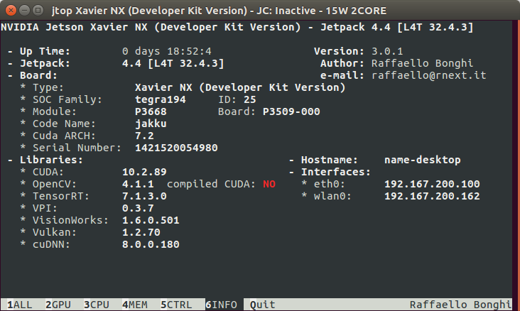
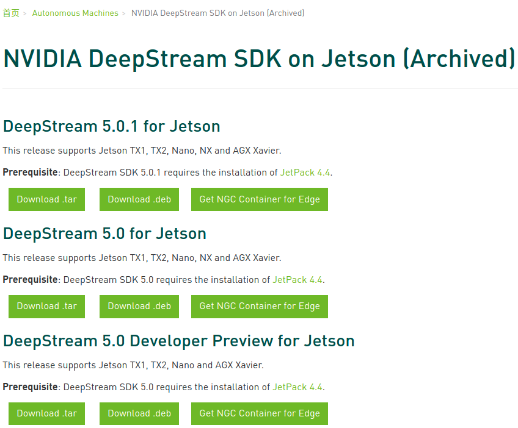
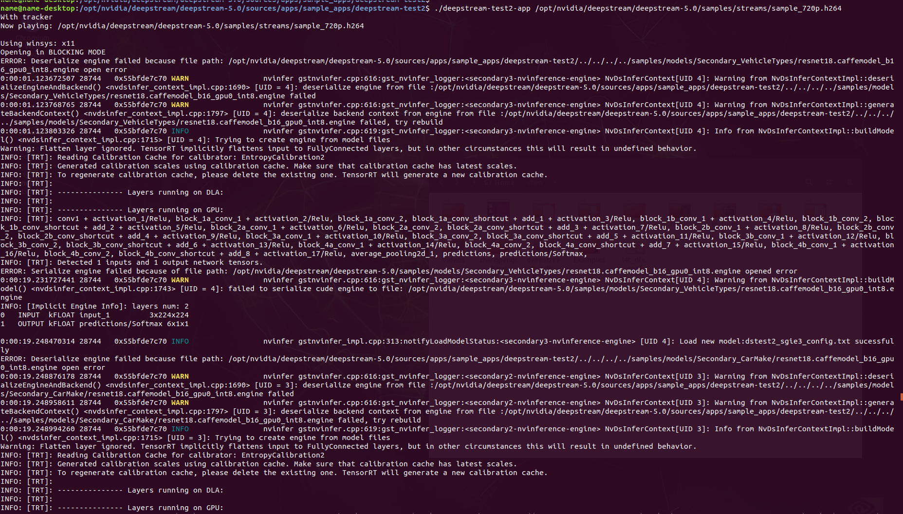
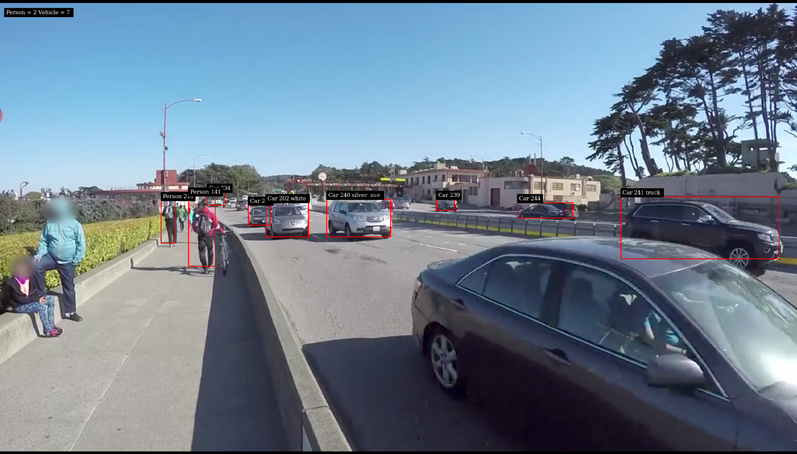
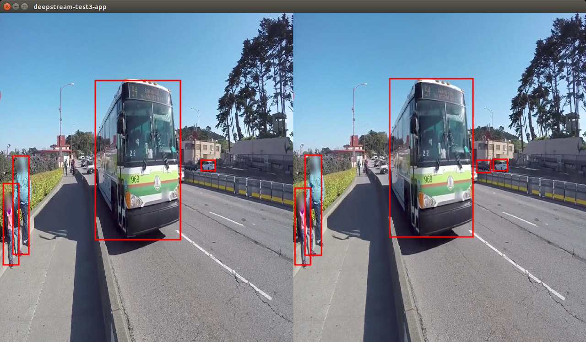

[TOC]

# Jetson 部署 Deep stream

## 环境准备

### **查看Jetson信息**

```shell
# sudo pip3 install jetson-stats
$ jtop
```



### **Jetson Setup**

如果是 Jetson Nano 或者 Jetson Xavier NX developer kit, 从[JetPack SDK](https://developer.nvidia.com/embedded/jetpack)下载 SD card image，这其中包含了 CUDA, TensorRT and cuDNN.

### **命令行工具nvpmodel**

```shell
$ sudo nvpmodel --query
NV Fan Mode:cool
NV Power Mode: MODE_15W_2CORE
0

# 切换到模式2
$ sudo nvpmodel -m 2
# 最大化Xavier性能
$ sudo jetson_clocks
# 显示当前设置：
$ sudo jetson_clocks --show
# 恢复以前的设置
$ sudo jetson_clocks --restore
```

### **查看操作系统信息**

```shell
# Linux查看版本当前操作系统 内核信息
$ uname --a
Linux name-desktop 4.9.140-tegra #1 SMP PREEMPT Thu Jun 25 21:22:12 PDT 2020 aarch64 aarch64 aarch64 GNU/Linux

# Linux查看当前操作系统 版本信息
$ cat /proc/version
Linux version 4.9.140-tegra (buildbrain@mobile-u64-3357) (gcc version 7.3.1 20180425 [linaro-7.3-2018.05 revision d29120a424ecfbc167ef90065c0eeb7f91977701] (Linaro GCC 7.3-2018.05) ) #1 SMP PREEMPT Thu Jun 25 21:22:12 PDT 2020

# Linux查看版本当前操作系统 发行版信息
$ cat /etc/issue
Ubuntu 18.04.5 LTS \n \l

# 查看cpu的信息
$ cat /proc/cpuinfo
processor	: 0
model name	: ARMv8 Processor rev 0 (v8l)
BogoMIPS	: 62.50
Features	: fp asimd evtstrm aes pmull sha1 sha2 crc32 atomics fphp asimdhp
CPU implementer	: 0x4e
CPU architecture: 8
CPU variant	: 0x0
CPU part	: 0x004
CPU revision	: 0
MTS version	: 50168445
	…
	…
	…
processor	: 5
model name	: ARMv8 Processor rev 0 (v8l)
BogoMIPS	: 62.50
Features	: fp asimd evtstrm aes pmull sha1 sha2 crc32 atomics fphp asimdhp
CPU implementer	: 0x4e
CPU architecture: 8
CPU variant	: 0x0
CPU part	: 0x004
CPU revision	: 0
MTS version	: 50168445
```

### DeepStream Setup

1. [NVIDIA DeepStream SDK](https://developer.nvidia.com/deepstream-sdk)官网下载 `deepstream_sdk_v5.0.1_jetson.tbz2`

2. 命令行执行以下命令

   ```shell
   $ sudo tar -xvf deepstream_sdk_v5.0.1_jetson.tbz2 -C /
   $ cd /opt/nvidia/deepstream/deepstream-5.0
   $ sudo ./install.sh
   $ sudo ldconfig
   ```



### Run deepstream-app

1. 导航到示例目录(samples)。

2. 输入以下命令以运行参考应用程序：

   ```shell
   $ deepstream-app -c <path_to_config_file>
   ```

   `<path_to_config_file>`可以在`configs/deepstream-app/`中找到

3. 在源文件目录中找到源码，编译并运行demo

   ```shell
   # 源文件目录（deepstream-test1）
   # 都需要make编译，具体请参阅其中的README文档
   $ cd /opt/nvidia/deepstream/deepstream-5.0/sources/apps/sample_apps/deepstream-test1
   $ ls
   deepstream_test1_app.c  dstest1_pgie_config.txt  Makefile  README
   $ make
   $ ls
   deepstream-test1-app    deepstream_test1_app.o   Makefile
   deepstream_test1_app.c  dstest1_pgie_config.txt  README
   # 运行deepstream-test1-app
   $ ./deepstream-test1-app /opt/nvidia/deepstream/deepstream-5.0/samples/streams/sample_720p.h264
   ```
   
   

   | Reference test application |   Path inside sources directory   | Description                                                  |
| :------------------------: | :-------------------------------: | ------------------------------------------------------------ |
   | Sample test application 1  | apps/sample_apps/deepstream-test1 | Sample of how to use DeepStream elements for a single H.264 stream: filesrc → decode → nvstreammuH264 containerized streamx → nvinfer (primary detector) → nvdsosd → renderer. |
   | Sample test application 2  | apps/sample_apps/deepstream-test2 | Sample of how to use DeepStream elements for a single H.264 stream: filesrc → decode → nvstreammux → nvinfer (primary detector) → nvtracker → nvinfer (secondary classifier) → nvdsosd → renderer. |
   | Sample test application 3  | apps/sample_apps/deepstream-test3 | Builds on deepstream-test1 (simple test application 1) to demonstrate how to:Use multiple sources in the pipelineUse a uridecodebin to accept any type of input (e.g. RTSP/File), any GStreamer supported container format, and any codecConfigure Gst-nvstreammux to generate a batch of frames and infer on it for better resource utilizationExtract the stream metadata, which contains useful information about the frames in the batched buffer |
   | Sample test application 4  | apps/sample_apps/deepstream-test4 | Builds on deepstream-test1 for a single H.264 stream: filesrc, decode, nvstreammux, nvinfer, nvdsosd, renderer to demonstrate how to:Use the Gst-nvmsgconv and Gst-nvmsgbroker plugins in the pipelineCreate NVDS_META_EVENT_MSG type metadata and attach it to the bufferUse NVDS_META_EVENT_MSG for different types of objects, e.g. vehicle and personImplement “copy” and “free” functions for use if metadata is extended through the extMsg field |
   | Sample test application 5  | apps/sample_apps/deepstream-test5 | Builds on top of deepstream-app. Demonstrates:Use of Gst-nvmsgconv and Gst-nvmsgbroker plugins in the pipeline for multistreamHow to configure Gst-nvmsgbroker plugin from the config file as a sink plugin (for KAFKA, Azure, etc.)How to handle the RTCP sender reports from RTSP servers or cameras and translate the Gst Buffer PTS to a UTC timestamp.For more details refer the RTCP Sender Report callback function `test5_rtcp_sender_report_callback()` registration and usage in `deepstream_test5_app_main.c`. GStreamer callback registration with rtpmanager element’s “handle-sync” signal is documented in `apps-common/src/deepstream_source_bin.c`. |
   
   

   

```shell
|-- opt
    |-- nvidia
        |-- deepstream
            |-- deepstream
            |-- deepstream-5.0
                |-- bin
                |-- doc
                |-- lib
                |-- samples
                |   |-- configs
                |   |   |-- deepstream-app
                |   |   |   |-- config_infer_primary.txt				#将nvinfer配置为主要检测器
                |   |   |   |-- config_infer_primary_nano.txt
                |   |   |   |-- config_infer_secondary_carcolor.txt		#将nvinfer配置为辅助分类器
                |   |   |   |-- config_infer_secondary_carmake.txt
                |   |   |   |-- config_infer_secondary_vehicletypes.txt
                |   |   |   |-- iou_config.txt							#配置一个低级的IOU跟踪器。
                |   |   |   |-- source12_1080p_dec_infer-resnet_tracker_tiled_display_fp16_tx2.txt
                |   |   |   |-- source1_csi_dec_infer_resnet_int8.txt   #演示一个CSI摄像机作为输入；仅适用于Jetson
                |   |   |   |-- source1_usb_dec_infer_resnet_int8.txt	#演示一个USB摄像机作为输入
                |   |   |   |-- source2_csi_usb_dec_infer_resnet_int8.txt
                                #演示30个具有主要推理功能的流解码（仅适用于dGPU和Jetson AGX Xavier平台）
                |   |   |   |-- source30_1080p_dec_infer-resnet_tiled_display_int8.txt 
                				#演示具有主要推理，对象跟踪和三个不同辅助分类器的四个流解码（仅适用于dGPU和Jetson AGX Xavier平台）
                |   |   |   |-- source4_1080p_dec_infer-resnet_tracker_sgie_tiled_display_int8.txt
                |   |   |   |-- source6_csi_dec_infer_resnet_int8.txt
                |   |   |   |-- source8_1080p_dec_infer-resnet_tracker_tiled_display_fp16_nano.txt
                |   |   |   |-- source8_1080p_dec_infer-resnet_tracker_tiled_display_fp16_tx1.txt
                |   |   |   |-- tracker_config.yml						#配置NvDCF跟踪器
                |   |   |-- deepstream-app-trtis
                |   |   |-- tlt_pretrained_models
                |   |-- models
                |   |-- streams
                |   |   |-- sample_1080p_h264.mp4	#H264 containerized stream
                |   |   |-- sample_1080p_h265.mp4	#H265 containerized stream
                |   |   |-- sample_720p.h264		#H264 elementary stream
                |   |   |-- sample_720p.jpg			#JPEG image
                |   |   |-- sample_720p.mjpeg		#MJPEG stream
                |   |   |-- sample_720p.mp4
                |   |   |-- sample_cam6.mp4			#H264 containerized stream(360D camera stream)
                |   |   |-- sample_industrial.jpg	
                |   |   |-- sample_qHD.h264
                |   |   |-- sample_qHD.mp4
                |   |   |-- yoga.jpg				
                |   |   |-- yoga.mp4
                |   |-- trtis_model_repo
                |-- sources
                    |-- apps
                    |   |-- apps-common
                    |   |   |-- includes
                    |   |-- sample_apps
                    |       |-- deepstream-app#端到端示例演示了4级联神经网络(1个一级检测器和3个二级分类器)的多相机流，并显示平铺输出。
                    |       |   |-- Makefile
                    |       |   |-- README
                    |       |   |-- deepstream_app.c
                    |       |   |-- deepstream_app.h
                    |       |   |-- deepstream_app_config_parser.c
                    |       |   |-- deepstream_app_main.c
                    |       |-- deepstream-test1#对单一H264视频流，应用filesrc→decode→nvstreammuH264 containerized streamx→nvinfer(主检测器)→nvdsosd→renderer
                    |       |   |-- Makefile
                    |       |   |-- README
                 Builds on deepstream-test1 (simple test application 1) to demonstrate how to:Use multiple sources in the pipelineUse a uridecodebin to accept any type of input (e.g. RTSP/File), any GStreamer supported container format, and any codecConfigure Gst-nvstreammux to generate a batch of frames and infer on it for better resource utilizationExtract the stream metadata, which contains useful information about the frames in the batched buffer   |       |   |-- deepstream-test1-app
                    |       |   |-- deepstream_test1_app.c
                    |       |   |-- deepstream_test1_app.o
                    |       |   |-- dstest1_pgie_config.txt
                    |       |-- deepstream-test2#建立在test1之上，显示额外的属性，如跟踪和二级分类属性。
                    |       |   |-- Makefile
                    |       |   |-- README
                    |       |   |-- deepstream_test2_app.c
                    |       |   |-- dstest2_pgie_config.txt
                    |       |   |-- dstest2_sgie1_config.txt
                    |       |   |-- dstest2_sgie2_config.txt
                    |       |   |-- dstest2_sgie3_config.txt
                    |       |   |-- dstest2_tracker_config.txt
                    |       |   |-- tracker_config.yml
                    |       |-- deepstream-test3#建立在test1的基础上，显示多个输入源和批处理使用nvstreammuxer。
                    |       |   |-- Makefile
                    |       |   |-- README
                    |       |   |-- deepstream_test3_app.c
                    |       |   |-- dstest3_pgie_config.txt
                    |       |-nfer_primary.txt
                |   |   |   |-- config_infer_primary_nano.txt
                |   |   |   |-- config_infer_secondary_carcolor.txt
                |   |   |   |-- config_infer_secondary_carmake.txt
                |   |   |   |-- config_infer_secondary_vehicletypes.txt
                |   |   |   |-- iou_config.txt
                |   |   |   |-- source12_1080p_dec_infer-resnet_tracker_tiled_display_fp16_tx2.txt
                |   |   |   |-- source1_csi_dec_infer_resnet_int8.txt
                |   |   |   |-- source1_usb_dec_infer_resnet_int8.txt
                |   |   |   |-- source2_cs- deepstream-test4
                    |       |   |-- Makefile
                    |       |   |-- README
                    |       |   |-- cfg_amqp.txt
                    |       |   |-- cfg_azure.txt
                    |       |   |-- cfg_kafka.txt
                    |       |   |-- deepstream_test4_app.c
                    |       |   |-- dstest4_msgconv_config.txt
                    |       |   |-- dstest4_pgie_config.txt
                    |       |-- deepstream-test5
                    |       |   |-- Makefile
                    |       |   |-- README
                    |       |   |-- deepstream_test5_app.h
                    |       |   |-- deepstream_test5_app_main.c
                    |       |   |-- deepstream_utc.c
                    |       |   |-- configs
                    |       |       |-- dstest5_msgconv_sample_config.txt
                    |       |       |-- test5_config_file_src_infer.txt
                    |       |       |-- test5_config_file_src_infer_azure_iotedge.txt
                    |       |       |-- test5_config_file_src_infer_tiler_demux.txt
                    |       |       |-- test5_config_file_src_infer_tracker_sgie.txt
                    |       |       |-- test5_dec_infer-resnet_tracker_sgie_tiled_display_int8.txt
                    |       |       |-- test5_ota_override_config.txt
                    |-- gst-plugins
                    |-- includes
                    |-- libs
                    |-- objectDetector_FasterRCNN
                    |-- objectDetector_SSD
                    |-- objectDetector_Yolo
                    |-- tools
```

日志信息：


结果显示：






## 参考

[NVIDIA DeepStream SDK开发指南](https://docs.nvidia.com/metropolis/deepstream/dev-guide/index.html)

[NVIDIA DeepStream插件手册](https://docs.nvidia.com/metropolis/deepstream/plugin-manual/index.html)

[NVIDIA DeepStream SDK API参考文档](https://docs.nvidia.com/metropolis/deepstream/dev-guide/)