[TOC]

# Installing  GStreamer 

## Installing on Linux

**系统：Ubuntu 16.04**

参照[官方文档](https://gstreamer.freedesktop.org/documentation/installing/on-linux.html?gi-language=c)，运行以下命令，但是在我的笔记本和公司的台式机上似乎不太ok...

```
apt-get install libgstreamer1.0-dev libgstreamer-plugins-base1.0-dev libgstreamer-plugins-bad1.0-dev gstreamer1.0-plugins-base gstreamer1.0-plugins-good gstreamer1.0-plugins-bad gstreamer1.0-plugins-ugly gstreamer1.0-libav gstreamer1.0-doc gstreamer1.0-tools gstreamer1.0-x gstreamer1.0-alsa gstreamer1.0-gl gstreamer1.0-gtk3 gstreamer1.0-qt5 gstreamer1.0-pulseaudio
```

[参考](https://samwhelp.github.io/note-ubuntu-18.04/read/howto/install-tool/gstreamer/)了一位湾湾网友，运行以下命令成功安装

```
sudo apt-get install libgstreamer1.0-0 gstreamer1.0-plugins-base gstreamer1.0-plugins-good gstreamer1.0-plugins-bad gstreamer1.0-plugins-ugly gstreamer1.0-libav gstreamer1.0-doc gstreamer1.0-tools
```

**Package**

- [libgstreamer1.0-0](https://packages.ubuntu.com/bionic/libgstreamer1.0-0)
- [gstreamer1.0-plugins-base](https://packages.ubuntu.com/bionic/gstreamer1.0-plugins-base)
- [gstreamer1.0-plugins-good](https://packages.ubuntu.com/bionic/gstreamer1.0-plugins-good)
- [gstreamer1.0-plugins-bad](https://packages.ubuntu.com/bionic/gstreamer1.0-plugins-bad)
- [gstreamer1.0-plugins-ugly](https://packages.ubuntu.com/bionic/gstreamer1.0-plugins-ugly)
- [gstreamer1.0-libav](https://packages.ubuntu.com/bionic/gstreamer1.0-libav)
- [gstreamer1.0-doc](https://packages.ubuntu.com/bionic/gstreamer1.0-doc)
- [gstreamer1.0-tools](https://packages.ubuntu.com/bionic/gstreamer1.0-tools)

**验证安装**

```
dpkg -l | grep gstreamer
```

**使用 GStreamer 构建应用程序**

为了编译 GStreamer 并使用 GStreamer 核心库的代码，需在`gcc`后添加以下命令

```
pkg-config --cflags --libs gstreamer-1.0
```

如果使用其他 GStreamer 库，例如视频库，则必须在上述 gstreamer-1.0 之后添加其他包（例如，视频库的 gstreamer-video-1.0）

**获取tutorial's source code**

可以使用以下命令git到本地，可以在文件目录`gst/examples/tutorials`中找到例程

```
git clone https://gitlab.freedesktop.org/gstreamer/gst-docs
```

**Building the tutorials**

```
gcc basic-tutorial-1.c -o basic-tutorial-1 `pkg-config --cflags --libs gstreamer-1.0`
```

**Running the tutorials**

```
./basic-tutorial-1
```

**运行结果**

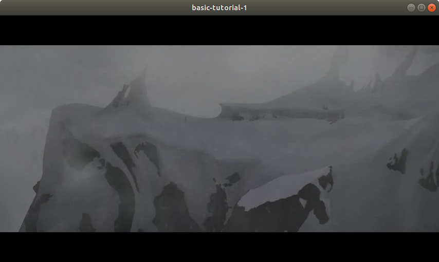

**nice**！


## Installing on Windows

首先参照[官方文档](https://gstreamer.freedesktop.org/documentation/installing/on-windows.html?gi-language=c)安装，真的蛮心累的，英文我都能看懂，但就是搞不定。记录一下GStreamer on Windows的崎岖之路。

**环境：Win 10 + VS2017**

**1. 下载GStreamer**

选择MSVC 64-bit(有mingw可选)

[gstreamer-1.0-msvc-x86_64-1.18.4.msi](https://gstreamer.freedesktop.org/data/pkg/windows/1.18.4/msvc/gstreamer-1.0-msvc-x86_64-1.18.4.msi)               先装

[gstreamer-1.0-devel-msvc-x86_64-1.18.4.msi](https://gstreamer.freedesktop.org/data/pkg/windows/1.18.4/msvc/gstreamer-1.0-devel-msvc-x86_64-1.18.4.msi)    后装

安装的时候都选择`Complete`完整安装，默认会安装在剩余空间最大的盘符

**2. 配置系统变量**

首先将`glibconfig.h`文件拷贝到`include/glib-2.0`以及`include/glib-2.0/glib`目录下

```
|-- lib
|   |-- glib-2.0
|   |    -- include
|   |        -- glibconfig.h 此文件拷贝到
```

```
|-- include
|     --glib-2.0 此目录下
|        -- glib 以及此目录下
```

添加用户变量

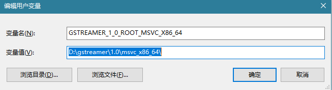

添加系统变量

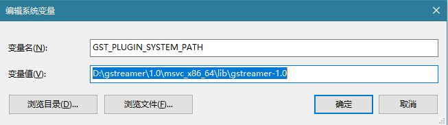

Path中添加路径

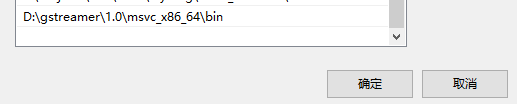

**3. 环境测试**

* 影像测试，打开cmd运行以下命令

  ```
  gst-launch-1.0 videotestsrc ! videoconvert ! autovideosink
  ```

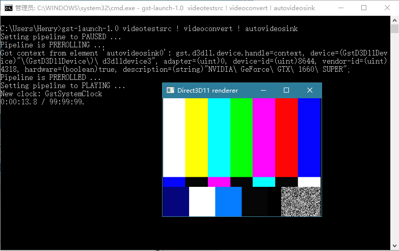

* 撞球测试，打开cmd运行以下命令

  ```
  gst-launch-1.0 -v videotestsrc pattern=ball ! video/x-raw,width=320,height=240 ! videoconvert ! tee ! autovideosink device=0
  ```

  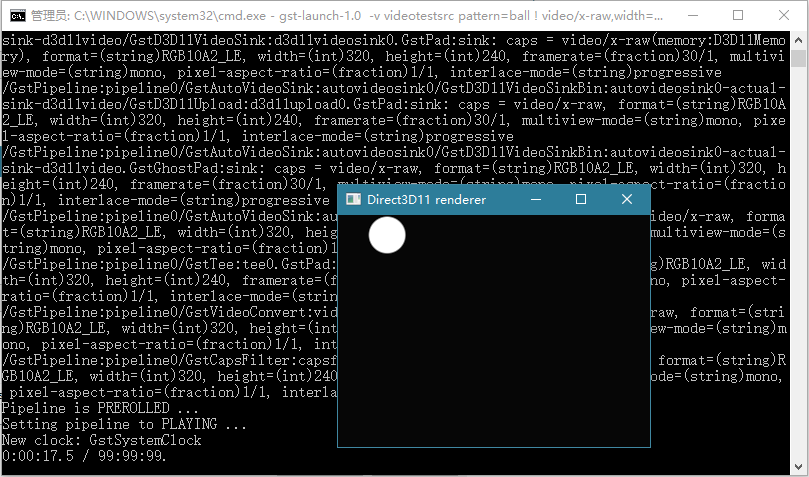

至此，GStreamer的MSCV环境ok，接下来在VS2017配置GStreamer

**4. VS2017配置GStreamer**

还是之前下载的[gst-docs](https://medium.com/r/?url=https://gitlab.freedesktop.org/gstreamer/gst-docs/)，用VS打开，双击`tutorials.sln`

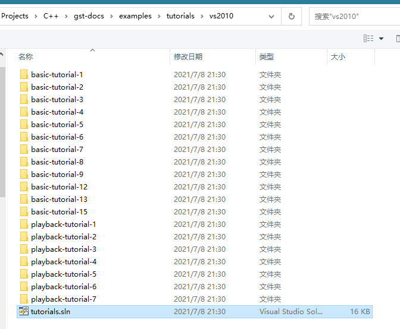

`tutorials`给的是`VS2010`的例程，当然要升级一下啦

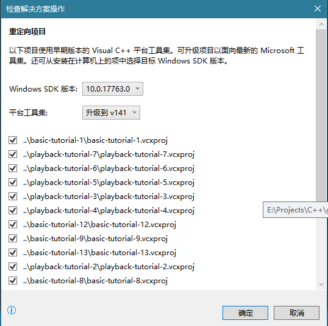

打开后是这样滴

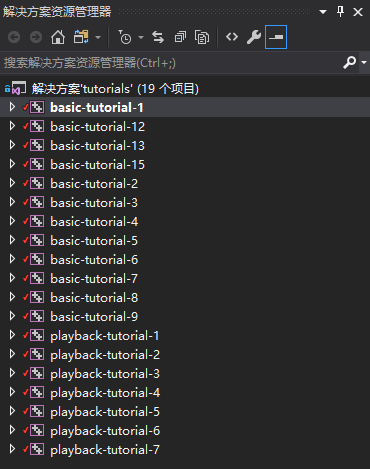

站起来活动一下，直直腰可以开始啦，一上来全是`Errors`，能运行才奇怪捏。。。

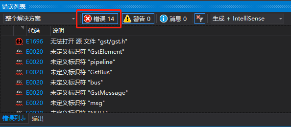

重点来了，第一次给`VS2017`配置第三方库

① 解决方案资源管理器里选择项目名，右键项目，选择属性

在配置属性------调试------工作目录 增加如下目录(选择活动(x64)平台哦，接下来都是)

```
D:\gstreamer\1.0\msvc_x86_64\bin
```

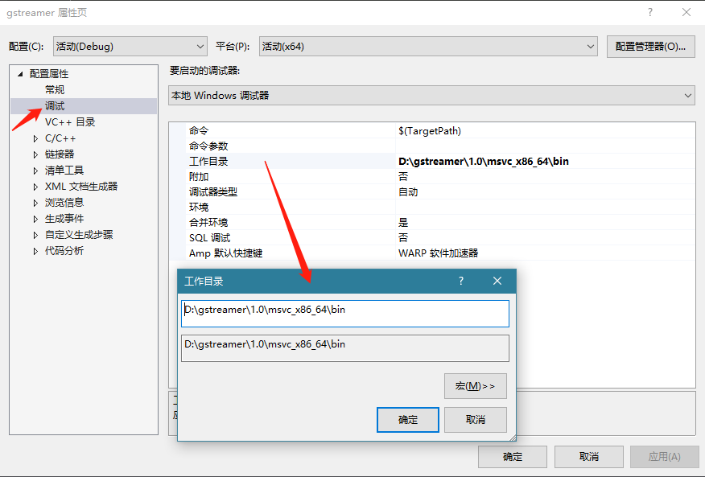

②在C/C++ ------ 常规------附加包含目录 增加如下目录
```
D:\gstreamer\1.0\msvc_x86_64\include\gstreamer-1.0
D:\gstreamer\1.0\msvc_x86_64\include\glib-2.0
D:\gstreamer\1.0\msvc_x86_64\include\libxml2
D:\gstreamer\1.0\msvc_x86_64\include
D:\gstreamer\1.0\msvc_x86_64\lib\glib-2.0\include
```

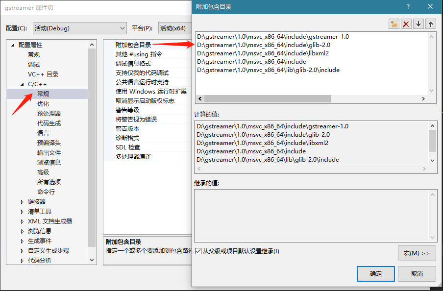

③在链接器----常规----附加库目录，增加 如下目录

```
D:\gstreamer\1.0\msvc_x86_64\lib
```

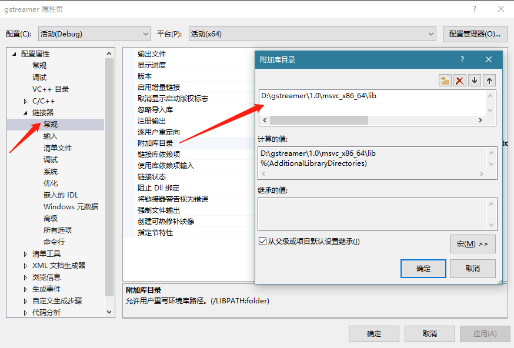

④在链接器----输入-----附加依赖性 增加

```
gobject-2.0.lib
glib-2.0.lib
gstreamer-1.0.lib
```

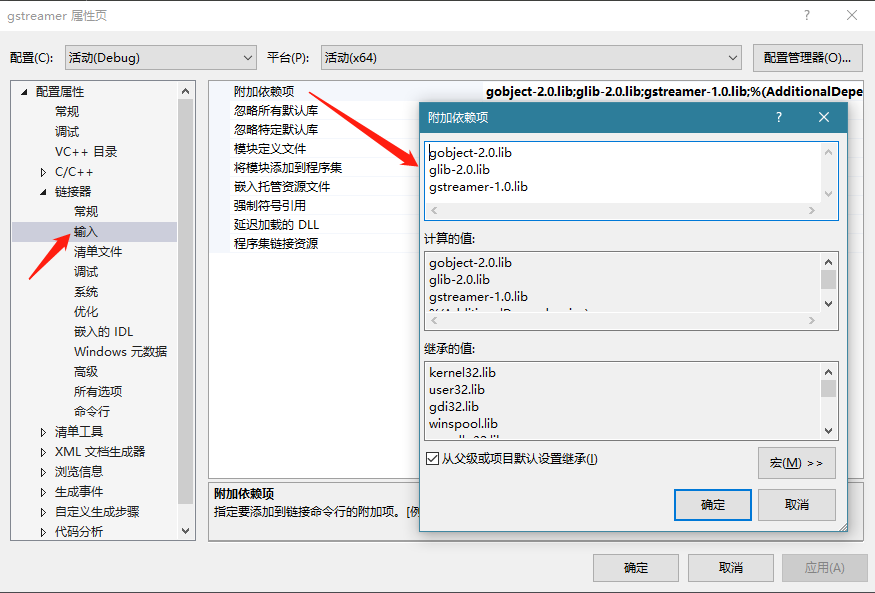

测试一下，运行一下`basic-tutorial-1.c`，没有报错了，撒花*★,°*:.☆(￣▽￣)/$:*.°★* 

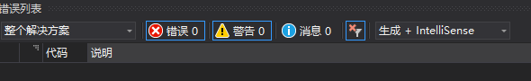

运行结果

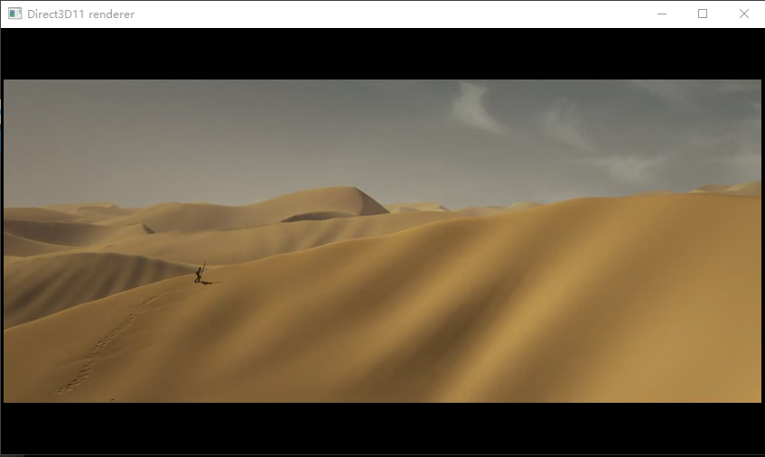

`basic-tutorial-1.c`的代码就先不解读啦，里面注释很清晰了

```c
#include <gst/gst.h>

int
main(int argc, char *argv[])
{
	GstElement *pipeline;
	GstBus *bus;
	GstMessage *msg;

	/* Initialize GStreamer */
	gst_init(&argc, &argv);

	/* Build the pipeline */
	pipeline =
		gst_parse_launch
		("playbin uri=https://www.freedesktop.org/software/gstreamer-sdk/data/media/sintel_trailer-480p.webm",
			NULL);

	/* Start playing */
	gst_element_set_state(pipeline, GST_STATE_PLAYING);

	/* Wait until error or EOS */
	bus = gst_element_get_bus(pipeline);
	msg =
		gst_bus_timed_pop_filtered(bus, GST_CLOCK_TIME_NONE,
			GST_MESSAGE_ERROR | GST_MESSAGE_EOS);

	/* Free resources */
	if (msg != NULL)
		gst_message_unref(msg);
	gst_object_unref(bus);
	gst_element_set_state(pipeline, GST_STATE_NULL);
	gst_object_unref(pipeline);
	return 0;
}
```

****

GStreamer on Windows的安装至此算是搞定了，还是有花蛮多精力的！No pains, no gains. 接下来还要学写GStreamer插件，能写好的再记录一下！


**参考**

https://gstreamer.freedesktop.org/data/pkg/windows/1.18.4/msvc/

https://gstreamer.freedesktop.org/documentation/installing/index.html?gi-language=c

https://www.cnblogs.com/0-lingdu/p/12718613.html

https://blog.csdn.net/kongxingxing/article/details/104270463

https://blog.csdn.net/fly_bear_unknown/article/details/113917633