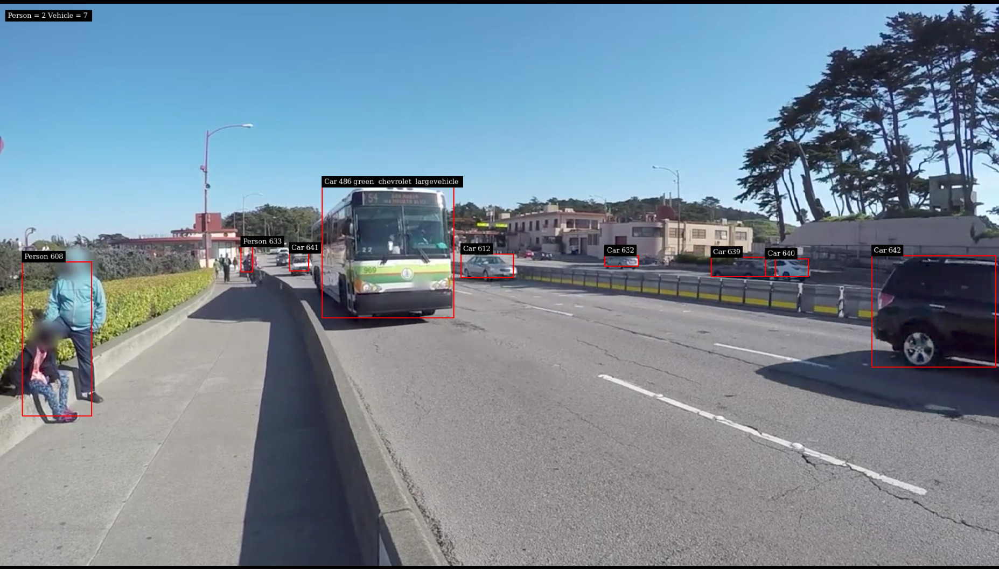
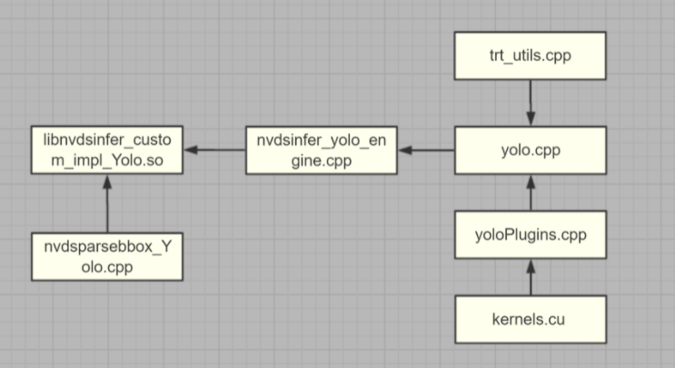
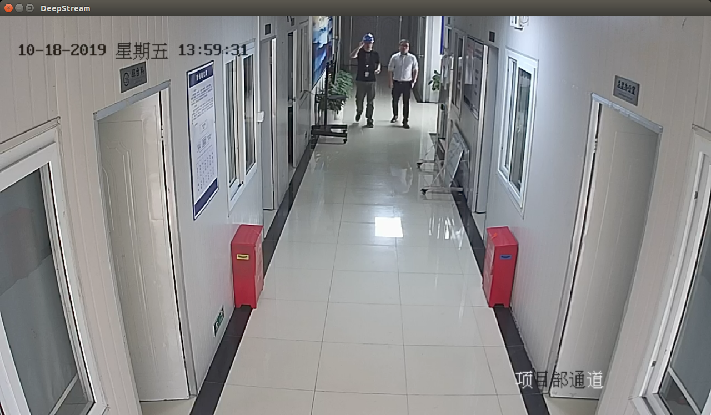
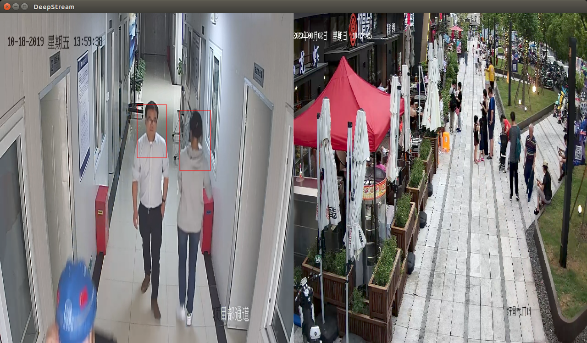

[TOC]

# Yolov3 检测安全帽

## 运行自带yolov3示例

### 环境和示例说明

**该示例是Deepstream-5.0在Jetson Xavier NX上运行，具体环境部署可以参见[这里](https://xuhuigeren.github.io/2021/07/02/week-1/).**

示例文件在`deepstram-5.0\sources\objectDetector_Yolo`目录下

```
 |-- objectDetector_Yolo
 |   |-- config_infer_primary_yoloV2.txt
 |   |-- config_infer_primary_yoloV2_tiny.txt
 |   |-- config_infer_primary_yoloV3.txt
 |   |-- config_infer_primary_yoloV3_tiny.txt
 |   |-- deepstream_app_config_yoloV2.txt
 |   |-- deepstream_app_config_yoloV2_tiny.txt
 |   |-- deepstream_app_config_yoloV3.txt
 |   |-- deepstream_app_config_yoloV3_tiny.txt
 |   |-- labels.txt
 |   |-- prebuild.sh
 |   |-- README
 |   |-- yolov3-calibration.table.trt7.0
 |   |-- nvdsinfer_custom_impl_Yolo             
 |       |-- Makefile
 |       |-- kernels.cu
 |       |-- nvdsinfer_yolo_engine.cpp
 |       |-- nvdsparsebbox_Yolo.cpp
 |       |-- trt_utils.cpp
 |       |-- trt_utils.h
 |       |-- yolo.cpp
 |       |-- yolo.h
 |       |-- yoloPlugins.cpp
 |       |-- yoloPlugins.h
```

**当然是先康康`README`，果然写的非常细致详尽，介绍了文件目录中每个文件的含义**

```
Sample contents:
- deepstream_app_config_yolo[V3,V3_tiny,V2,V2_tiny,tlt].txt - DeepStream reference
  app configuration file for using YoloV2/yoloV2-tiny/yolo/yolo-tiny/tlt model
  as the primary detector.
- config_infer_primary_yolo[V3,V3_tiny,V2,V2_tiny,tlt].txt - Configuration file for the GStreamer
  nvinfer plugin for the Yolo detector model.
- yolov3-calibration.table.trt7.0 - yoloV3 INT8 calibration binary on TensorRT 7.0+
- nvdsinfer_custom_impl_Yolo/nvdsinfer_yolo_engine.cpp -
  Implementation of 'NvDsInferCreateModelParser'/IModelParser for nvdsinfer to
  parse custom models. Alternatively, also contains implementation of
  'NvDsInferYoloCudaEngineGet' for nvdsinfer to directly create cuda engine.
  To use the 'NvDsInferYoloCudaEngineGet' interface, enable the macro
  USE_CUDA_ENGINE_GET_API in nvdsinfer_yolo_engine.cpp
- nvdsinfer_custom_impl_Yolo/nvdsparsebbox_Yolo.cpp - Output layer
  parsing function for detected objects for the Yolo model.
- nvdsinfer_custom_impl_Yolo/yoloPlugins.h -
  Declaration of YoloLayerV3 and YoloLayerV3PluginCreator.
- nvdsinfer_custom_impl_Yolo/yoloPlugins.cpp -
  Implementation of YoloLayerV3 and YoloLayerV3PluginCreator.
- nvdsinfer_custom_impl_Yolo/kernels.cu - Implementation of cuda kernels for
- nvdsinfer_custom_impl_Yolo/trt_utils.h - Utilities to setup tensorRT networks
- nvdsinfer_custom_impl_Yolo/trt_utils.cpp - Implementation of Utilities to setup
   tensorRT networks
- nvdsinfer_custom_impl_Yolo/yolo.h - Interface to create Yolo Cuda-Engine
- nvdsinfer_custom_impl_Yolo/yolo.cpp - Implementation to create Yolo Cuda-Engine
```

**下载权重和配置文件**

```
Pre-requisites:
- Download yolo config and weights files
  $ ./prebuild.sh         # 可以把脚本里的不需要的部分注释掉，提高下载速度。
- Set correct yolo config/weights file in config_infer_primary_yolo[...].txt.
    custom-network-config # path to yolo config
    model-file # path to yolo weights
- Enable INT8 precision detection if there is a calibration cache file, update
  config_infer_primary_yolo[...].txt.
    int8-calib-file=yolo[...]-calibration.table.trt5.1
- Other INT8 precision calibration table need to be calibrated by user.
- The yolo-tlt sample makes use of a few TensorRT OSS plugins. Download the
  TensorRT OSS repo (https://github.com/NVIDIA/TensorRT/) and checkout the
  'release/7.0' branch. Follow the instructions in the README to build the
  plugin library 'libnvinfer_plugin.so.7.0.0' corresponding to your dGPU/Jetson
  platform. This library needs to be used with LD_PRELOAD to let nvinfer plugin
  access the TRT OSS plugin layers.
- Set the path of the etlt model (tlt-encoded-model) and the tlt model key
  (tlt-model-key) in config_infer_primary_yolo_tlt.txt before running the sample.
```

**编译工程**

```
Compile the custom library:
  # Based on the API to use 'NvDsInferCreateModelParser' or 'NvDsInferCudaEngineGet'
  # set the macro USE_CUDA_ENGINE_GET_API to 0 or 1 in
  # nvdsinfer_custom_impl_Yolo/nvdsinfer_yolo_engine.cpp

  # Export correct CUDA version (e.g. 10.2, 10.1)
  $ export CUDA_VER=10.2
  $ make -C nvdsinfer_custom_impl_Yolo
  这时候会在nvdsinfer_custom_impl_Yolo文件夹里生成.so文件
```

**运行示例**

```
Run the sample:
The "nvinfer" config file config_infer_primary_yolo.txt specifies the path to
the custom library and the custom output parsing function through the properties
"custom-lib-path" and "parse-bbox-func-name" respectively.
The first-time a "model_b1_int8.engine" would be generated as the engine-file

- With deepstream-app
  $ deepstream-app -c deepstream_app_config_yoloV3.txt
  $ deepstream-app -c deepstream_app_config_yoloV3_tiny.txt
  $ deepstream-app -c deepstream_app_config_yoloV2.txt
  $ deepstream-app -c deepstream_app_config_yoloV2_tiny.txt
  $ LD_PRELOAD=<path-to-TRT-OSS-libnvinfer_plugin.so.7.0.0> deepstream-app -c deepstream_app_config_yolo_tlt.txt
```

**检测结果**




### 程序注释和理解

该程序分为两个部分：

* 一部分是`tensorRT`部分 就是`sources\objectDetector_Yolo`文件夹里的，编译后会生产动态库文件。也就是`libnvdsinfer_custom_impl_Yolo.so`

* 另一部分是`deepstream`的文件，在`sources\apps\sample_apps\deepstream-app`文件夹里。

首先说明下`tensorRT`几个文件的关系：

```
|-- kernels.cu						cuda核最底层的实现
|-- nvdsinfer_yolo_engine.cpp		根据网络类型创建引擎,生成tensorrt engine
|-- nvdsparsebbox_Yolo.cpp			yolo目标检测结果的输出,推理后的后处理部分
|-- trt_utils.cpp					建立tensorRT网络的部分
|-- trt_utils.h	
|-- yolo.cpp						创建引擎、创建网络等的具体实现
|-- yolo.h
|-- yoloPlugins.cpp					模型搭建的一些组件以及相应的实现
|-- yoloPlugins.h	
```



其中yolo.cpp实现了网络层的搭建，是核心代码部分,下面代码实现了卷积层的搭建：

```c
//如果是卷积层
else if (m_ConfigBlocks.at(i).at("type") == "convolutional") {
    //获取tensor的大小
    std::string inputVol = dimsToString(previous->getDimensions());
    nvinfer1::ILayer* out;
    std::string layerType;		//保存网络类型
    // check if batch_norm enabled
    if (m_ConfigBlocks.at(i).find("batch_normalize") !=
    m_ConfigBlocks.at(i).end()) {
    //有BN的卷积层
    out = netAddConvBNLeaky(i, m_ConfigBlocks.at(i), weights,
    m_TrtWeights, weightPtr, channels, previous, &network);
    layerType = "conv-bn-leaky";
    }
    else
    {
    out = netAddConvLinear(i, m_ConfigBlocks.at(i), weights,
    m_TrtWeights, weightPtr, channels, previous, &network);
    layerType = "conv-linear";
    }
    previous = out->getOutput(0);	//获取该层的输出
    assert(previous != nullptr);
    channels = getNumChannels(previous);
    //获取tensor的大小
    std::string outputVol = dimsToString(previous->getDimensions());
    //保存相应的层输出
    tensorOutputs.push_back(out->getOutput(0));
    //打印参数
    printLayerInfo(layerIndex, layerType, inputVol, outputVol, std::to_string(weightPtr));
```

下面说明一下deepstream部分代码：

```
|-- deepstream-app
|   |-- Makefile
|   |-- README
|   |-- deepstream_app.c					pipeline的一些操作在这里
|   |-- deepstream_app.h
|   |-- deepstream_app_config_parser.c	 	配置文件的解析
|   |-- deepstream_app_main.c			 	deepstream主函数

deepstream会调用动态库文件libnvdsinfer_custom_impl_Yolo.so实现网络层的搭建等功能
```


再来看下deepstream_app_main.c主函数部分的代码

```c
int
main (int argc, char *argv[])
{
  GOptionContext *ctx = NULL;
  GOptionGroup *group = NULL;
  GError *error = NULL;
  guint i;
  ctx = g_option_context_new ("Nvidia DeepStream Demo");
  group = g_option_group_new ("abc", NULL, NULL, NULL, NULL);
  g_option_group_add_entries (group, entries);  //把entries添加到group
  g_option_context_set_main_group (ctx, group); //group添加到ctx
  g_option_context_add_group (ctx, gst_init_get_option_group ());
  GST_DEBUG_CATEGORY_INIT (NVDS_APP, "NVDS_APP", 0, NULL);   
  // 解析命令行参数，识别已添加到上下文的选项
  if (!g_option_context_parse (ctx, &argc, &argv, &error)) {
    NVGSTDS_ERR_MSG_V ("%s", error->message);
    return -1;
  }
  if (print_version) {
    g_print ("deepstream-app version %d.%d.%d\n",
        NVDS_APP_VERSION_MAJOR, NVDS_APP_VERSION_MINOR, NVDS_APP_VERSION_MICRO);
    nvds_version_print ();
    return 0;
  }
  if (print_dependencies_version) {
    g_print ("deepstream-app version %d.%d.%d\n",
        NVDS_APP_VERSION_MAJOR, NVDS_APP_VERSION_MINOR, NVDS_APP_VERSION_MICRO);
    nvds_version_print ();
    nvds_dependencies_version_print ();
    return 0;
  }
  if (cfg_files) {	//一般执行这项
    num_instances = g_strv_length (cfg_files);
  }
  if (input_files) {
    num_input_files = g_strv_length (input_files);
  }
  if (!cfg_files || num_instances == 0) {
    NVGSTDS_ERR_MSG_V ("Specify config file with -c option");
    return_value = -1;
    goto done;
  }
  for (i = 0; i < num_instances; i++) {
    appCtx[i] = g_malloc0 (sizeof (AppCtx));
    appCtx[i]->person_class_id = -1;
    appCtx[i]->car_class_id = -1;
    appCtx[i]->index = i;
    appCtx[i]->active_source_index = -1;
    if (show_bbox_text) {
      appCtx[i]->show_bbox_text = TRUE;
    }
    if (input_files && input_files[i]) {
      appCtx[i]->config.multi_source_config[0].uri =
          g_strdup_printf ("file://%s", input_files[i]);
      g_free (input_files[i]);
    }
	// 解析配置文件内容，这是个重点函数
    if (!parse_config_file (&appCtx[i]->config, cfg_files[i])) {
      NVGSTDS_ERR_MSG_V ("Failed to parse config file '%s'", cfg_files[i]);
      appCtx[i]->return_value = -1;
      goto done;
    }
  }
  // 针对配置进行创建pipeline，这里是关键部分deepstream部分
  for (i = 0; i < num_instances; i++) {
    if (!create_pipeline (appCtx[i], NULL,
            all_bbox_generated, perf_cb, overlay_graphics)) {
      NVGSTDS_ERR_MSG_V ("Failed to create pipeline");
      return_value = -1;
      goto done;
    }
  }
  main_loop = g_main_loop_new (NULL, FALSE);
  _intr_setup ();
  g_timeout_add (400, check_for_interrupt, NULL);
  g_mutex_init (&disp_lock);
  // 这部分是显示相关的内容
  display = XOpenDisplay (NULL);
  for (i = 0; i < num_instances; i++) {
    guint j;

    if (gst_element_set_state (appCtx[i]->pipeline.pipeline,
            GST_STATE_PAUSED) == GST_STATE_CHANGE_FAILURE) {
      NVGSTDS_ERR_MSG_V ("Failed to set pipeline to PAUSED");
      return_value = -1;
      goto done;
    }
    if (!appCtx[i]->config.tiled_display_config.enable)
      continue;
    for (j = 0; j < appCtx[i]->config.num_sink_sub_bins; j++) {
      XTextProperty xproperty;
      gchar *title;
      guint width, height;
      XSizeHints hints = {0};
      if (!GST_IS_VIDEO_OVERLAY (appCtx[i]->pipeline.instance_bins[0].
              sink_bin.sub_bins[j].sink)) {
        continue;
      }
      if (!display) {
        NVGSTDS_ERR_MSG_V ("Could not open X Display");
        return_value = -1;
        goto done;
      }
	  // 显示设置
      if (appCtx[i]->config.sink_bin_sub_bin_config[j].render_config.width)
        width =
            appCtx[i]->config.sink_bin_sub_bin_config[j].render_config.width;
      else
        width = appCtx[i]->config.tiled_display_config.width;

      if (appCtx[i]->config.sink_bin_sub_bin_config[j].render_config.height)
        height =
            appCtx[i]->config.sink_bin_sub_bin_config[j].render_config.height;
      else
        height = appCtx[i]->config.tiled_display_config.height;
      width = (width) ? width : DEFAULT_X_WINDOW_WIDTH;
      height = (height) ? height : DEFAULT_X_WINDOW_HEIGHT;
      hints.flags = PPosition | PSize;
      hints.x = appCtx[i]->config.sink_bin_sub_bin_config[j].render_config.offset_x;
      hints.y = appCtx[i]->config.sink_bin_sub_bin_config[j].render_config.offset_y;
      hints.width = width;
      hints.height = height;
      windows[i] =
          XCreateSimpleWindow (display, RootWindow (display,
              DefaultScreen (display)), hints.x, hints.y, width, height, 2,
              0x00000000, 0x00000000);
      XSetNormalHints(display, windows[i], &hints);
      if (num_instances > 1)
        title = g_strdup_printf (APP_TITLE "-%d", i);
      else
        title = g_strdup (APP_TITLE);
      if (XStringListToTextProperty ((char **) &title, 1, &xproperty) != 0) {
        XSetWMName (display, windows[i], &xproperty);
        XFree (xproperty.value);
      }
      XSetWindowAttributes attr = { 0 };
      if ((appCtx[i]->config.tiled_display_config.enable &&
              appCtx[i]->config.tiled_display_config.rows *
              appCtx[i]->config.tiled_display_config.columns == 1) ||
          (appCtx[i]->config.tiled_display_config.enable == 0 &&
              appCtx[i]->config.num_source_sub_bins == 1)) {
        attr.event_mask = KeyPress;
      } else {
        attr.event_mask = ButtonPress | KeyRelease;
      }
      XChangeWindowAttributes (display, windows[i], CWEventMask, &attr);

      Atom wmDeleteMessage = XInternAtom (display, "WM_DELETE_WINDOW", False);
      if (wmDeleteMessage != None) {
        XSetWMProtocols (display, windows[i], &wmDeleteMessage, 1);
      }
      XMapRaised (display, windows[i]);
      XSync (display, 1);       //discard the events for now
      gst_video_overlay_set_window_handle (GST_VIDEO_OVERLAY (appCtx
              [i]->pipeline.instance_bins[0].sink_bin.sub_bins[j].sink),
          (gulong) windows[i]);
      gst_video_overlay_expose (GST_VIDEO_OVERLAY (appCtx[i]->
              pipeline.instance_bins[0].sink_bin.sub_bins[j].sink));
      if (!x_event_thread)
        x_event_thread = g_thread_new ("nvds-window-event-thread",
            nvds_x_event_thread, NULL);
    }
  }
  /* Dont try to set playing state if error is observed */ 
  // 发生错误的处理
  if (return_value != -1) {
    for (i = 0; i < num_instances; i++) {
      if (gst_element_set_state (appCtx[i]->pipeline.pipeline,
              GST_STATE_PLAYING) == GST_STATE_CHANGE_FAILURE) {

        g_print ("\ncan't set pipeline to playing state.\n");
        return_value = -1;
        goto done;
      }
    }
  }
  print_runtime_commands ();
  changemode (1);
  g_timeout_add (40, event_thread_func, NULL);
  g_main_loop_run (main_loop);
  changemode (0);
done:
  g_print ("Quitting\n");
  // 下面是释放资源
  for (i = 0; i < num_instances; i++) {
    if (appCtx[i]->return_value == -1)
      return_value = -1;
    destroy_pipeline (appCtx[i]);

    g_mutex_lock (&disp_lock);
    if (windows[i])
      XDestroyWindow (display, windows[i]);
    windows[i] = 0;
    g_mutex_unlock (&disp_lock);
    g_free (appCtx[i]);
  }
  g_mutex_lock (&disp_lock);
  if (display)
    XCloseDisplay (display);
  display = NULL;
  g_mutex_unlock (&disp_lock);
  g_mutex_clear (&disp_lock);
  if (main_loop) {
    g_main_loop_unref (main_loop);		//执行循环推理
  }
  if (ctx) {
    g_option_context_free (ctx);
  }
  if (return_value == 0) {
    g_print ("App run successful\n");
  } else {
    g_print ("App run failed\n");
  }
  gst_deinit ();
  return return_value;
}
```

然后是`deepstream_app_config_parser.c`解析配置文件的代码，

```c
gboolean
parse_config_file (NvDsConfig *config, gchar *cfg_file_path)
{
  GKeyFile *cfg_file = g_key_file_new ();
  GError *error = NULL;
  gboolean ret = FALSE;
  gchar **groups = NULL;
  gchar **group;
  guint i, j;

  config->source_list_enabled = FALSE;

  if (!APP_CFG_PARSER_CAT) {
    GST_DEBUG_CATEGORY_INIT (APP_CFG_PARSER_CAT, "NVDS_CFG_PARSER", 0, NULL);
  }

  if (!g_key_file_load_from_file (cfg_file, cfg_file_path, G_KEY_FILE_NONE,
          &error)) {
    GST_CAT_ERROR (APP_CFG_PARSER_CAT, "Failed to load uri file: %s",
        error->message);
    goto done;
  }

  if (g_key_file_has_group (cfg_file, CONFIG_GROUP_SOURCE_LIST)) {
    if (!parse_source_list (config, cfg_file, cfg_file_path)) {
      GST_CAT_ERROR (APP_CFG_PARSER_CAT, "Failed to parse '%s' group",
          CONFIG_GROUP_SOURCE_LIST);
      goto done;
    }
    config->num_source_sub_bins = config->total_num_sources;
    config->source_list_enabled = TRUE;
    if (!g_key_file_has_group (cfg_file, CONFIG_GROUP_SOURCE_ALL)) {
      NVGSTDS_ERR_MSG_V ("[source-attr-all] group not present.");
      ret = FALSE;
      goto done;
    }
    g_key_file_remove_group (cfg_file, CONFIG_GROUP_SOURCE_LIST, &error);
  }
  if (g_key_file_has_group (cfg_file, CONFIG_GROUP_SOURCE_ALL)) {
    if (!parse_source (&global_source_config,
            cfg_file, CONFIG_GROUP_SOURCE_ALL, cfg_file_path)) {
      GST_CAT_ERROR (APP_CFG_PARSER_CAT, "Failed to parse '%s' group",
          CONFIG_GROUP_SOURCE_LIST);
      goto done;
    }
    if (!set_source_all_configs (config, cfg_file_path)) {
      ret = FALSE;
      goto done;
    }
    g_key_file_remove_group (cfg_file, CONFIG_GROUP_SOURCE_ALL, &error);
  }
  // 信息存储在里cfg_file里面
  groups = g_key_file_get_groups (cfg_file, NULL);
  //这里对应的是8项  
  //group[0]=application
  //group[1]=tiled-display
  //group[2]=source0
  //group[3]=sink0
  //group[4]=osd
  //group[5]=streammux
  //group[6]=primary-gie
  //group[7]=tracker
  //group[8]=tests
  for (group = groups; *group; group++) {
    gboolean parse_err = FALSE;
    GST_CAT_DEBUG (APP_CFG_PARSER_CAT, "Parsing group: %s", *group);
    // application 
    if (!g_strcmp0 (*group, CONFIG_GROUP_APP)) {
      parse_err = !parse_app (config, cfg_file, cfg_file_path);
    }
	// source0  
    if (!strncmp (*group, CONFIG_GROUP_SOURCE,
            sizeof (CONFIG_GROUP_SOURCE) - 1)) {
      if (config->num_source_sub_bins == MAX_SOURCE_BINS) {
        NVGSTDS_ERR_MSG_V ("App supports max %d sources", MAX_SOURCE_BINS);
        ret = FALSE;
        goto done;
      }
      gchar *source_id_start_ptr = *group + strlen (CONFIG_GROUP_SOURCE);
      gchar *source_id_end_ptr = NULL;
      guint index =
          g_ascii_strtoull (source_id_start_ptr, &source_id_end_ptr, 10);
      if (source_id_start_ptr == source_id_end_ptr
          || *source_id_end_ptr != '\0') {
        NVGSTDS_ERR_MSG_V
            ("Source group \"[%s]\" is not in the form \"[source<%%d>]\"",
            *group);
        ret = FALSE;
        goto done;
      }
      guint source_id = 0;
      if (config->source_list_enabled) {
        if (index >= config->total_num_sources) {
          NVGSTDS_ERR_MSG_V
              ("Invalid source group index %d, index cannot exceed %d", index,
              config->total_num_sources);
          ret = FALSE;
          goto done;
        }
        source_id = index;
        NVGSTDS_INFO_MSG_V ("Some parameters to be overwritten for group [%s]",
            *group);
      } else {
        source_id = config->num_source_sub_bins;
      }
      parse_err = !parse_source (&config->multi_source_config[source_id],
          cfg_file, *group, cfg_file_path);
      if (config->source_list_enabled
          && config->multi_source_config[source_id].type ==
          NV_DS_SOURCE_URI_MULTIPLE) {
        NVGSTDS_ERR_MSG_V
            ("MultiURI support not available if [source-list] is provided");
        ret = FALSE;
        goto done;
      }
      if (config->multi_source_config[source_id].enable
          && !config->source_list_enabled) {
        config->num_source_sub_bins++;
      }
    }
    // streammux
    if (!g_strcmp0 (*group, CONFIG_GROUP_STREAMMUX)) {
      // 存储到config->streammux_config中
      parse_err = !parse_streammux (&config->streammux_config, cfg_file, cfg_file_path);
    }
	// osd
    if (!g_strcmp0 (*group, CONFIG_GROUP_OSD)) {
      parse_err = !parse_osd (&config->osd_config, cfg_file);
    }
	// primary_gie
    if (!g_strcmp0 (*group, CONFIG_GROUP_PRIMARY_GIE)) {
      parse_err =
          !parse_gie (&config->primary_gie_config, cfg_file,
          CONFIG_GROUP_PRIMARY_GIE, cfg_file_path);
    }

    if (!g_strcmp0 (*group, CONFIG_GROUP_TRACKER)) {
      parse_err = !parse_tracker (&config->tracker_config, cfg_file, cfg_file_path);
    }

    if (!strncmp (*group, CONFIG_GROUP_SECONDARY_GIE,
                  sizeof (CONFIG_GROUP_SECONDARY_GIE) - 1)) {
      if (config->num_secondary_gie_sub_bins == MAX_SECONDARY_GIE_BINS) {
        NVGSTDS_ERR_MSG_V ("App supports max %d secondary GIEs", MAX_SECONDARY_GIE_BINS);
        ret = FALSE;
        goto done;
      }
      parse_err =
          !parse_gie (&config->secondary_gie_sub_bin_config[config->
                                  num_secondary_gie_sub_bins],
                                  cfg_file, *group, cfg_file_path);
      if (config->secondary_gie_sub_bin_config[config->num_secondary_gie_sub_bins].enable){
        config->num_secondary_gie_sub_bins++;
      }
    }

    if (!strncmp (*group, CONFIG_GROUP_SINK, sizeof (CONFIG_GROUP_SINK) - 1)) {
      if (config->num_sink_sub_bins == MAX_SINK_BINS) {
        NVGSTDS_ERR_MSG_V ("App supports max %d sinks", MAX_SINK_BINS);
        ret = FALSE;
        goto done;
      }
      parse_err =
          !parse_sink (&config->
          sink_bin_sub_bin_config[config->num_sink_sub_bins], cfg_file, *group,
          cfg_file_path);
      if (config->
          sink_bin_sub_bin_config[config->num_sink_sub_bins].enable){
        config->num_sink_sub_bins++;
      }
    }

    if (!strncmp (*group, CONFIG_GROUP_MSG_CONSUMER,
        sizeof (CONFIG_GROUP_MSG_CONSUMER) - 1)) {
      if (config->num_message_consumers == MAX_MESSAGE_CONSUMERS) {
        NVGSTDS_ERR_MSG_V ("App supports max %d consumers", MAX_MESSAGE_CONSUMERS);
        ret = FALSE;
        goto done;
      }
      parse_err = !parse_msgconsumer (
                    &config->message_consumer_config[config->num_message_consumers],
                    cfg_file, *group, cfg_file_path);

      if (config->message_consumer_config[config->num_message_consumers].enable) {
        config->num_message_consumers++;
      }
    }
    // tiled-display
    if (!g_strcmp0 (*group, CONFIG_GROUP_TILED_DISPLAY)) {
      parse_err = !parse_tiled_display (&config->tiled_display_config, cfg_file);
    }
    
    if (!g_strcmp0 (*group, CONFIG_GROUP_IMG_SAVE)) {
      parse_err = !parse_image_save (&config->image_save_config , cfg_file, *group, cfg_file_path);
    }

    if (!g_strcmp0 (*group, CONFIG_GROUP_DSANALYTICS)) {
      parse_err = !parse_dsanalytics (&config->dsanalytics_config, cfg_file, cfg_file_path);
    }

    if (!g_strcmp0 (*group, CONFIG_GROUP_DSEXAMPLE)) {
      parse_err = !parse_dsexample (&config->dsexample_config, cfg_file);
    }

    if (!g_strcmp0 (*group, CONFIG_GROUP_MSG_CONVERTER)) {
      parse_err = !parse_msgconv (&config->msg_conv_config, cfg_file, *group, cfg_file_path);
    }
	// tests
    if (!g_strcmp0 (*group, CONFIG_GROUP_TESTS)) {
      parse_err = !parse_tests (config, cfg_file);
    }

    if (parse_err) {
      GST_CAT_ERROR (APP_CFG_PARSER_CAT, "Failed to parse '%s' group", *group);
      goto done;
    }
  }
  // 二级网络处理
  for (i = 0; i < config->num_secondary_gie_sub_bins; i++) {
    if (config->secondary_gie_sub_bin_config[i].unique_id ==
        config->primary_gie_config.unique_id) {
      NVGSTDS_ERR_MSG_V ("Non unique gie ids found");
      ret = FALSE;
      goto done;
    }
  }

  for (i = 0; i < config->num_secondary_gie_sub_bins; i++) {
    for (j = i + 1; j < config->num_secondary_gie_sub_bins; j++) {
      if (config->secondary_gie_sub_bin_config[i].unique_id ==
          config->secondary_gie_sub_bin_config[j].unique_id) {
        NVGSTDS_ERR_MSG_V ("Non unique gie id %d found",
                            config->secondary_gie_sub_bin_config[i].unique_id);
        ret = FALSE;
        goto done;
      }
    }
  }
  // 多输入源处理
  for (i = 0; i < config->num_source_sub_bins; i++) {
    if (config->multi_source_config[i].type == NV_DS_SOURCE_URI_MULTIPLE) {
      if (config->multi_source_config[i].num_sources < 1) {
        config->multi_source_config[i].num_sources = 1;
      }
      for (j = 1; j < config->multi_source_config[i].num_sources; j++) {
        if (config->num_source_sub_bins == MAX_SOURCE_BINS) {
          NVGSTDS_ERR_MSG_V ("App supports max %d sources", MAX_SOURCE_BINS);
          ret = FALSE;
          goto done;
        }
        memcpy (&config->multi_source_config[config->num_source_sub_bins],
            &config->multi_source_config[i],
            sizeof (config->multi_source_config[i]));
        config->multi_source_config[config->num_source_sub_bins].type =
            NV_DS_SOURCE_URI;
        config->multi_source_config[config->num_source_sub_bins].uri =
            g_strdup_printf (config->multi_source_config[config->
                num_source_sub_bins].uri, j);
        config->num_source_sub_bins++;
      }
      config->multi_source_config[i].type = NV_DS_SOURCE_URI;
      config->multi_source_config[i].uri =
          g_strdup_printf (config->multi_source_config[i].uri, 0);
    }
  }
  ret = TRUE;

done:
  if (cfg_file) {
    g_key_file_free (cfg_file);
  }

  if (groups) {
    g_strfreev (groups);
  }

  if (error) {
    g_error_free (error);
  }
  if (!ret) {
    NVGSTDS_ERR_MSG_V ("%s failed", __func__);
  }
  return ret;
}
```

最后是建立`pipeline`的代码，建立`pipeline`是属于`deepstream`的部分，里面包含了`tensorRT`的调用。配置文件当中的`[primary-gie]`是对推理引擎的相关配置。修改配置文件可以对模型参数进行设置。


## 使用yolov3检测安全帽👷

### 数据准备

模型配置文件：`yolov3_half_helmet.cfg`
模型权重文件：`yolov3_half_helmet.weights`
模型类别：3  ， 0-正常头肩，1-保安头肩，2-安全帽头肩 见`helmet.names`
测试视频文件：`test_helmet_1.mp4`    ` test_personcount.mp4`


### 检测任务

①使用`deepstream`构建一个`pipeline`，检测`test_helmet_1.mp4`，输出画面中正常头肩画红框，保安头肩画蓝框，安全帽头肩画绿框
②测试安全帽检测 前处理，推理，后处理所用的时间
③使用`deepstream`构建多线程`pipeline`，使用安全帽检测模型同时检测2个视频文件

### 修改配置文件

对于自定义数据的检测，需根据自己检测的类别修改如下文件

修改`nvdsinfer_custom_impl_Yolo/nvdsparsebbox_Yolo.cpp`文件中检测类别

```
# 默认检测coco数据集80个类别，修改为你自己检测的类别
static const int NUM_CLASSES_YOLO = 3;
```

注意，修改完需要重新编译和运行生成链接的`.so`文件

修改`config_infer_primary_yoloV3.txt`文件，修改`cfg`和`weights`等文件，根据自己检测的类别设置`num-detected-classes`

```
[property]
gpu-id=0
net-scale-factor=0.0039215697906911373
#0=RGB, 1=BGR
model-color-format=0
#修改cfg文件
custom-network-config=yolov3_half_helmet_20200607.cfg
#修改weights文件
model-file=yolov3_half_helmet_20200607.weights
#model-engine-file=yolov3_b1_gpu0_int8.engine
#修改label文件
labelfile-path=helmet_names.txt
int8-calib-file=yolov3-calibration.table.trt7.0
## 0=FP32, 1=INT8, 2=FP16 mode
network-mode=1
#模型类别:3 0-正常头肩，1-保安头肩，2-安全帽头肩
num-detected-classes=3
gie-unique-id=1
network-type=0
is-classifier=0
## 0=Group Rectangles, 1=DBSCAN, 2=NMS, 3= DBSCAN+NMS Hybrid, 4 = None(No clustering)
cluster-mode=2
maintain-aspect-ratio=1
parse-bbox-func-name=NvDsInferParseCustomYoloV3
# 编译的动态库路径
custom-lib-path=nvdsinfer_custom_impl_Yolo/libnvdsinfer_custom_impl_Yolo.so
engine-create-func-name=NvDsInferYoloCudaEngineGet
#scaling-filter=0
#scaling-compute-hw=0

[class-attrs-all]	
nms-iou-threshold=0.3		# NMS的阈值
#threshold=0.7
pre-cluster-threshold=0.7   # 检测框的过滤阈值
```

修改`deepstream_app_config_yoloV3.txt`文件

```
[application]
enable-perf-measurement=1
perf-measurement-interval-sec=5
#gie-kitti-output-dir=streamscl

[tiled-display]
enable=1
rows=1
columns=1
width=1280
height=720
gpu-id=0
#(0): nvbuf-mem-default - Default memory allocated, specific to particular platform
#(1): nvbuf-mem-cuda-pinned - Allocate Pinned/Host cuda memory, applicable for Tesla
#(2): nvbuf-mem-cuda-device - Allocate Device cuda memory, applicable for Tesla
#(3): nvbuf-mem-cuda-unified - Allocate Unified cuda memory, applicable for Tesla
#(4): nvbuf-mem-surface-array - Allocate Surface Array memory, applicable for Jetson
nvbuf-memory-type=0

[source0]
enable=1
#Type - 1=CameraV4L2 2=URI 3=MultiURI
type=3
# 修改文件位置
uri=file://../../samples/streams/test_helmet_1.mp4
num-sources=1
gpu-id=0
# (0): memtype_device   - Memory type Device
# (1): memtype_pinned   - Memory type Host Pinned
# (2): memtype_unified  - Memory type Unified
cudadec-memtype=0

[sink0]
enable=1
#Type - 1=FakeSink 2=EglSink 3=File
type=2
sync=0
source-id=0
gpu-id=0
nvbuf-memory-type=0

[osd]
enable=1
gpu-id=0
border-width=1
text-size=15
text-color=1;1;1;1;
text-bg-color=0.3;0.3;0.3;1
font=Serif
show-clock=0
clock-x-offset=800
clock-y-offset=820
clock-text-size=12
clock-color=1;0;0;0
nvbuf-memory-type=0

[streammux]
gpu-id=0
##Boolean property to inform muxer that sources are live
live-source=0
batch-size=1
##time out in usec, to wait after the first buffer is available
##to push the batch even if the complete batch is not formed
batched-push-timeout=40000
## Set muxer output width and height
width=1920
height=1080
##Enable to maintain aspect ratio wrt source, and allow black borders, works
##along with width, height properties
enable-padding=0
nvbuf-memory-type=0

# config-file property is mandatory for any gie section.
# Other properties are optional and if set will override the properties set in
# the infer config file.
[primary-gie]
enable=1
gpu-id=0
#model-engine-file=model_b1_gpu0_int8.engine
# 修改标签文件
labelfile-path=helmet_names.txt
batch-size=1
#Required by the app for OSD, not a plugin property
bbox-border-color0=1;0;0;1
bbox-border-color1=0;1;1;1
bbox-border-color2=0;0;1;1
bbox-border-color3=0;1;0;1
interval=2
gie-unique-id=1
nvbuf-memory-type=0
# 修改config文件
config-file=config_infer_helmet_yoloV3.txt

[tracker]
enable=1
tracker-width=640
tracker-height=384
ll-lib-file=/opt/nvidia/deepstream/deepstream-5.0/lib/libnvds_mot_klt.so

[tests]
file-loop=0
```

如果要检测多个视频，只要在`deepstream_app_config_yoloV3.txt`文件中添加`source`和`sink`并且一一对应即可。

### 检测结果

安全帽检测



使用安全帽检测模型同时检测2个视频文件



第一次运行生成`engine`，这是最耗时的地方，`engine`只在第一次运行生成，然后可以把`config_infer_primary_yoloV3.txt`文件中配置打开，多次运行时不必再生成`engine`

```
# 当这项配置打开时，这样只会在第一次生成引擎，后续启动会很快。
model-engine-file=yolov3_b1_gpu0_int8.engine
```

## 测试时间

测试安全帽检测 前处理，推理，后处理所用的时间这部分还没有完成。。。

尽量尽快补充完成！