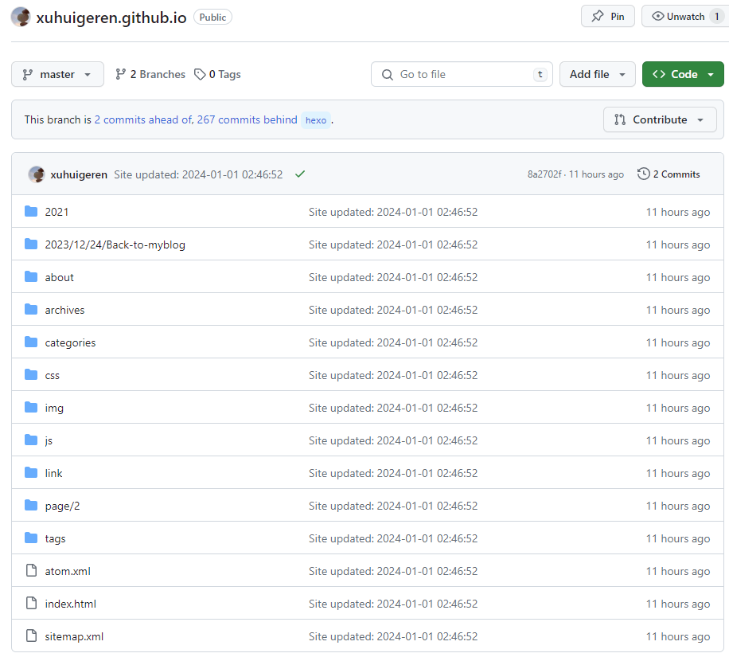
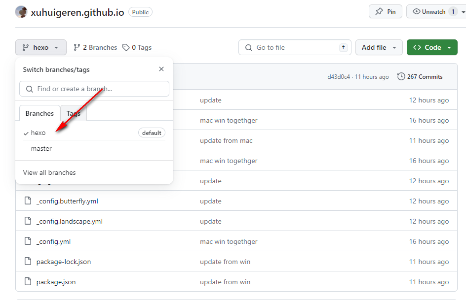
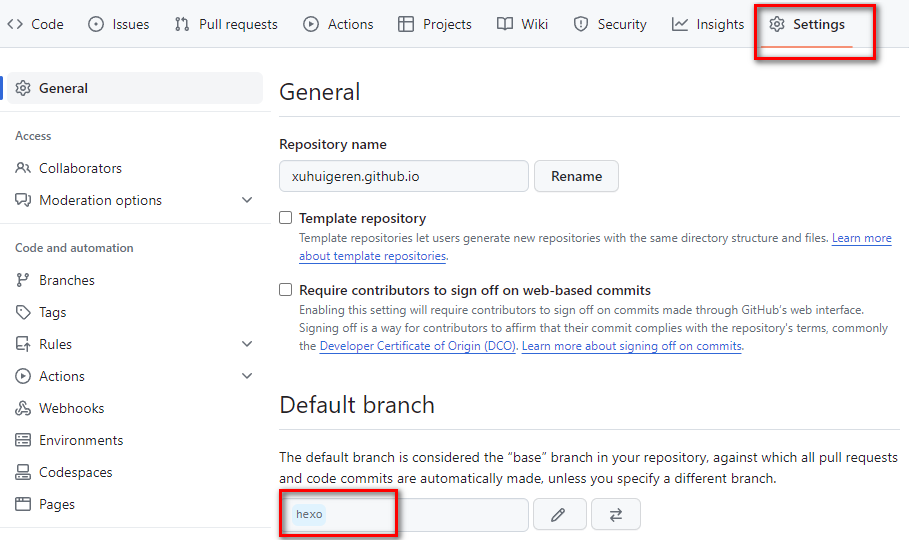
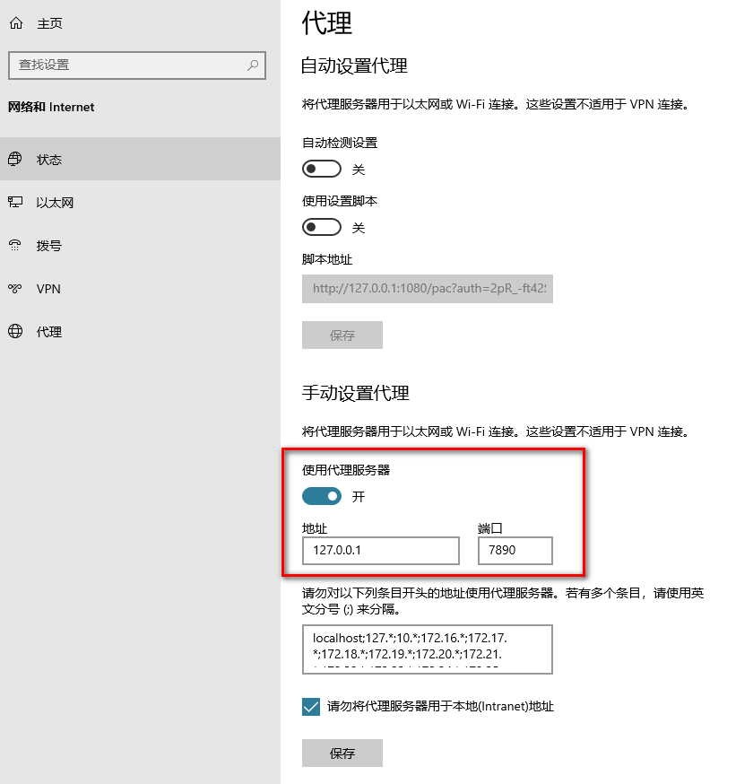

### 前言

我的blog是基于gitub pages和hexo搭建的静态博客，环境win10 + nodejs + git，本地编写md文件，然后部署到github转化为html托管于github，优点不用花钱买服务器。

如题，因为部署blog的老PC是台式机，想更新下blog还得坐到电脑前，总归有点不方便，现在想在Mac/Ubuntu上也能管理hexo博客。既然blog都托管在github，那git指定行啊。

### 新建一个git分支

原先hexo d生成的静态页面默认推到master分支上，提供博客页面供人访问，这是在_config.yml中配置的

```
deploy:
  type: git #冒号后面有空格
  repository: git@github.com:xuhuigeren/xuhuigeren.github.io.git  #ssh/https仓库地址
  branch: master
```



**新建一个分支<hexo>**，并且把hexo分支设为default分支，配置文件决定了hexo d每次推到master分支，master和hexo两个分支互相独立，hexo分支拉到本地，本地新增、删改时，git add，git commit、git push来更新源文件，然后执行hexo d更新静态页面，Mac/Ubuntu端同样本地维护hexo分支，为了保证同步，推荐先`git pull`合并更新在编辑博客。





**编辑hexo分支**

这部分是最重要的，临门一脚（Win侧操作，也就是在原PC上）

1. git仓库到本地（clone下来的是默认的hexo分支）

```
git clone git@github.com:username/username.github.io.git
```

2. 下载的文件夹里仅留下.git 文件夹，其他的文件都删除
3. 将原来hexo blog文件夹内除.deploy_git 以外都复制到git下来的文件夹

注意：如果已经git过主题文件，需要把theme主题文件夹里的 .git(隐藏文件) 也删除，因为git不能嵌套上传。

4. 将修改以后的文件夹推送到远程库

```
git add .
git commit –m “msg”
git push
```

此时已经成功将整个网站推送到了远程库的默认分支hexo

至此，网站部署至master分支，整个网站备份至hexo分支。当网站的配置或文章修改后都要先git操作推到hexo分支，再hexo d，最新改动也同步更新到master分支了，两个分支互不干扰！

### 在Mac上管理博客

* **配置环境**
>* 安装Node.js
>  * 版本最好与win一样
>  * node -v和npm -v查看
>* 安装Git
>* 安装hexo
>  * [hexo创建博客看这里](https://xuhuigeren.github.io/2021/02/14/hello-world/)
>
>* 配置github的SSH key
>  * cd ~/.ssh
>  * ssh-keygen -t rsa -C "邮件地址"
>  * github主页New SSH key复制进去
>  * ssh -T git@github.com 测试是否配置成功

* git hexo分支到本地

```
git clone git@github.com:username/username.github.io.git
```

* 在username.github.io文件夹下执行（不需要执行hexo init）

```
npm install hexo
npm install
npm install hexo-deployer-git
```

* 最后执行`hexo g`、`hexo s`、`hexo d`等命令即可提交成功


至此，其实任何一台电脑只要有nodejs和git环境，都可以完整复刻出一个hexo环境，你甚至可以把老电脑原有的hexo工程删掉再执行上面这几步一样可以快速构建hexo环境、


### 可能遇到的问题

* mac这边文件权限不足 errno -13
  * udo chown -R $USER /usr/xxx/xxx
  
* 26 vulnerabilities (3 low, 4 moderate, 12 high, 7 critical)
  * 如果是按以上步骤来操作的，可以不用管
  
* 科学上网会导致`ssh: connect to host github.com port 22: Connection timed out` 或者 `Failed to connect to github.com port 443: Timed out`
  * git 所设端口与系统代理不一致，需重新设置
```bash
git config --global http.proxy http://127.0.0.1:7890 
git config --global https.proxy http://127.0.0.1:7890
```
