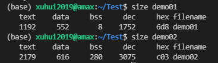
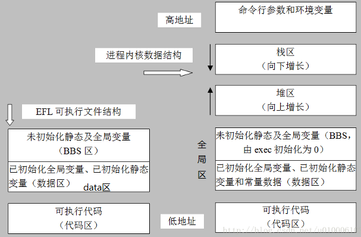
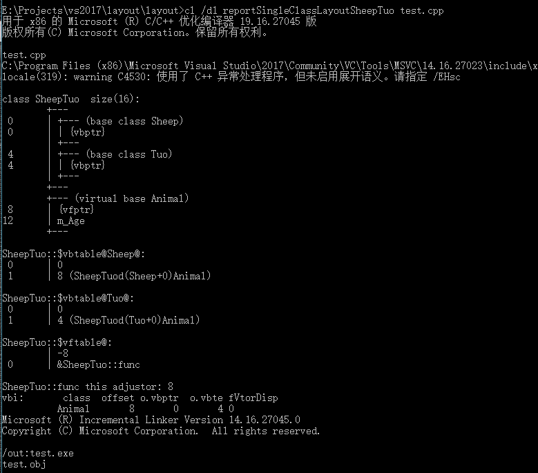
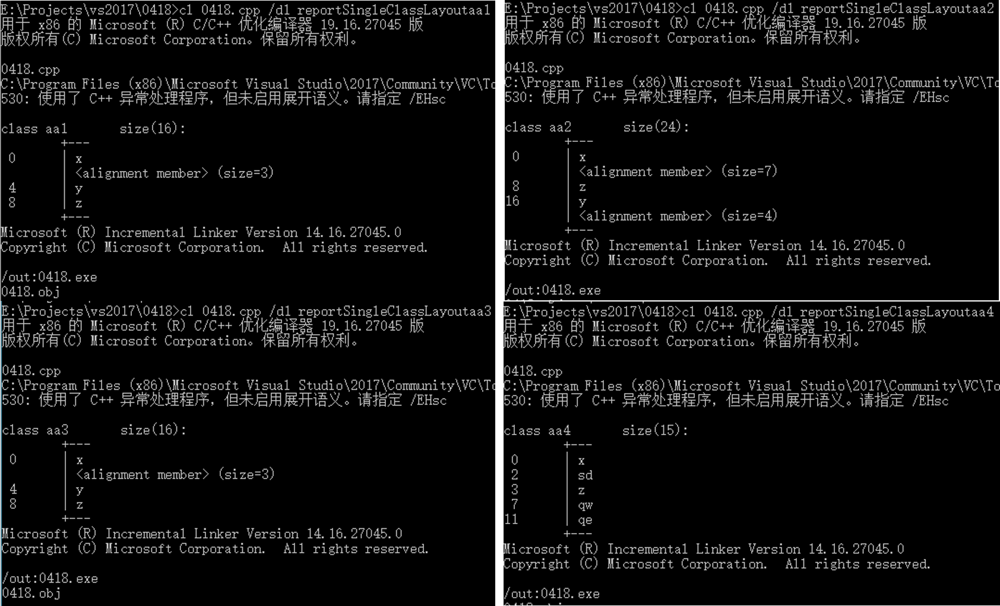
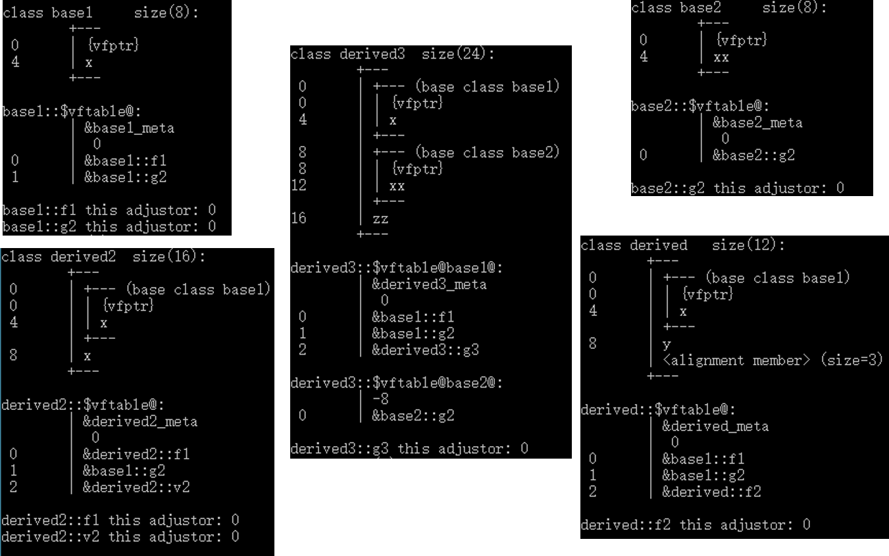
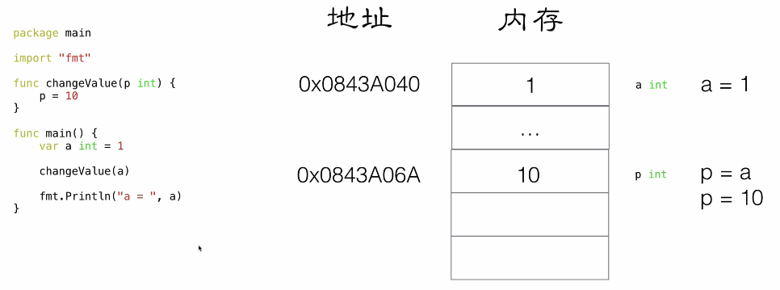
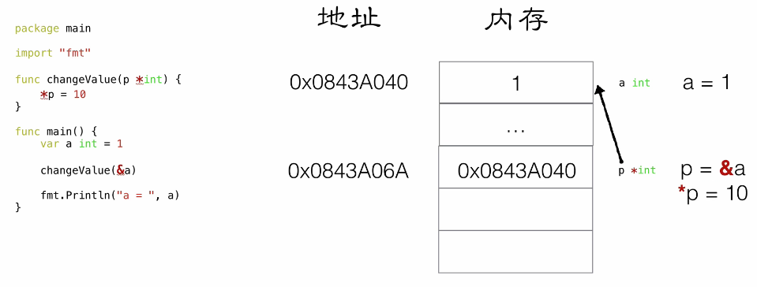
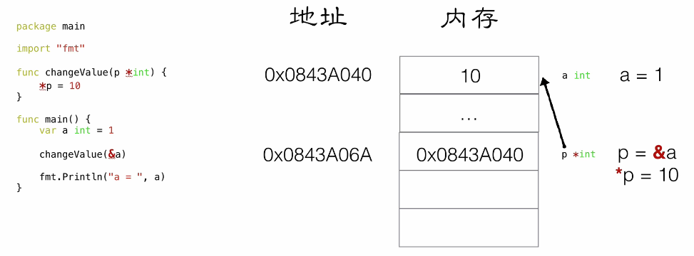

## C/C++内存分区模型

C/C++程序在执行时，将内存大方向划分为**4个区域**

- 代码区：存放函数体的二进制代码，由操作系统进行管理,只读
- 全局区：存放`全局变量和静态变量以及常量`，可读可写
- 堆区：由程序员分配和释放,若程序员不释放,程序结束时由操作系统回收,可读可写
- 栈区：由编译器自动分配释放, 存放`函数的参数值,局部变量`等，可读可写

**内存四区意义：**

不同区域存放的数据，赋予不同的生命周期, 给我们更大的灵活编程

**程序编译后**，win下生成exe可执行程序，Linux下生成ELF格式可执行文件，**未执行该程序前**分为两个区域

​	**代码区：**

​		存放 CPU 执行的机器指令

​		代码区是**共享**的，共享的目的是对于频繁被执行的程序，只需要在内存中有一份代码即可

​		代码区是**只读**的，使其只读的原因是防止程序意外地修改了它的指令

​	**全局区：**
​    由数据区data+未初始化区bss+常量区组成

* data区：存放的是已经初始化的全局变量、静态变量
- bss区：存放未初始化的全局变量和未初始化的静态变量，由exec初始化为0
- 常量区：存放字符串常量和const修饰的全局变量，只读

可执行程序的三段是指【text段、data段、bss段】






## 堆和栈的区别

栈是由编译器在程序运行时分配的空间，由操作系统维护.堆是由malloc()函数分配的内存块，内存的管理由程序员手动控制，在C语言使用free()函数完成.主要区别有一下几点：

- 管理方式不同
程序在运行时栈由操作系统自动管理，无须程序员手工控制；而堆空间的申请、释放工作由程序员控制，容易产生内存泄露.
- 空间大小不同
**栈是向低地址扩展**，是一块连续的内存区域.即栈顶的地址和栈的最大容量是系统预先规定好的，当申请的空间超过栈的剩余空间时，将出现栈溢出错误。**堆是向高地址扩展**，是不连续的内存区域.因为系统是用==链表==来存储空闲内存地址的，且链表的遍历方向是由低地址高地址.
- 产生碎片不同
对于堆来说，频繁的malloc/free势必会造成内存空间的不连续从而造成大量的碎片，使程序效率降低.对于栈来说，一定是连续的物理内存空间。它是有点类似于数据结构上的一个先进后出的栈，进出一一对应，不会产生碎片。
- 增长方式不同
在X86平台上，堆的增长方向是向上，即向着内存地址增加的方向；栈的增长方向是向下的，即向着内存地址减小的方向.
- 分配方式不同
堆都是程序中由malloc()函数动态申请分配并由free() 函数释放；栈的分配和释放是由操作系统完成的，栈的动态分配有alloca()函数完成，但是栈的动态分配和堆是不同的，其由编译器进行分配和释放，无须手工完成.
- 分配效率不同
栈是系统提供的，操作系统会在底层对栈提供支持：分配专门的寄存器存放栈的地址，压栈出栈都是专门的指令执行。堆则是C 函数库提供的，它的机制很复杂，例如为了分配一块内存，则需要操作系统重新整理内存，搜索整理内存空间，这样就有机会分到足够大小的内存，然后返回。显然，堆的效率比栈要低的多.

## static 关键字

- 用于修饰局部变量，使其具有静态存储期，即在函数调用结束后不会被销毁，而是保留上一次的值。这样可以实现一些特殊的功能，比如计数器，累加器等。
- 用于修饰全局变量或函数，使其具有文件作用域，即只能在定义它的源文件中被访问，而不能被其他文件访问。这样可以避免命名冲突，提高程序的模块化和封装性。
- 用于修饰类的数据成员或成员函数，使其属于整个类，而不是某个对象。这样可以实现类的共享数据和函数，节省内存空间，提高效率。

## 指针 数组 函数

```cpp
int *p[10]    //指针数组
int (*p)[10]  //数组指针
int *p(int)   //函数声明
int (*p)(int) //函数指针
    
int Func(int x);   /*声明一个函数*/
int (*p) (int x);  /*定义一个函数指针*/
p = Func;          /*将Func函数的首地址赋给指针变量p*/
```

- int *p[10]表示指针数组，强调数组概念，是一个数组变量，数组大小为10，数组内每个元素都是指向int类型的指针变量。
- int (*p)[10]表示数组指针，强调是指针，只有一个变量，是指针类型，不过指向的是一个int类型的数组，这个数组大小是10。
- int *p(int)是函数声明，函数名是p，参数是int类型的，返回值是int *类型的。
- int (*p)(int)是函数指针，强调是指针，该指针指向的函数具有int类型参数，并且返回值是int类型的。
- 如果在程序中定义了一个函数，那么在编译时系统就会为这个函数代码分配一段存储空间，这段存储空间的首地址称为这个函数的地址。而且函数名表示的就是这个地址。既然是地址我们就可以定义一个指针变量来存放，这个指针变量就叫作函数指针变量，简称函数指针。
- 最后需要注意的是，指向函数的指针变量没有 ++ 和 -- 运算。

## new/delete 与 malloc/free

**相同点**

- 都可用于内存的动态申请和释放

**不同点**

- 前者是C++运算符，支持重载overload，后者是C/C++语言标准库函数，支持覆盖override
- new自动计算要分配的空间大小，malloc需要手工计算
- new是封装了malloc，直接free不会报错，但是这只是释放内存，而不会析构对象
- new是类型安全的，malloc不是。因为 new 内置了**sizeof、类型转换和类型安全检查功能**。对于**非内部数据类型的对象而言，new 在创建动态对象的同时完成了初始化工作**：

```c
int *p = new float[2]; //编译错误
int *p = (int*)malloc(2 * sizeof(double));//编译无错误
//函数malloc 的原型
void * malloc(size_t size);
//用 malloc 申请一块长度为length 的整数类型的内存
int *p = (int *) malloc(length * sizeof(int));
//函数free 的原型
void free( void * memblock );
//new 创建对象数组，那么只能使用对象的无参数构造函数
Obj *objects = new Obj[100];       // 创建100 个动态对象
Obj *objects = new Obj[100](1);    // 创建100 个动态对象的同时赋初值1  错误❌
delete []objects; // 正确的用法
delete objects;   // 错误的用法
```

- new由两步构成：operator new 和 construct，operator new 对应于malloc，但 operator new可以重载，可以自定义内存分配策略；delete由deconstruct 和 operator new 构成，先析构对象，再释放内存。
- malloc仅仅分配内存空间，free仅仅回收空间，不具备调用构造函数和析构函数功能，用malloc分配空间存储类的对象存在风险；new和delete除了分配回收功能外，还会调用构造函数和析构函数。

* delete和delete[]区别：delete只会调用一次析构函数，delete[]会调用数组中每个元素的析构函数。

## public，protected，private

（1）三种访问权限

- public:用该关键字修饰变量和函数在类的内部外部都可以访问
- private:用该关键字修饰的元素只能在类内访问
- protected:用该关键字修饰的变量和函数只能在类的内部和其派生类中访问

（2）三种继承方式

- 若继承方式是public，基类成员在派生类中的访问权限保持不变
- 若继承方式是private，基类所有成员在派生类中的访问权限都会变为私有(private)权限；
- 若继承方式是protected，基类的公有成员和保护成员在派生类中的访问权限都会变为保护(protected)权限，私有成员在派生类中的访问权限仍然是私有(private)权限。

## 重载 重写/覆盖 隐藏




**使用 CL 编译器选项查看 C++ 类内存布局**

```shell
#VS开发人员命令提示符
>cl ***.cpp /d1 reportSingleClassLayout[classname]
```


```c++
#include <iostream>
using namespace std;
   
struct aa1{
    char x;
    int y;
    double z;
};
struct aa2{
    char x;
    double z;
    int y;};
struct aa3{
    char x;
    int y;
    double z; };

#pragma pack(1)
struct aa4{
    short x;
    char sd;
    float z;
    float qw;
    float qe;};
#pragma pack()

class base{
private:
    int x;
public:
    virtual void f1();
    virtual int g2();
};

class derived: public base{
private:
    char y;
public:
    virtual float f2();
};

class derived2: public base{
private:
    double x;
public:
    virtual void f1();
    virtual float v2();
    int f3();
};

class base2{
private:
    int xx;
public:
    virtual void g2();
};

class derived3: public base, public base2{
    private:
    double zz;
    public:
    virtual void g3();
};

int main(){
    
    return 0;
}
```








## C++中struct和class

**相同点**

- 两者都拥有成员函数、公有和私有部分
- 任何可以使用class完成的工作，同样可以使用struct完成

**不同点**

- 两者中如果不对成员不指定公私有，struct默认是**公有的public**，class则默认是**私有的private**
- class默认是**private继承**，而struct模式是**public继承**
- class可以作为模板类型，struct不行

**引申**：C++和C的struct区别

- C语言中：struct是用户自定义数据类型（UDT）；C++中struct是抽象数据类型（ADT），支持成员函数的定义，（C++中的struct能继承，能实现多态）
- C中struct是没有权限的设置的，且struct中只能是一些变量的集合体，可以封装数据却不可以隐藏数据，而且成员**不可以是函数**
- C++中，struct增加了访问权限，且可以和类一样有成员函数，成员默认访问说明符为public（为了与C兼容）
- struct作为类的一种特例是用来自定义数据结构的。一个结构标记声明后，在C中必须在结构标记前加上struct，才能做结构类型名（除：typedef struct class{};），C++中结构体标记（结构体名）可以直接作为结构体类型名使用，此外结构体struct在C++中被当作类的一种特例
- C语言中，空结构体的大小为0，而C++中空结构体（属于空类）的大小为1。

## C++ 11新特性

- nullptr 替代 NULL

- 引入了 auto 和 decltype 这两个关键字实现了类型推导

- 基于范围的 for 循环

  ```cpp
  for(auto& i : nums){}
  ```

- 类和结构体的中初始化列表

- Lambda 表达式（匿名函数）

- std::forward_list（单向链表）

- 右值引用和move语义

- 智能指针

- ...

## 值传递 地址传递

```go
package main
import "fmt"
/*
func swap(a int ,b int) {
	var temp int
	temp = a
	a = b
	b = temp
}
*/
func swap(pa *int, pb *int) {
	var temp int
	temp = *pa //temp = main::a
	*pa = *pb  // main::a = main::b
	*pb = temp // main::b = temp
}

func main() {
	var a int = 10
	var b int = 20
	swap(&a, &b)
	fmt.Println("a = ", a, " b = ", b)

	var p *int
	p = &a
	fmt.Println(&a)
	fmt.Println(p)

	var pp **int //二级指针
	pp = &p

	fmt.Println(&p)
	fmt.Println(pp)
}
```



***



***



## 左值和右值

**左值、右值**

>在C++11中所有的值必属于左值、右值两者之一，右值又可以细分为纯右值、将亡值。==在C++11中可以取地址的、有名字的就是左值，反之，不能取地址的、没有名字的就是右值（将亡值或纯右值）==。举个例子，int a = b+c, a 就是左值，其有变量名为a，通过&a可以获取该变量的地址；表达式b+c、函数int func()的返回值是右值，在其被赋值给某一变量前，我们不能通过变量名找到它，＆(b+c)这样的操作则不会通过编译。


**右值、将亡值**

> 在理解C++11的右值前，先看看C++98中右值的概念：C++98中右值是纯右值，纯右值指的是临时变量值、不跟对象关联的字面量值。临时变量指的是非引用返回的函数返回值、表达式等，例如函数int func()的返回值，表达式a+b；不跟对象关联的字面量值，例如true，2，”C”等。
>
> C++11对C++98中的右值进行了扩充。在C++11中右值又分为纯右值（prvalue，Pure Rvalue）和将亡值（xvalue，eXpiring Value）。其中纯右值的概念等同于我们在C++98标准中右值的概念，指的是临时变量和不跟对象关联的字面量值；将亡值则是C++11新增的跟右值引用相关的表达式，这样表达式通常是将要被移动的对象（移为他用），比如返回右值引用T&&的函数返回值、std::move的返回值，或者转换为T&&的类型转换函数的返回值。
>
> 将亡值可以理解为通过“盗取”其他变量内存空间的方式获取到的值。在确保其他变量不再被使用、或即将被销毁时，通过“盗取”的方式可以避免内存空间的释放和分配，能够延长变量值的生命期。

**左值引用、右值引用**

>左值引用就是对一个左值进行引用的类型。右值引用就是对一个右值进行引用的类型，事实上，由于右值通常不具有名字，我们也只能通过引用的方式找到它的存在。
>
>右值引用和左值引用都是属于引用类型。无论是声明一个左值引用还是右值引用，都必须立即进行初始化。而其原因可以理解为是引用类型本身自己并不拥有所绑定对象的内存，只是该对象的一个别名。左值引用是具名变量值的别名，而右值引用则是不具名（匿名）变量的别名。
>
>左值引用通常也不能绑定到右值，但常量左值引用是个“万能”的引用类型。它可以接受非常量左值、常量左值、右值对其进行初始化。不过常量左值所引用的右值在它的“余生”中只能是只读的。相对地，非常量左值只能接受非常量左值对其进行初始化。


```c++
int &a = 2;       # 左值引用绑定到右值，编译失败

int b = 2;        # 非常量左值
const int &c = b; # 常量左值引用绑定到非常量左值，编译通过
const int d = 2;  # 常量左值
const int &e = c; # 常量左值引用绑定到常量左值，编译通过
const int &b =2;  # 常量左值引用绑定到右值，编程通过
```


右值值引用通常不能绑定到任何的左值，要想绑定一个左值到右值引用，通常需要std::move()将左值强制转换为右值，例如：

```c++
int a;
int &&r1 = c;             # 编译失败
int &&r2 = std::move(a);  # 编译通过
```

下表列出了在C++11中各种引用类型可以引用的值的类型。值得注意的是，只要能够绑定右值的引用类型，都能够延长右值的生命期。

**右值引用的作用**：==移动语义和完美转发==

[参考](https://blog.csdn.net/hyman_yx/article/details/52044632?utm_medium=distribute.pc_relevant.none-task-blog-2%7Edefault%7ECTRLIST%7Edefault-3.searchformbaiduhighlight&depth_1-utm_source=distribute.pc_relevant.none-task-blog-2%7Edefault%7ECTRLIST%7Edefault-3.searchformbaiduhighlight)

## 智能指针

> RAII是C++的发明者Bjarne Stroustrup提出的概念，RAII全称是“Resource Acquisition is Initialization”，直译过来是“资源获取即初始化”，也就是说在构造函数中申请分配资源，在析构函数中释放资源。因为C++的语言机制保证了，当一个对象创建的时候，自动调用构造函数，当对象超出作用域的时候会自动调用析构函数。所以，在RAII的指导下，我们应该使用类来管理资源，将资源和对象的生命周期绑定。智能指针（std::shared_ptr和std::unique_ptr）即RAII最具代表的实现

**原理**：

智能指针是一个类，用来存储指向动态分配对象的指针，负责自动释放动态分配的对象，防止堆内存泄漏。动态分配的资源，交给一个类对象去管理，当类对象声明周期结束时，自动调用析构函数释放资源

**常用的智能指针**：

**(1) shared_ptr**

实现原理：采用引用计数器的方法，允许多个智能指针指向同一个对象，每当多一个指针指向该对象时，指向该对象的所有智能指针内部的引用计数加1，每当减少一个智能指针指向对象时，引用计数会减1，当计数为0的时候会自动的释放动态分配的资源。

- 智能指针将一个计数器与类指向的对象相关联，引用计数器跟踪共有多少个类对象共享同一指针
- 每次创建类的新对象时，初始化指针并将引用计数置为1
- 当对象作为另一对象的副本而创建时，拷贝构造函数拷贝指针并增加与之相应的引用计数
- 对一个对象进行赋值时，赋值操作符减少左操作数所指对象的引用计数（如果引用计数为减至0，则删除对象），并增加右操作数所指对象的引用计数
- 调用析构函数时，减少引用计数（如果引用计数减至0，则删除基础对象）

**(2) unique_ptr**

unique_ptr采用的是独享所有权语义，一个非空的unique_ptr总是拥有它所指向的资源。转移一个unique_ptr将会把所有权全部从源指针转移给目标指针，源指针被置空；所以unique_ptr不支持普通的拷贝和赋值操作，不能用在STL标准容器中；局部变量的返回值除外（因为编译器知道要返回的对象将要被销毁）；如果你拷贝一个unique_ptr，那么拷贝结束后，这两个unique_ptr都会指向相同的资源，造成在结束时对同一内存指针多次释放而导致程序崩溃。

**(3) weak_ptr**

weak_ptr：弱引用。 引用计数有一个问题就是互相引用形成环（环形引用），这样两个指针指向的内存都无法释放。需要使用weak_ptr打破环形引用。weak_ptr是一个弱引用，它是为了配合shared_ptr而引入的一种智能指针，它指向一个由shared_ptr管理的对象而不影响所指对象的生命周期，也就是说，它只引用，不计数。如果一块内存被shared_ptr和weak_ptr同时引用，当所有shared_ptr析构了之后，不管还有没有weak_ptr引用该内存，内存也会被释放。所以weak_ptr不保证它指向的内存一定是有效的，在使用之前使用函数lock()检查weak_ptr是否为空指针。

**(4) auto_ptr**

主要是为了解决“有异常抛出时发生内存泄漏”的问题 。因为发生异常而无法正常释放内存。

auto_ptr有拷贝语义，拷贝后源对象变得无效，这可能引发很严重的问题；而unique_ptr则无拷贝语义，但提供了移动语义，这样的错误不再可能发生，因为很明显必须使用std::move()进行转移。

auto_ptr不支持拷贝和赋值操作，不能用在STL标准容器中。STL容器中的元素经常要支持拷贝、赋值操作，在这过程中auto_ptr会传递所有权，所以不能在STL中使用。

## 宏定义和函数

- 宏在编译时完成替换，之后被替换的文本参与编译，相当于直接插入了代码，运行时不存在函数调用，执行起来更快；函数调用在运行时需要跳转到具体调用函数
- 宏定义属于在结构中插入代码，没有返回值；函数调用具有返回值
- 宏定义参数没有类型，不进行类型检查；函数参数具有类型，需要检查类型
- 宏定义不要在最后加分号

## 宏定义和typedef

- 宏主要用于定义常量及书写复杂的内容；typedef主要用于定义类型别名
- 宏替换发生在编译阶段之前(预处理)，属于文本插入替换；typedef是编译的一部分
- 宏不检查类型；typedef会检查数据类型
- 宏不是语句，不在在最后加分号；typedef是语句，要加分号标识结束
- 注意对指针的操作，typedef char * p_char和#define p_char char *区别巨大

```c++
typedef char * p_char;
p_char a,b; //a,b均为char*
#define p_char char*
p_char a,b; //a为char*，b为char
#define只是进行字符串替换，因此第二句相当于char *a, b;
```

## 宏定义和inline

宏在C语言里极其重要，关于宏的第一规则是：绝不应该去使用它，除非你不得不这样做。几乎每个宏都表明了程序设计语言里或者程序里或者程序员的一个缺陷，因为它将在编译器看到程序的正文之前重新摆布这些正文。

inline函数是C++引入的机制，目的是解决使用宏定义的一些缺点

>- 内联函数在编译时展开，宏在预编译/预处理时展开；
>- 内联函数直接嵌入到目标代码中，宏是简单的做文本替换；
>- 内联函数有类型检测、语法判断等功能，而宏没有；
>- inline函数是函数，支持重载，宏不是；
>- 内联函数代码是被放到符号表中，使用时像宏一样展开，没有调用的开销，效率很高；
>- 宏定义时要注意书写（参数要括起来）否则容易出现歧义，内联函数不会产生歧义；
>- 宏不能访问对象的私有成员，inline函数作为类的成员函数，可以使用类的保护成员及私有成员；

**为什么不能把所有的函数写成inline函数**

>* 函数体内的代码比较长，将导致内存消耗代价；
>* 函数体内有循环，函数执行时间要比函数调用开销大；
>* 内联函数本身不能是直接递归函数(自己内部还调用自己的函数)

## 宏定义和const

**语法**

```c++
#define 宏名称 宏值
const 数据类型 常量名 = 常量值;
```

**编译阶段**

- define是在**预处理**阶段起作用，而const是在**运行**的时候起作用

**安全性**

- define只做替换，不做类型检查和计算，要注意书写（参数要括起来）否则容易出现歧义
- const常量有数据类型，编译器可以对其进行类型安全检查

**内存占用**

- 宏定义的数据没有分配内存空间，只是插入替换掉；const定义的变量只是值不能改变，但要分配内存空间。
- define仅仅是展开，有多少地方使用，就展开多少次，**不会分配内存**。（宏定义不分配内存，变量定义分配内存。）
- const常量会在**内存中分配**(可以是堆中也可以是栈中)


## C++空类默认函数

```c++
class Empty{
public:
      Empty(); // 缺省构造函数

      Empty( const Empty& ); // 拷贝构造函数

      ~Empty(); // 析构函数

       Empty& operator=( const Empty& ); // 赋值运算符

       Empty* operator&(); // 取址运算符

       const Empty* operator&() const; // 取址运算符 const
};
```


## 虚函数、纯虚函数

## 同步 异步 

## 进程 线程


## 会话层

## 接口

## 数据结构 -- 数组和链表

**数组的优点：**

* 随机访问性强,查找速度快，时间复杂度是0（1）

**数组的缺点：**

* 从头部删除、从头部插入的效率低，时间复杂度是o(n),因为需要相应的向前搬移和向后搬移。

* 空间利用率不高

* 内存空间要求高，必须要有足够的连续的内存空间。

* 数组的空间大小是固定的，不能进行动态扩展。

**链表的优点：**

* 任意位置插入元素和删除元素的速度快，时间复杂度是o(1)

* 内存利用率高，不会浪费内存

* 链表的空间大小不固定，可以动态拓展。

**链表的缺点：**

* 随机访问效率低，时间复杂度是o(N)

|   操作   | 数组 | 链表 |
| :------: | :--: | :--: |
| 随机访问 | O(1) | O(N) |
| 头部插入 | O(N) | O(1) |
| 头部删除 | O(N) | O(1) |
| 尾部插入 | O(1) | O(1) |
| 尾部删除 | O(1) | O(1) |

## 单链表 双链表

>单向链表：只有一个指向下一个节点的指针。
>
>优点：单向链表增加删除节点简单。遍历时候不会死循环；
>
>缺点：只能从头到尾遍历。只能找到后继，无法找到前驱，也就是只能前进。
>
>适用于节点的增加删除。


>双向链表：有两个指针，一个指向前一个节点，一个后一个节点。
>
>优点：可以找到前驱和后继，可进可退；
>
>缺点：增加删除节点复杂，需要多分配一个指针存储空间。
>
>适用于需要双向查找节点值的情况。

## 红黑树


1. 自我介绍

   2.[项目]()相关，实习相关。  

   3.什么是Reactor？Reactor和Proactor的区别，为什么用Reactor? 同步和异步IO的区别。  

   4.epoll怎么判断数据读取完毕？  

   5.new 和 malloc的区别？有malloc了为什么还要设置new，new还有哪些用法？  

   6.为什么要设置虚析构函数？虚析构函数的作用。  

   7.TCP 和 UDP的区别？ 面向连接的连接的含义？  

8. private 有多态吗？ 引用有多态吗？  

   9. web 服务器的作用？服务器的处理流程？  

   10. 日志系统的实现，为什么采用两块缓冲区，而不是把缓冲区的大小扩大。好处是什么。  

   11. 日志来不及写，怎么处理。  

   12. 线程池的处理逻辑，怎么判断一个线程挂掉，怎么实现负载均衡。  

   13. 对智能指针的理解。  

   14.怎么处理失效和过期的请求。  

   15.如果没有空闲的工作线程，新到的请求怎么办？  

   16.怎么处理下载请求。下载的数据大小都不一致。怎么支持浏览器。  

   17.介绍一下对深度学习的理解。

## 操作系统--进程和线程

|          |                             进程                             |                        线程                        |                             协程                             |
| -------- | :----------------------------------------------------------: | :------------------------------------------------: | :----------------------------------------------------------: |
| 定义     |                      资源分配的最小单位                      |                 CPU调度的最小单位                  |          用户态的轻量级线程，线程内部调度的基本单位          |
| 切换情况 | 旧进程CPU环境的保存(栈、寄存器、页表)以及新进行CPU环境的设置 |     保存和设置程序计数器、少量寄存器和栈的内容     |     先将寄存器上下文和栈保存，等切换回来的时候再进行恢复     |
| 切换者   |                           操作系统                           |                      操作系统                      |                             用户                             |
| 切换过程 |                    用户态->内核态->用户态                    |               用户态->内核态->用户态               |                     用户态(没有陷入内核)                     |
| 调用栈   |                            内核栈                            |                       内核栈                       |                            用户栈                            |
| 拥有资源 |             CPU资源、内存资源、文件资源和句柄等              |           程序计数器、寄存器、栈和状态字           |                  拥有自己的寄存器上下文和栈                  |
| 并发性   |        不同进程之间切换实现并发，各自占有CPU实现并行         |           一个进程内部的多个线程并发执行           | 同一时间只能执行一个协程，而其他协程处于休眠状态，适合对任务进行分时处理 |
| 系统开销 | 切换虚拟地址空间，切换内核栈和硬件上下文，CPU高速缓存失效、页表切换，开销很大 |  切换时只需保存和设置少量寄存器内容，因此开销很小  | 直接操作栈则基本没有内核切换的开销，可以不加锁的访问全局变量，所以上下文的切换非常快 |
| 通信方面 |                  进程间通信需要借助操作系统                  | 线程间可以直接读写进程数据段(如全局变量)来进行通信 |                      共享内存、消息队列                      |

- 进程是资源调度的基本单位，是资源分配的最小单位，运行一个可执行程序会创建一个或多个进程，进程就是运行起来的可执行程序
- 线程是程序执行的基本单位，是CPU调度的最小单位，是轻量级的进程。每个进程中都有唯一的主线程，且只能有一个，主线程和进程是相互依存的关系，主线程结束进程也会结束。
- Linux 中进程和线程实际上都是用一个结构体 `task_struct`来表示一个执行任务的实体。进程创建调用`fork` 系统调用，而线程创建则是 `pthread_create` 方法，但是这两个方法最终都会调用到 `do_fork` 来做具体的创建操作 ，区别就在于传入的参数不同。Linux 实现线程的方式简直太巧妙了，实际上根本没有**线程**，它创建的就是进程，只不过通过参数指定多个进程之间共享某些资源（如虚拟内存、页表、文件描述符等），函数调用栈、寄存器等线程私有数据则独立。
- 同一进程内的多个线程共享该进程的资源，但线程并不拥有资源，只是使用他们。
- 但是在其它提供了专门线程支持的系统中，则会在进程控制块（PCB）中增加一个包含指向该进程所有线程的指针，然后在每个线程中再去包含自己独占的资源。这算是非常正统的实现方式了，比如 Windows 就是这样干的。
- 多提一句：协程是用户态的轻量级线程，线程内部调度的基本单位

> 维基百科对于协程的定义：https://zh.wikipedia.org/wiki/%E5%8D%8F%E7%A8%8B
>
> 官方定义：A coroutine is a **function** that can **suspend** its execution (yield) until the given given **YieldInstruction** finishes.

**另一篇博客的总结：**


- 进程是资源分配的最小单位，会拥有独立的地址空间以及对应的内存空间，还有网络和文件资源等，不同进程之间资源都是独立的，可以通过进程间通信（管道、共享内存、信号量等方式）来进行交互。
- 线程为CPU调度的基本单位，除了拥有运行中必不可少的信息(如程序计数器、一组寄存器和栈)以外，本身并不拥有系统资源，所有线程会共享进程的资源，比如会共享堆资源。
- 协程可以认为是运行在线程上的代码块，协程提供的挂起操作会使协程暂停执行，而不会导致线程阻塞。一个线程内部可以创建几千个协程都没有任何问题。
- 进程的切换和线程切换中都包含了对应上下文的切换，这块都涉及到了内核来完成，即一次用户态到内核态的切换和一次内核态到用户态的切换。因为进程上下文切换保存的信息更多，所以进程切换代价会比线程切换代价更大。
- 协程是一个纯用户态的并发机制，同一时刻只会有一个协程在运行，其他协程挂起等待；不同协程之间的切换不涉及内核，只用在用户态切换即可，所以切换代价更小，更轻量级，适合IO密集型的场景。

